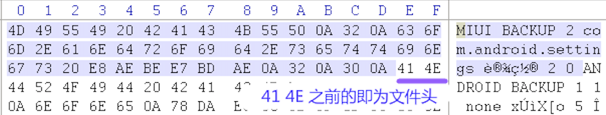

Android 无 ROOT 导出微信聊天记录
====================================

- 微信：6.7.3
- MIUI：10.3.2.0

备份并导出微信数据
------------------

在手机上点击进入【设置 / 更多设置 / 备份和重置】，选择【本地备份 / 新建备份】，去除【系统数据】和【软件程序】的勾选，点击【软件程序】右侧的箭头进入程序列表页面，勾选微信，点击【确定】返回上级页面，然后点击【开始备份】开始备份微信数据。

MIUI 备份后的数据保存在 ``/MIUI/backup/Allbackup/`` 中以备份时间命名的子目录里，将子目录中的备份文件（.bak 文件）复制到电脑上面。

MIUI 在 Android 的标准备份文件的前面添加了一个自定义文件头，如下图所示：

我们需要去除 ``41 4e`` 前面的自定义文件头，然后使用 `Android backup extractor <https://github.com/nelenkov/android-backup-extractor/releases/download/20181012025725-d750899/abe-all.jar>`_ 和 tar 提取和解压微信备份数据，提取和解压命令如下：

.. code-block:: console

    $ bak_file=微信.bak
    $ tail -c +$(python -c "import sys; print open('$bak_file').read(100).index('\x41\x4e')+1") $bak_file | java -jar abe-all.jar unpack - - | tar xf -

备份数据会被解压到一个 ``wechat`` 目录里。

解密聊天记录数据库文件
----------------------

进入 ``wechat`` 目录，执行下面的命令找到聊天记录的数据库所在目录：

.. code-block:: console

    $ cd wechat
    $ find . -name "EnMicroMsg.db"
    ./com.tencent.mm/r/MicroMsg/f1bde7***********7a127aae38462/EnMicroMsg.db
    ./com.tencent.mm/r/MicroMsg/EnMicroMsg.db

上面一串类似随机数的目录里的 ``EnMicroMsg.db`` 就是聊天记录的数据库文件，这个文件是一个使用 sqlcipher 加密过的 sqlite 数据库文件。加密的密码由手机的 IMEI 和 自己的微信 UIN 计算得到，所以首先我们需要先提取这两个的值。

将下面的代码保存到 MapDumper.java 文件中：

.. code-block:: java

    import java.io.FileInputStream;
    import java.io.ObjectInputStream;
    import java.util.Map;

    public class MapDumper {
        public static void main(String[] args) {
            try {
                FileInputStream file = new FileInputStream(args[0]);
                ObjectInputStream mObjectInputStream = new ObjectInputStream(file);
                Map map = (Map) mObjectInputStream.readObject();
                System.out.println(map);
            } catch (Exception e) {
                e.printStackTrace();
            }
        }
    }

然后执行下面的命令来提取 IMEI 和 UIN：

.. code-block:: console

    $ javac MapDumper.java
    $ java MapDumper $(find . -name CompatibleInfo.cfg)
    {98305=false, 256=A86802803750460, 94209=0, 258=XXXXXXXXXXXXXX, 259=XiaomiRedmi 5A: half thumb fastmult vfp edsp neon vfpv3 tls vfpv4 idiva idivt lpae evtstrm aes pmull sha1 sha2 crc32: AArch64 Processor rev 4 (aarch64): 8: Qualcomm Technologies, Inc MSM8917: null}
    $ java MapDumper $(find . -name systemInfo.cfg)
    {1=YYYYYYYYY, 2=10,163.177.81.139,80,szshort.weixin.qq.com|18,183.3.224.141,80,szshort.weixin.qq.com|6,121.51.140.139,80,szshort.weixin.qq.com|10,163.177.81.139,80,szextshort.weixin.qq.com|18,183.3.224.141,80,szextshort.weixin.qq.com|6,121.51.140.139,80,szextshort.weixin.qq.com|6,121.51.130.84,80,szshort.pay.weixin.qq.com|6,121.51.140.143,80,szshort.pay.weixin.qq.com|10,163.177.81.143,80,szshort.pay.weixin.qq.com|10,58.251.80.105,80,szshort.pay.weixin.qq.com|18,183.3.224.143,80,szshort.pay.weixin.qq.com|18,183.3.234.104,80,szshort.pay.weixin.qq.com|6,127.0.0.1,80,localhost|, 3=10,163.177.81.141,80,szlong.weixin.qq.com|10,58.251.100.119,80,szlong.weixin.qq.com|18,14.215.158.119,80,szlong.weixin.qq.com|18,183.3.224.139,80,szlong.weixin.qq.com|6,121.51.140.141,80,szlong.weixin.qq.com|6,121.51.8.119,80,szlong.weixin.qq.com|, 35=10, 37=637993789, 6=80:8080:443, 7=5:5, 46=0, 47=0, 17=0, 24=szshort.weixin.qq.com, 25=szlong.weixin.qq.com}

CompatibleInfo.cfg 文件 dump 出的内容中 ``258=`` 后是手机 IMEI 号， systemInfo.cfg 文件 dump 出的内容中  ``1=`` 后面是微信 UIN 号。

得到这两个值后将 IMEI 和 UIN 合并后计算其 md5 值，取其前 7 位即为加密数据库的密码：

.. code-block:: console

    $ echo -n XXXXXXXXXXXXXXYYYYYYYYY | md5 | cut -c -7
    PPPPPPP

最后，进入 sqlcipher 命令行：

.. code-block:: console

    $ sqlcipher
    sqlite>

执行下面的命令解密数据库到 MicroMsg.db 文件（其中 PPPPPPP 为上面计算得到的密码）。

.. code-block:: console

    .open ./com.tencent.mm/r/MicroMsg/f1bde7***********7a127aae38462/EnMicroMsg.db
    PRAGMA key='PPPPPPP';
    PRAGMA cipher_use_hmac=off;
    PRAGMA cipher_page_size=1024;
    PRAGMA kdf_iter=4000;
    ATTACH DATABASE 'MicroMsg.db' AS mm KEY '';
    SELECT sqlcipher_export('mm');
    DETACH DATABASE mm;
    .quit

导出聊天记录
---------------

最后我们使用 `wechat-dump <https://github.com/ppwwyyxx/wechat-dump>`_ 中的命令从解密后的 Micromsg.db 文件中导出聊天记录到 .txt 或者 .html 文件。

参考：

- `轻松解包 MIUI 备份 bak 文件 还原出明文数据 <https://www.feifeiboke.com/android/3669.html>`_
- `记一次微信聊天文字记录导出到 Excel 工作 <https://www.bilibili.com/read/cv8798/>`_
- `解密安卓微信聊天记录数据库 <https://wormtooth.com/20180417-decrypt-wechat-database/>`_ 

