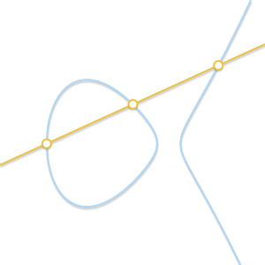

Elliptic Curve Cryptography
==============================

原文：

- `Elliptic curves over real numbers and the group law <http://andrea.corbellini.name/2015/05/17/elliptic-curve-cryptography-a-gentle-introduction/>`_
- `Elliptic Curve Cryptography: finite fields and discrete logarithms <http://andrea.corbellini.name/2015/05/23/elliptic-curve-cryptography-finite-fields-and-discrete-logarithms/>`_
- `Key pair generation and two ECC algorithms: ECDH and ECDSA <http://andrea.corbellini.name/2015/05/30/elliptic-curve-cryptography-ecdh-and-ecdsa/>`_

椭圆曲线（Elliptic Curves）
---------------------------

首先，什么是椭圆曲线，简单来说，椭圆曲线就是满足以下公式的点的集合：

.. math:: y^2 = x^3 + ax + b

其中 :math:`4a^3 + 27b^2 \ne 0` （排除掉奇异曲线 singular curves）。

.. figure:: images/ecc/curves.png

   不同形状的椭圆曲线，:math:`b = 1`, :math:`a` 从 2 到 -3。

*a* 和 *b* 的值不一样，曲线在平面上的形状也不一样。显而易见并且容易证明的是：椭圆曲线都是相对于 x 轴对称的。

另外，我们定义无穷远点（point at infinity）为椭圆曲线上的一点，这个点我们用符号 :math:`0` 来表示。

加上无穷远点，完善后的椭圆曲线公式如下：

.. math:: \left\{ (x, y) \in \mathbb{R}^2\ |\ y^2 = x^3 + ax + b,\ 4 a^3 + 27 b^2 \ne 0 \right\}\ \cup\ \left\{ 0 \right\}

群（Groups）
----------------

在数学中，群是一个集合 :math:`\mathbb{G}` ，连同其上定义的二元运算 *加* （使用符号 + 表示）。要具备成为群的资格，这个集合和运算 :math:`(\mathbb{G}, +)` 还必须满足叫做群公理的四个要求：

1. 封闭性（closure）：对于所有 :math:`\mathbb{G}` 中 a, b，运算 a + b 的结果也在 :math:`\mathbb{G}` 中。
2. 结合性（associativity）：对于所有 :math:`\mathbb{G}` 中的 a, b 和 c，等式 (a + b) + c = a + (b + c) 成立。
3. 单位元（identity element）：存在 :math:`\mathbb{G}` 中的一个元素 :math:`0`，使得对于所有 :math:`\mathbb{G}` 中的元素 a，等式 :math:`a + 0 = 0 + a = a` 成立。
4. 逆元（inverse）：对于每个 :math:`\mathbb{G}` 中的 a，存在 :math:`\mathbb{G}` 中的一个元素 b 使得 :math:`a + b = 0`。

如果再加上第 5 个条件：

5. 交换性（commutativity）: a + b = b + a 。

那么这个群又叫做阿贝尔群（abelian group）。

整数集合 :math:`\mathbb{Z}` 连同我们日常使用的整数加法构成一个群（还是一个阿贝尔群）。自然数集合 :math:`\mathbb{N}` 不是群，因为不满足第 4 个要求。

在以上特性成立的基础上，我们可以继续推导出群的一些其它特性，比如：单位元是唯一的，并且逆元也是唯一的，也就是说：对于任意 a，只存在唯一的 b 使得 a + b = 0（我们可以将 b 写做 -a）。这些特性在后文中会直接或间接的派上重要用场。

在椭圆曲线上定义一个群（The group law for elliptic curves）
-----------------------------------------------------------

我们可以如下定义一个椭圆曲线上的群：

- 群里的元素为曲线上的点。
- *单位元* 为无穷远点 :math:`0`。
- 曲线上任意一点 :math:`P` 的 *逆元* 是其相对于 x 轴的对称点。
- *加* 法规定如下：曲线上任意的 3 点 :math:`P`，:math:`Q`，:math:`R`，如果 3 点在一条直线上（aligned）并且都不是无穷远点（nonzero），那么它们的和 :math:`P + Q + R = 0` 。

注意最后一条规则，我们只要求 3 个点在一条直线上，并不要求其顺序，也就是说 :math:`P + (Q + R) = Q + (P + R) = R + (P + Q) = \cdots = 0`，因此定义的加法满足结合性和交换性，也就是说这是一个阿贝尔群。

那么，我们如何计算任意两点相加的和呢？

几何加法（Geometric addition）
----------------------------------

上面定义的群是一个阿贝尔群，所以我们可以将 :math:`P + Q + R = 0` 改写成 :math:`P + Q = -R` 。从后面这个公式我们可以得出计算任意两点 :math:`P` 和 :math:`Q` 相加和的几何方法：过 :math:`P` 和 :math:`Q` 两点画一条直线，这条直线交曲线上第三点 :math:`R`，取其逆元 :math:`-R` 即是 :math:`P + Q` 的结果。

.. image:: images/ecc/point-addition.png

上面的几何计算方法可以工作但还需要几点补充，尤其是下面几个问题需要解决：

- **如果** :math:`P = 0` **或者** :math:`Q = 0` **怎么办？**  此时无法画一条过两点的直线，但是前面我们已经定义了 :math:`0` 为单位元，所以 :math:`P + 0 = P` ，:math:`0 + Q = Q` 。
- **如果** :math:`P = -Q` **呢？** 此时过两点的直线是垂直的，和曲线没有第三个交点。但是因为 :math:`P` 是 :math:`Q` 的逆元，根据逆元的定义： :math:`P + Q = P + (-P) = 0` 。
- **如果** :math:`P = Q` **呢？** 过一点有无数条直线，这里问题变得有点复杂了。考虑曲线上的一点 :math:`Q' \ne P` ，如果我们让 :math:`Q'` 不断逼近 :math:`P`，此时过 :math:`P` 和 :math:`Q'` 的直线就变成了曲线的切线。基于此，我们可以定义 :math:`P + P = -R` ，这里 :math:`R` 是曲线在 :math:`P` 点的切线与曲线的另外一个交点。

  .. image:: images/ecc/animation-point-doubling.gif

- **如果** :math:`P \ne Q`，**但是没有第三个交点** :math:`R` **呢？** 这个和前面一个问题的情况类似，此时过 :math:`P` 和 :math:`Q` 的直线是曲线的切线。

  .. image:: images/ecc/animation-tangent-line.gif

  假设 :math:`P` 是切点，那么 :math:`P + P = -Q`，所以 :math:`P + Q = -P`，同理，如果 :math:`Q` 是切点，:math:`P + Q = -Q` 。

以上就是几何加法的完整步骤，使用笔和尺子我们就可以完成椭圆曲线上任意两点的加法（或者可以使用这个 `可视化工具`_ ）。
 
代数加法（Algebraic addition）
----------------------------------

为了使用计算机来计算椭圆曲线上点的加法，我们需要将上面的几何方法转换为代数方法。将上面的规则转化为公式涉及到解三次方程，比较繁琐，所以这里我们省略过程直接给出结果。

首先，我们先去掉一些极限情况，我们知道 :math:`P + (-P) = 0`，也知道 :math:`P + 0 = 0 + P = P`，所以下面的公式中我们排除这两种情况，只考虑 :math:`P = (x_P, y_p)` 和 :math:`Q = (x_Q, y_Q)` 为非对称点、非无穷远点的情况。

因为 :math:`P` 和 :math:`Q` 非对称（:math:`x_P \ne x_Q`），所以过两点的直线有斜率（slope），斜率为：

.. math:: m = \frac{y_P - y_Q}{x_P - x_Q}

设直线与椭圆曲线的第三个交点为 :math:`R = (x_R, y_R)`，则：

.. math::

    \begin{array}{rcl}
        x_R & = & m^2 - x_P - x_Q \\
        y_R & = & y_P + m(x_R - x_P)
    \end{array}

或者：

.. math::

   y_R = y_Q + m(x_R - x_Q)

我们使用一个例子来验证以下以上公式的正确性：根据我们的 `可视化工具`_ ，给定曲线 :math:`y^2 = x^3 - 7x + 10` ，:math:`P = (1, 2)` 和 :math:`Q = (3, 4)` ，两点的和 :math:`P + Q = -R = (-3, 2)` 。我们来看下和我们上面的公式计算的结果是否吻合：

.. math::

    \begin{array}{rcl}
        m & = & \frac{y_P - y_Q}{x_P - x_Q} = \frac{2 - 4}{1 - 3} = 1 \\
        x_R & = & m^2 - x_P - x_Q = 1^2 - 1 - 3 = -3 \\
        y_R & = & y_P + m(x_R - x_P) = 2 + 1 \cdot (-3 - 1) = -2 \\
        & = & y_Q + m(x_R - x_Q) = 4 + 1 \cdot (-3 - 3) = -2
    \end{array}

结果一致！

即使 :math:`P` **或者** :math:`Q` **中的一点是切点**，上面的公式依然可以得出正确的结果。例如： :math:`P = (-1, 4)` 和 :math:`Q = (1, 2)` 。

.. math::

    \begin{array}{rcl}
        m & = & \frac{y_P - y_Q}{x_P - x_Q} = \frac{4 - 2}{-1 - 1} = -1 \\
        x_R & = & m^2 - x_P - x_Q = (-1)^2 - (-1) - 1 = 1 \\
        y_R & = & y_P + m(x_R - x_P) = 4 + -1 \cdot (1 - (-1)) = 2
    \end{array}

结果 :math:`P + Q = (1, -2)` ，和 `可视化工具`_ 给出的一样。

:math:`P = Q` **的情况需要特殊处理：** 计算 :math:`x_R` 和 :math:`y_R` 的公式不变，但是斜率的公式需要修改使用以下公式（因为 :math:`x_P = x_Q`）：

.. math:: m = \frac{3x_P^2 + a}{2y_P}

此时，斜率 m 是下面这个公式的一阶导数：

.. math:: y_P = \pm \sqrt{x_P^3 + ax_P + b}

使用 :math:`P = Q = (1, 2)` 验证一下：

.. math::

    \begin{array}{rcl}
        m & = & \frac{3x_P^2 + a}{2 y_P} = \frac{3 \cdot 1^2 - 7}{2 \cdot 2} = -1 \\
        x_R & = & m^2 - x_P - x_Q = (-1)^2 - 1 - 1 = -1 \\
        y_R & = & y_P + m(x_R - x_P) = 2 + (-1) \cdot (-1 - 1) = 4
    \end{array}

结果： :math:`P + P = -R = (-1,-4)` ，`正确 <https://cdn.rawgit.com/andreacorbellini/ecc/920b29a/interactive/reals-add.html?px=1&py=2&qx=1&qy=2>`_ ！

.. _可视化工具: https://cdn.rawgit.com/andreacorbellini/ecc/920b29a/interactive/reals-add.html?px=-1&py=4&qx=1&qy=2

乘法（Scalar multiplication）
--------------------------------

除了加法之外，我们可以再定义一个运算：乘法。

.. math:: nP = \underbrace{P + P + \cdots + P}_{n\ \text{times}}

这里，:math:`n` 是一个自然数。 `乘法可视化计算工具 <https://cdn.rawgit.com/andreacorbellini/ecc/920b29a/interactive/reals-mul.html>`_ 。

从乘法定义来看，计算 :math:`nP` 需要进行 :math:`n` 次加法运算。假如 :math:`n` 为 :math:`k` bit，则计算复杂度为： :math:`O(2^k)` ，性能不好，还好乘法存在不少快速算法。

**double and add** 就是其中算法之一。这个算法的原理可以用一个例子来解释清楚。令 :math:`n = 151` ，它的二进制表达形式为： :math:`10010111_2` ，这个二进制形式可以进一步用一系列 *2的幂(powers of two)* 的和来表示：

.. math::

    \begin{array}{rcl}
        151 & = & 1 \cdot 2^7 + 0 \cdot 2^6 + 0 \cdot 2^5 + 1 \cdot 2^4 + 0 \cdot 2^3 + 1 \cdot 2^2 + 1 \cdot 2^1 + 1 \cdot 2^0 \\
        & = & 2^7 + 2^4 + 2^2 + 2^1 + 2^0
    \end{array}

因此 :math:`151 \cdot P` 可以写成：

.. math:: 151 \cdot P = 2^7 P + 2^4 P + 2^2 P + 2^1 P + 2^0 P

最后，double and add 算法的计算步骤如下：

- 取 :math:`P` 。
- 计算（Double） :math:`2P = P + P` 。
- 将 :math:`2P` 和 :math:`P` 相加得到 :math:`2^1P + 2^0P` 的结果。
- 计算 :math:`2^2P = 2P + 2P` 。
- 将 :math:`2^2P` 和前面的结果相加得到 :math:`2^2P + 2^1P + 2^0P` 的结果。
- 计算 :math:`2^3P = 2^2P + 2^2P` 。
- 计算 :math:`2^4P = 2^3P + 2^3P` 。
- 将 :math:`2^4P` 和前面的结果相加得到 :math:`2^4P + 2^2P + 21^P + 2^0P` 的结果。
- ……

最终我们通过 7 次 Double 和 4 次加运算就得到了 :math:`151 \cdot P` 的结果。

如果上面的描述不够清晰，下面是该算法的 Python 代码实现：

.. code-block:: python

    def bits(n):
        """
        Generates the binary digits of n, starting
        from the least significant bit.

        bits(151) -> 1, 1, 1, 0, 1, 0, 0, 1
        """
        while n:
            yield n & 1
            n >>= 1

    def double_and_add(n, x):
        """
        Returns the result of n * x, computed using
        the double and add algorithm.
        """
        result = 0
        addend = x

        for bit in bits(n):
            if bit == 1:
                result += addend
            addend *= 2

        return result

如果 Double 和加法的复杂度是 :math:`O(1)` ，那么本算法的复杂度就是 :math:`O(\log n)` （或者用 n 的 bit 长度表示的话： :math:`O(k)` ），性能很不错，比一开始 :math:`O(n)` 的复杂度好多了。

对数（Logarithm）
----------------------

给定 :math:`n` 和 :math:`P` ，我们有了一个算法可以在多项式时间内计算得到 :math:`Q = nP` 。那么反过来，如果我们知道 :math:`Q` 和 :math:`P` 需要计算出 :math:`n` 呢？这个问题被称作 **对数问题** ，称其为“对数”而不是“除”主要是为了和其它加密系统一致（这些系统里乘法对应的是幂 exponentiation）。

对数问题目前没有比较高效（easy）的解决算法，当然通过 `摸索 <https://cdn.rawgit.com/andreacorbellini/ecc/920b29a/interactive/reals-mul.html?a=-3&b=1&px=0&py=1>`_ 我们也能看到一些模式（pattern）。比如，曲线 :math:`y^2 = x^3 - 3x +1` 和点 :math:`P = (0, 1)` ，可以看到，当 :math:`n` 是奇数时，:math:`nP` 总是落在左边的曲线上，当 :math:`n` 是偶数时，:math:`nP` 落在右边的曲线上。通过不断的实验，我们也许可以发现更多的模式，这些模式可能最终可以帮我们找到一个解决对数问题的高效算法。

但是，对数问题中有一类 *离散* 对数问题，我们将在下文中看到，当我们缩小曲线的值域， **曲线上的乘法还是可以高效运算，但是其逆运算，也就是离散对数运算变得非常的困难（hard）**。这种不对称（duality）即椭圆曲线加密的核心。

----
