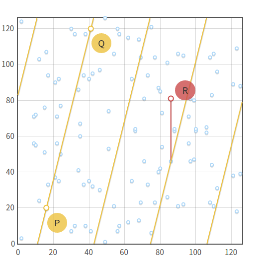
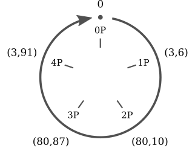

Elliptic Curve Cryptography
==============================

原文：

- `Elliptic curves over real numbers and the group law <http://andrea.corbellini.name/2015/05/17/elliptic-curve-cryptography-a-gentle-introduction/>`_
- `Elliptic Curve Cryptography: finite fields and discrete logarithms <http://andrea.corbellini.name/2015/05/23/elliptic-curve-cryptography-finite-fields-and-discrete-logarithms/>`_
- `Key pair generation and two ECC algorithms: ECDH and ECDSA <http://andrea.corbellini.name/2015/05/30/elliptic-curve-cryptography-ecdh-and-ecdsa/>`_

实数域上的椭圆曲线与群
^^^^^^^^^^^^^^^^^^^^^^^^

椭圆曲线（Elliptic Curves）
---------------------------

首先，什么是椭圆曲线，简单来说，椭圆曲线就是满足以下公式的点的集合：

.. math:: y^2 = x^3 + ax + b

其中 :math:`4a^3 + 27b^2 \ne 0` （排除掉奇异曲线 singular curves）。

.. figure:: images/ecc/curves.png

   不同形状的椭圆曲线，:math:`b = 1`, :math:`a` 从 2 到 -3。

*a* 和 *b* 的值不一样，曲线在平面上的形状也不一样。显而易见并且容易证明的是：椭圆曲线都是相对于 x 轴对称的。

另外，我们定义无穷远点（point at infinity）为椭圆曲线上的一点，这个点我们用符号 :math:`0` 来表示。

加上无穷远点，完善后的椭圆曲线公式如下：

.. math:: \left\{ (x, y) \in \mathbb{R}^2\ |\ y^2 = x^3 + ax + b,\ 4 a^3 + 27 b^2 \ne 0 \right\}\ \cup\ \left\{ 0 \right\}

群（Groups）
----------------

在数学中，群是一个集合 :math:`\mathbb{G}` ，连同其上定义的二元运算 *加* （使用符号 + 表示）。要具备成为群的资格，这个集合和运算 :math:`(\mathbb{G}, +)` 还必须满足叫做群公理的四个要求：

1. 封闭性（closure）：对于所有 :math:`\mathbb{G}` 中 a, b，运算 a + b 的结果也在 :math:`\mathbb{G}` 中。
2. 结合性（associativity）：对于所有 :math:`\mathbb{G}` 中的 a, b 和 c，等式 (a + b) + c = a + (b + c) 成立。
3. 单位元（identity element）：存在 :math:`\mathbb{G}` 中的一个元素 :math:`0`，使得对于所有 :math:`\mathbb{G}` 中的元素 a，等式 :math:`a + 0 = 0 + a = a` 成立。
4. 逆元（inverse）：对于每个 :math:`\mathbb{G}` 中的 a，存在 :math:`\mathbb{G}` 中的一个元素 b 使得 :math:`a + b = 0`。

如果再加上第 5 个条件：

5. 交换性（commutativity）: a + b = b + a 。

那么这个群又叫做阿贝尔群（abelian group）。

整数集合 :math:`\mathbb{Z}` 连同我们日常使用的整数加法构成一个群（还是一个阿贝尔群）。自然数集合 :math:`\mathbb{N}` 不是群，因为不满足第 4 个要求。

在以上特性成立的基础上，我们可以继续推导出群的一些其它特性，比如：单位元是唯一的，并且逆元也是唯一的，也就是说：对于任意 a，只存在唯一的 b 使得 a + b = 0（我们可以将 b 写做 -a）。这些特性在后文中会直接或间接的派上重要用场。

在椭圆曲线上定义一个群（The group law for elliptic curves）
-----------------------------------------------------------

我们可以如下定义一个椭圆曲线上的群：

- 群里的元素为曲线上的点。
- *单位元* 为无穷远点 :math:`0`。
- 曲线上任意一点 :math:`P` 的 *逆元* 是其相对于 x 轴的对称点。
- *加* 法规定如下：曲线上任意的 3 点 :math:`P`，:math:`Q`，:math:`R`，如果 3 点在一条直线上（aligned）并且都不是无穷远点（nonzero），那么它们的和 :math:`P + Q + R = 0` 。

.. image:: images/ecc/three-aligned-points.png

注意最后一条规则，我们只要求 3 个点在一条直线上，并不要求其顺序，也就是说 :math:`P + (Q + R) = Q + (P + R) = R + (P + Q) = \cdots = 0`，因此定义的加法满足结合性和交换性，也就是说这是一个阿贝尔群。

那么，我们如何计算任意两点相加的和呢？

几何加法（Geometric addition）
----------------------------------

上面定义的群是一个阿贝尔群，所以我们可以将 :math:`P + Q + R = 0` 改写成 :math:`P + Q = -R` 。从后面这个公式我们可以得出计算任意两点 :math:`P` 和 :math:`Q` 相加和的几何方法：过 :math:`P` 和 :math:`Q` 两点画一条直线，这条直线交曲线上第三点 :math:`R`，取其逆元 :math:`-R` 即是 :math:`P + Q` 的结果。

.. image:: images/ecc/point-addition.png

上面的几何计算方法可以工作但还需要几点补充，尤其是下面几个问题需要解决：

- **如果** :math:`P = 0` **或者** :math:`Q = 0` **怎么办？**  此时无法画一条过两点的直线，但是前面我们已经定义了 :math:`0` 为单位元，所以 :math:`P + 0 = P` ，:math:`0 + Q = Q` 。
- **如果** :math:`P = -Q` **呢？** 此时过两点的直线是垂直的，和曲线没有第三个交点。但是因为 :math:`P` 是 :math:`Q` 的逆元，根据逆元的定义： :math:`P + Q = P + (-P) = 0` 。
- **如果** :math:`P = Q` **呢？** 过一点有无数条直线，这里问题变得有点复杂了。考虑曲线上的一点 :math:`Q' \ne P` ，如果我们让 :math:`Q'` 不断逼近 :math:`P`，此时过 :math:`P` 和 :math:`Q'` 的直线就变成了曲线的切线。基于此，我们可以定义 :math:`P + P = -R` ，这里 :math:`R` 是曲线在 :math:`P` 点的切线与曲线的另外一个交点。

  .. image:: images/ecc/animation-point-doubling.gif

- **如果** :math:`P \ne Q`，**但是没有第三个交点** :math:`R` **呢？** 这个和前面一个问题的情况类似，此时过 :math:`P` 和 :math:`Q` 的直线是曲线的切线。

  .. image:: images/ecc/animation-tangent-line.gif

  假设 :math:`P` 是切点，那么 :math:`P + P = -Q`，所以 :math:`P + Q = -P`，同理，如果 :math:`Q` 是切点，:math:`P + Q = -Q` 。

以上就是几何加法的完整步骤，使用笔和尺子我们就可以完成椭圆曲线上任意两点的加法（或者可以使用这个 `可视化工具`_ ）。
 
代数加法（Algebraic addition）
----------------------------------

为了使用计算机来计算椭圆曲线上点的加法，我们需要将上面的几何方法转换为代数方法。将上面的规则转化为公式涉及到解三次方程，比较繁琐，所以这里我们省略过程直接给出结果。

首先，我们先去掉一些极限情况，我们知道 :math:`P + (-P) = 0`，也知道 :math:`P + 0 = 0 + P = P`，所以下面的公式中我们排除这两种情况，只考虑 :math:`P = (x_P, y_p)` 和 :math:`Q = (x_Q, y_Q)` 为非对称点、非无穷远点的情况。

因为 :math:`P` 和 :math:`Q` 非对称（:math:`x_P \ne x_Q`），所以过两点的直线有斜率（slope），斜率为：

.. math:: m = \frac{y_P - y_Q}{x_P - x_Q}

设直线与椭圆曲线的第三个交点为 :math:`R = (x_R, y_R)`，则：

.. math::

    \begin{array}{rcl}
        x_R & = & m^2 - x_P - x_Q \\
        y_R & = & y_P + m(x_R - x_P)
    \end{array}

或者：

.. math::

   y_R = y_Q + m(x_R - x_Q)

我们使用一个例子来验证以下以上公式的正确性：根据我们的 `可视化工具`_ ，给定曲线 :math:`y^2 = x^3 - 7x + 10` ，:math:`P = (1, 2)` 和 :math:`Q = (3, 4)` ，两点的和 :math:`P + Q = -R = (-3, 2)` 。我们来看下和我们上面的公式计算的结果是否吻合：

.. math::

    \begin{array}{rcl}
        m & = & \frac{y_P - y_Q}{x_P - x_Q} = \frac{2 - 4}{1 - 3} = 1 \\
        x_R & = & m^2 - x_P - x_Q = 1^2 - 1 - 3 = -3 \\
        y_R & = & y_P + m(x_R - x_P) = 2 + 1 \cdot (-3 - 1) = -2 \\
        & = & y_Q + m(x_R - x_Q) = 4 + 1 \cdot (-3 - 3) = -2
    \end{array}

结果一致！

即使 :math:`P` **或者** :math:`Q` **中的一点是切点**，上面的公式依然可以得出正确的结果。例如： :math:`P = (-1, 4)` 和 :math:`Q = (1, 2)` 。

.. math::

    \begin{array}{rcl}
        m & = & \frac{y_P - y_Q}{x_P - x_Q} = \frac{4 - 2}{-1 - 1} = -1 \\
        x_R & = & m^2 - x_P - x_Q = (-1)^2 - (-1) - 1 = 1 \\
        y_R & = & y_P + m(x_R - x_P) = 4 + -1 \cdot (1 - (-1)) = 2
    \end{array}

结果 :math:`P + Q = (1, -2)` ，和 `可视化工具`_ 给出的一样。

:math:`P = Q` **的情况需要特殊处理：** 计算 :math:`x_R` 和 :math:`y_R` 的公式不变，但是斜率的公式需要修改使用以下公式（因为 :math:`x_P = x_Q`）：

.. math:: m = \frac{3x_P^2 + a}{2y_P}

此时，斜率 m 是下面这个公式的一阶导数：

.. math:: y_P = \pm \sqrt{x_P^3 + ax_P + b}

使用 :math:`P = Q = (1, 2)` 验证一下：

.. math::

    \begin{array}{rcl}
        m & = & \frac{3x_P^2 + a}{2 y_P} = \frac{3 \cdot 1^2 - 7}{2 \cdot 2} = -1 \\
        x_R & = & m^2 - x_P - x_Q = (-1)^2 - 1 - 1 = -1 \\
        y_R & = & y_P + m(x_R - x_P) = 2 + (-1) \cdot (-1 - 1) = 4
    \end{array}

结果： :math:`P + P = -R = (-1,-4)` ，`正确 <https://cdn.rawgit.com/andreacorbellini/ecc/920b29a/interactive/reals-add.html?px=1&py=2&qx=1&qy=2>`_ ！

.. _可视化工具: https://cdn.rawgit.com/andreacorbellini/ecc/920b29a/interactive/reals-add.html?px=-1&py=4&qx=1&qy=2

乘法（Scalar multiplication）
--------------------------------

除了加法之外，我们可以再定义一个运算：乘法。

.. math:: nP = \underbrace{P + P + \cdots + P}_{n\ \text{times}}

这里，:math:`n` 是一个自然数。 `乘法可视化计算工具 <https://cdn.rawgit.com/andreacorbellini/ecc/920b29a/interactive/reals-mul.html>`_ 。

从乘法定义来看，计算 :math:`nP` 需要进行 :math:`n` 次加法运算。假如 :math:`n` 为 :math:`k` bit，则计算复杂度为： :math:`O(2^k)` ，性能不好，还好乘法存在不少快速算法。

**double and add** 就是其中算法之一。这个算法的原理可以用一个例子来解释清楚。令 :math:`n = 151` ，它的二进制表达形式为： :math:`10010111_2` ，这个二进制形式可以进一步用一系列 *2的幂(powers of two)* 的和来表示：

.. math::

    \begin{array}{rcl}
        151 & = & 1 \cdot 2^7 + 0 \cdot 2^6 + 0 \cdot 2^5 + 1 \cdot 2^4 + 0 \cdot 2^3 + 1 \cdot 2^2 + 1 \cdot 2^1 + 1 \cdot 2^0 \\
        & = & 2^7 + 2^4 + 2^2 + 2^1 + 2^0
    \end{array}

因此 :math:`151 \cdot P` 可以写成：

.. math:: 151 \cdot P = 2^7 P + 2^4 P + 2^2 P + 2^1 P + 2^0 P

最后，double and add 算法的计算步骤如下：

- 取 :math:`P` 。
- 计算（Double） :math:`2P = P + P` 。
- 将 :math:`2P` 和 :math:`P` 相加得到 :math:`2^1P + 2^0P` 的结果。
- 计算 :math:`2^2P = 2P + 2P` 。
- 将 :math:`2^2P` 和前面的结果相加得到 :math:`2^2P + 2^1P + 2^0P` 的结果。
- 计算 :math:`2^3P = 2^2P + 2^2P` 。
- 计算 :math:`2^4P = 2^3P + 2^3P` 。
- 将 :math:`2^4P` 和前面的结果相加得到 :math:`2^4P + 2^2P + 21^P + 2^0P` 的结果。
- ……

最终我们通过 7 次 Double 和 4 次加运算就得到了 :math:`151 \cdot P` 的结果。

如果上面的描述不够清晰，下面是该算法的 Python 代码实现：

.. code-block:: python

    def bits(n):
        """
        Generates the binary digits of n, starting
        from the least significant bit.

        bits(151) -> 1, 1, 1, 0, 1, 0, 0, 1
        """
        while n:
            yield n & 1
            n >>= 1

    def double_and_add(n, x):
        """
        Returns the result of n * x, computed using
        the double and add algorithm.
        """
        result = 0
        addend = x

        for bit in bits(n):
            if bit == 1:
                result += addend
            addend *= 2

        return result

如果 Double 和加法的复杂度是 :math:`O(1)` ，那么本算法的复杂度就是 :math:`O(\log n)` （或者用 n 的 bit 长度表示的话： :math:`O(k)` ），性能很不错，比一开始 :math:`O(n)` 的复杂度好多了。

对数（Logarithm）
----------------------

给定 :math:`n` 和 :math:`P` ，我们有了一个算法可以在多项式时间内计算得到 :math:`Q = nP` 。那么反过来，如果我们知道 :math:`Q` 和 :math:`P` 需要计算出 :math:`n` 呢？这个问题被称作 **对数问题** ，称其为“对数”而不是“除”主要是为了和其它加密系统一致（这些系统里乘法对应的是幂 exponentiation）。

对数问题目前没有比较高效（easy）的解决算法，当然通过 `摸索 <https://cdn.rawgit.com/andreacorbellini/ecc/920b29a/interactive/reals-mul.html?a=-3&b=1&px=0&py=1>`_ 我们也能看到一些模式（pattern）。比如，曲线 :math:`y^2 = x^3 - 3x +1` 和点 :math:`P = (0, 1)` ，可以看到，当 :math:`n` 是奇数时，:math:`nP` 总是落在左边的曲线上，当 :math:`n` 是偶数时，:math:`nP` 落在右边的曲线上。通过不断的实验，我们也许可以发现更多的模式，这些模式可能最终可以帮我们找到一个解决对数问题的高效算法。

但是，对数问题中有一类 *离散* 对数问题，我们将在下文中看到，当我们缩小曲线的值域， **曲线上的乘法还是可以高效运算，但是其逆运算，也就是离散对数运算变得非常的困难（hard）**。这种不对称（duality）即椭圆曲线加密的核心。

有限域与离散对数问题
^^^^^^^^^^^^^^^^^^^^^

“整数对 p 取模“有限域（The field of integers modulo p）
-------------------------------------------------------

有限域是什么？首先，它是一个包含有限个元素的集合。有限域最常见的例子是当 p 为素数时，整数对 p 取模，一般使用 :math:`\mathbb{Z}/p`, :math:`GF(p)` 或者 :math:`\mathbb{F}_p` 表示，下文中我们使用最后一种表示这个有限域。

有限域上定义了加法（+）和乘法（·）两种运算，运算满足封闭性、结合性和交换性。存在唯一的单位元（identity element），域中的每个元素存在唯一的逆元（inverse element）。最后，乘法对加法满足分配律（distributive）： :math:`x \cdot (y + z) = x \cdot y + x \cdot z` 。

整数对 p 取模有限域中包含了从 :math:`0` 到 :math:`p - 1` 的所有整数，加法和乘法同 `模运算（modular arithmetic） <http://en.wikipedia.org/wiki/Modular_arithmetic>`_ ，下面是 :math:`\mathbb{F}_{23}` 的运算示例：

- 加： :math:`(18 + 9) \bmod 23 = 4`
- 减： :math:`(7 - 14) \bmod 23 = 16`
- 乘： :math:`(4 \cdot 7) \bmod 23 = 5`
- 加法逆元（Additive inverse）： :math:`-5 \bmod 23 = 18`

  :math:`(5 + (-5)) \bmod 23 = (5 + 18) \bmod 23 = 0` ，正确。

- 乘法逆元（Multiplicative inverse）： :math:`9^{-1} \bmod 23 = 18`

  :math:`9 \cdot 9^{-1} \bmod 23 = 9 \cdot 18 \bmod 23 = 1` ，正确。

如果上面的公式看不太明白，可以看下可汗学院的这个教程： `What is Modular Arithmetic <https://www.khanacademy.org/computing/computer-science/cryptography/modarithmetic/a/what-is-modular-arithmetic>`_ 。

注意： :math:`p` 必须是一个素数。比如整数对 4 取模构成的集合就不是一个域：因为集合里的元素 2 没有乘法逆元，也就是说 :math:`2 \cdot x \bmod 4 = 1` 无解。

模除(Division modulo p)
--------------------------------

在 :math:`\mathbb{F}_p` 中 :math:`x/y = x \cdot y^{-1}` ，也就是说，:math:`x` 除 :math:`y` 等价于 :math:`x` 乘上 :math:`y` 的乘法逆元。

乘法逆元可以使用 `扩展欧几里得算法（extended Euclidean algorithm） <http://en.wikipedia.org/wiki/Extended_Euclidean_algorithm>`_ 很容易的计算得出，复杂度最差为 :math:`O(\log p)`，用 p 的 bit 长度表示的话为 :math:`O(k)` 。

这个算法的细节跟本文主题无关，这里就不展开叙述了，下面是这个算法的 Python 语言实现，有兴趣的可以看看：

.. code-block:: python

    def extended_euclidean_algorithm(a, b):
        """
        Returns a three-tuple (gcd, x, y) such that
        a * x + b * y == gcd, where gcd is the greatest
        common divisor of a and b.

        This function implements the extended Euclidean
        algorithm and runs in O(log b) in the worst case.
        """
        s, old_s = 0, 1
        t, old_t = 1, 0
        r, old_r = b, a

        while r != 0:
            quotient = old_r // r
            old_r, r = r, old_r - quotient * r
            old_s, s = s, old_s - quotient * s
            old_t, t = t, old_t - quotient * t

        return old_r, old_s, old_t

    def inverse_of(n, p):
        """
        Returns the multiplicative inverse of
        n modulo p.

        This function returns an integer m such that
        (n * m) % p == 1.
        """
        gcd, x, y = extended_euclidean_algorithm(n, p)
        assert (n * x + p * y) % p == gcd

        if gcd != 1:
            # Either n is 0, or p is not a prime number.
            raise ValueError(
                '{} has no multiplicative inverse '
                'modulo {}'.format(n, p))
        else:
            return x % p

:math:`\mathbb{F}_p` 上的椭圆曲线（Elliptic curves in :math:`\mathbb{F}_p`）
-------------------------------------------------------------------------------

下面我们将椭圆曲线限定在 :math:`\mathbb{F}_p` 上，前文提到实数域上的椭圆曲线公式如下：

.. math::

    \begin{array}{rcl}
    \left\{(x, y) \in \mathbb{R}^2 \right. & \left. | \right. & \left. y^2 = x^3 + ax + b, \right. \\
    & & \left. 4a^3 + 27b^2 \ne 0\right\}\ \cup\ \left\{0\right\}
    \end{array}

限定之后，公式变为：

.. math::

    \begin{array}{rcl}
    \left\{(x, y) \in (\mathbb{F}_p)^2 \right. & \left. | \right. & \left. y^2 \equiv x^3 + ax + b \bmod p, \right. \\
    & & \left. 4a^3 + 27b^2 \not\equiv 0 \bmod p \right\}\ \cup\ \left\{0\right\}
    \end{array}

其中 :math:`0` 依然是无穷远点，:math:`a` 和 :math:`b` 是 :math:`\mathbb{F}_p` 上的整数。

.. figure:: images/ecc/elliptic-curves-mod-p.png

   曲线 :math:`y^2 \equiv x^3 - 7x + 10 (\bmod p)` ，:math:`p = 19, 97, 127, 487` 。每一个 x 对应两个点，并相对于 :math:`y = p/2` 对称。

之前连续的曲线现在变成了 :math:`xy` 平面上的离散点。我们可以证明，限定之后， :math:`\mathbb{F}_p` **上的椭圆曲线依然构成一个阿贝尔群**。

曲线上点的加法（Point addition）
----------------------------------

我们需要稍微修改一下加法的定义，让其在 :math:`\mathbb{F}_p` 上可以正常工作。在实数域上，我们说三个在一条直线上的点的和为零（:math:`P + Q + R = 0`）。在 :math:`\mathbb{F}_p` 上同理，只是这里的直线和实数域上的直线不太一样。:math:`\mathbb{F}_p` 上的直线指的是满足 :math:`ax + by + c \equiv 0 (\bmod p)` 的所有点 :math:`(x, y)` 的集合。

曲线构成群，所以曲线上点的加法依然满足前面说的各种群特性。

- :math:`Q + 0 = 0 + Q = Q` (根据单位元的定义）。
- 非无穷元点 :math:`Q` 的逆元 :math:`-Q = (x_Q, -y_Q \bmod p)` 。比如， :math:`\mathbb{F}_{29}` 上的曲线上有一个点 :math:`Q = (2,5)` ，那么其逆元 :math:`-Q = (2, -5 \bmod 29) = (2,24)` 。
- :math:`P + (-P) = 0` （根据逆元的定义）。

代数加法（Algebraic sum）
----------------------------

公式和前面实数域上的代数加法一样，只是每个公式的最后需要追加一个“:math:`\bmod p`”。给定 :math:`P = (x_P, y_P)`, :math:`Q = (x_Q, y_Q)` 和 :math:`R = (x_R, y_R)` ，我们如下计算 :math:`P + Q = -R` ：

.. math::

    \begin{array}{rcl}
    x_R & = & (m^2 - x_P - x_Q) \bmod{p} \\
    y_R & = & [y_P + m(x_R - x_P)] \bmod{p} \\
    & = & [y_Q + m(x_R - x_Q)] \bmod{p}
    \end{array}

如果 :math:`P \ne Q`，斜率 :math:`m` 为：

.. math:: m = (y_P - y_Q)(x_P - x_Q)^{-1} \bmod p

否则：

.. math:: m = (3 x_P^2 + a)(2 y_P)^{-1} \bmod{p}

`离散点加法可视化工具 <https://cdn.rawgit.com/andreacorbellini/ecc/920b29a/interactive/modk-add.html>`_

椭圆曲线群的序（The order of an elliptic curve group）
--------------------------------------------------------

有限域上的椭圆曲线群的集合中包含有限个数的点，这些点的个数称为该群的序（order）。

我们可以从 :math:`0` 到 :math:`p - 1` 遍历 :math:`x` 的所有可能值来计算得到点的个数，计算复杂度为 :math:`O(p)` ，如果 :math:`p` 非常大的话，性能会很低下。

还好，存在高效算法 `Schoof's algorithm <https://en.wikipedia.org/wiki/Schoof%27s_algorithm>`_ 可以快速计算一个群的序。具体细节我们可以不用关注，只需要知道其可以多项式时间内计算完成就行。

乘法和循环子群（Scalar multiplication and cyclic subgroups）
--------------------------------------------------------------

有限域上的乘法和实数域上一样，还是：

.. math::

    nP = \underbrace{P + P + \cdots + P}_{n\ \text{times}}

我们依然可以使用 double and add 算法来高效完成乘法运算。

`乘法可视化演示工具 <https://cdn.rawgit.com/andreacorbellini/ecc/920b29a/interactive/modk-mul.html>`_

:math:`\mathbb{F}_p` 上的椭圆曲线上的点的乘法有一个非常有意思的特性。以曲线 :math:`y^2 \equiv x^3 + 2x + 3 (\bmod 97)` 和点 :math:`P = (3, 6)` 为例：

- :math:`0P = 0`
- :math:`1P = (3, 6)`
- :math:`2P = (80, 10)`
- :math:`3P = (80, 87)`
- :math:`4P = (3, 91)`
- :math:`5P = 0`
- :math:`6P = (3, 6)`
- :math:`7P = (80, 10)`
- :math:`8P = (80, 87)`
- :math:`9P = (3, 91)`
- ……

首先，:math:`nP` 所有可能的值只有 5 个。第二，这些值循环出现。所以，对于所有的整数 :math:`k` ：

- :math:`5kP = 0`
- :math:`(5k + 1)P = P`
- :math:`(5k + 2)P = 2P`
- :math:`(5k + 3)P = 3P`
- :math:`(5k + 4)P = 4P`

使用取模运算我们可以将上面 5 个公式进一步简化为： :math:`kP = (k \bmod 5)P` 。

不仅如此，我们还可以证明这 5 个点的加法是封闭的。也就是说 :math:`0` 、:math:`P`、:math:`2P`、:math:`3P`、:math:`4P` 任意相加，最终的结果还是这 5 个点之一。

以上规律并不限于 :math:`P = (3, 6)` 这个点，而是对曲线上所有的点都成立。假设 :math:`P` 是曲线上任意一点：

.. math::

    nP + mP = \underbrace{P + \cdots + P}_{n\ \text{times}} + \underbrace{P + \cdots + P}_{m\ \text{times}} = (n + m)P

也就是说：两个 :math:`P` 的倍乘数相加，它们的和还是 :math:`P` 的倍乘数。也就证明了 :math:`nP` 的可能值构成的集合是一个椭圆曲线的循环子群。

通过点 :math:`P` 我们可以获得这个循环子群里的所有元素，所以 :math:`P` 又被称为这个循环子群的 **生成元（generator）**  或者 **基点（base point）** 。

循环子群是椭圆曲线加密以及其它一些加密系统的基石。

子群的序（Subgroup order）
------------------------------

Schoof's algorithm 只能计算椭圆曲线群的序，不能用于计算点 :math:`P` 生成的子群的序，那么这个子群的序怎么来计算呢？

在解决这个问题之前，我们先做一点铺垫：

- 前面，我们定义一个群的序为这个群里元素的个数。不过对于循环子群，我们可以给出另外一个等价的定义：:math:`P` 的序为满足 :math:`nP = 0` 的最小正整数 :math:`n` 。例如前面包含 5 个点的子群，我们可以看到 :math:`5P = 0` 。
- 根据 `拉格朗日定理（Lagrange's theorem） <https://en.wikipedia.org/wiki/Lagrange%27s_theorem_(group_theory)>`_ ，子群的序是其父群的一个约数（divisor）。也就是说，如果椭圆曲线群的序为 :math:`N`，子群的序为 :math:`n`，那么 :math:`n` 是 :math:`N` 的一个约数。

综上，我们可以得到如下计算子群的序的算法：

1. 使用 Schoof's algorithm 计算得到椭圆曲线群的序 :math:`N`。
2. 找出 :math:`N` 的所有约数。
3. 对于 :math:`N` 的每一个约数 :math:`n`，计算 :math:`nP` 。
4. 满足 :math:`nP = 0` 的最小 :math:`n` ，就是基点为 :math:`P` 的子群的序。

例如，:math:`\mathbb{F}_{37}` 上的椭圆曲线群 :math:`y^2 = x^3 - x + 3` 的序为 :math:`N = 42`。那么它的子群的序可能是 :math:`n =` 1, 2, 3, 6, 7, 14, 21 或者 42。对于点 :math:`P = (2, 3)`，我们可以计算得到 :math:`P \ne 0`，:math:`2P \ne 0`，……，:math:`7P = 0`，所以，:math:`P` 的序为 :math:`n = 7` 。

另外一个例子：:math:`\mathbb{F}_{29}` 上的椭圆曲线群 :math:`y^2 = x^3 - x + 3` 的序为 :math:`N = 37`，是一个素数，所以它的子群的序 :math:`n` 只能为 1 或者 37。当 :math:`n = 1` 时，子群里只有无穷远点，当 :math:`n = N` 时，子群包含了椭圆曲线群里的所有点。

寻找基点（Finding a base point）
------------------------------------

对于椭圆曲线加密算法，我们需要一个序比较高的子群。具体来说，我们需要选择一个椭圆曲线，计算它的序 :math:`N`，选择 :math:`N` 的一个比较大的约数作为子群的序 :math:`n`，最后找到这个序对应的基点。这里我们不是先选基点再计算它的序，而是反过来：先选定序再寻找其对应的基点。那么在知道序的情况下如何找到其对应的基点呢？

我们需要再引入一个概念。根据拉格朗日定理可知 :math:`h = N/n` **必然是一个整数** （:math:`n` 是 :math:`N` 的约数）。这个 :math:`h` 叫做 **子群的 cofactor** 。

对于椭圆曲线上的任意点，都有 :math:`NP = 0`，因为 :math:`N` 是所以 :math:`n` 的公倍数，根据 cofactor 的定义，我们可以得到：

.. math:: n(hP) = 0

假设 :math:`n` 是一个素数（具体理由后面会解释）。从上面的公式我们可以知道：点 :math:`G = hP` 生成一个序为 :math:`n` 的子群（除非 :math:`G = hP = 0`，它生成的群的序为 1）。

据此，我们得到以下算法：

1. 计算椭圆曲线的序 :math:`N` 。
2. 选择子群的序 :math:`n`， :math:`n` 是素数并且是 :math:`N` 的约数。
3. 计算 cofactor :math:`h = N/n`。
4. 取曲线上随机一点 :math:`P` 。
5. 计算 :math:`G = hP` 。
6. 如果 :math:`G` 是 :math:`0`，回第 4 步，否则 :math:`G` 就是我们要找的基点（序为 :math:`n`，cofactor 为 :math:`h` ）。

注意，算法可以工作的前提是 :math:`n` 是一个素数，如果不是，:math:`G` 的序可能是 :math:`n` 的一个约数。

离散对数（Discrete logarithm）
--------------------------------

如果知道 :math:`P` 和 :math:`Q`，如何找到 :math:`k` 使得 :math:`Q = kP` 呢？

这个问题前面已经说了，叫做 **离散对数问题** 。到目前为止，还没有一个算法可以在多项式时间内解决。

这个问题同 DSA 算法、 Diffie-Hellman (D-H) 密钥交换以及 ElGamal 算法中使用的离散对数问题类似，区别只在于这些算法使用的是幂次而不是乘法运算，这些算法中的离散对数问题是这样的：如果知道 :math:`a` 和 :math:`b`，如何找到 :math:`k` 使得 :math:`b = a^k \bmod p` 。

因为这些问题都是限定在有限域上的，所以它们是“离散”的，因为它们和普通的对数运算类似，所以叫做对数问题。

椭圆曲线有意思的地方在于：比起其它的加密算法，它的离散对数问题似乎更难解决。这意味着我们可以使用较少 bit 的 :math:`k` 就获得和其它加密系统同样的安全等级。