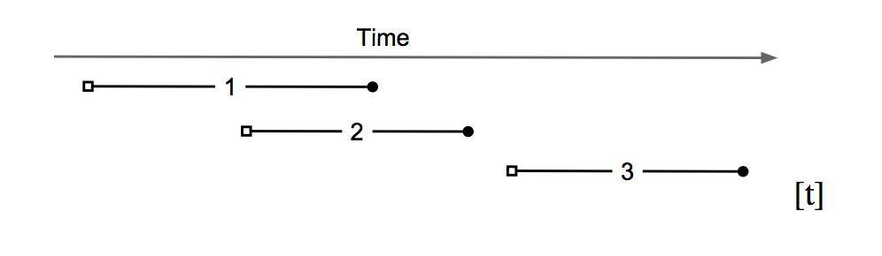
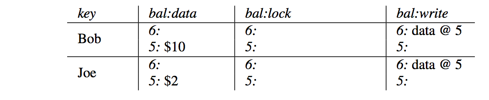
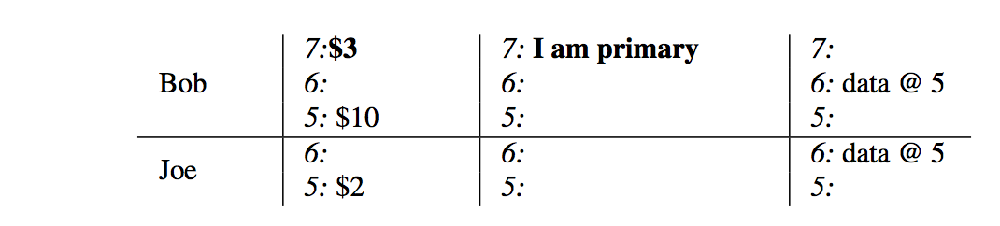
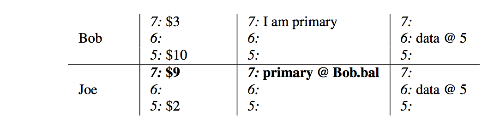
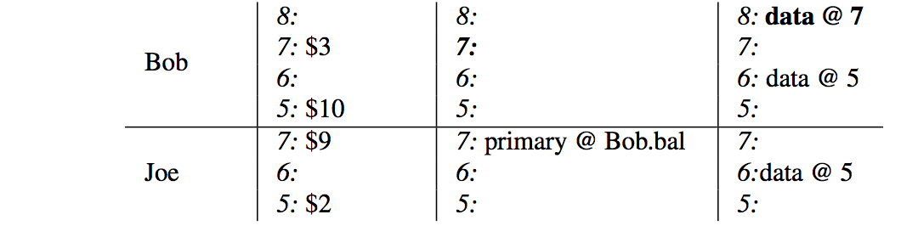
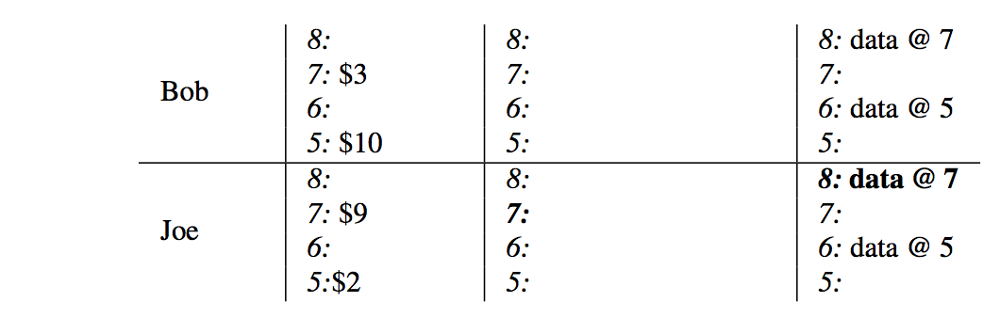

Percolator 的事务模型
===========================

- 原文：https://research.google.com/pubs/pub36726.html
- 论文中的伪代码： https://gist.github.com/chanfung032/bbc6f753cefe25656839e12ad71b31f5

概述
------------------

1. Bigtable 可以看作一个分布式、持久化存储的有序大 map。key-value 映射关系如下： ::

    (row, column, timestamp) => value

2. Bigtable 支持单行事务，也就是说支持同一个 row 下数据 read-modify-write 的原子操作。
3. Percolator 基于 Bigtable 构建，通过 *snapshot-isolation* + *两阶段提交* 提供跨行、跨表的事务。

Snapshot-Isolation
------------------------

Percolator 使用 Bigtable 的 timestamp 维度记录数据的多个版本，多个版本提供 *snapshot-isolation* ，使得每个事务的读仿佛都是读事务开始时间点上的 snapshot 一样。

如上图中的 3 个事务（空心方框处读、实心圆圈处写／提交）：

- 事务 2 看不到 事务 1 写的数据，因为其开始时间在事务 1 的提交时间之前。
- 事务 3 可以看到事务 1 和事务 2 提交的数据。
- 事务 1 和事务 2 并行运行。如果两个事务有写同一行的话，那么两个事务中有一个会失败。

*snapshot isolation* 的优点是读性能高，可以无锁读，只需要使用 timestamp 查找即可获取数据在某一时间点上的 snapshot。

Percolator 中的一个 column *c* 由 5 个 Bigtable column 组成，其中和事务相关的是以下 3 个：

- (row, *c:data*, start_ts) => value ，
- (row, *c:lock*, start_ts) => (primary.row,...)
- (row, *c:write*, commit_ts) => start_ts

其中 *start_ts* 是事务开始的时间， *commit_ts* 是事务提交的时间。

二阶段提交
----------------

**Prewrite阶段**

对于事务中所有更新的 row，选择其中一行作为 primary row，其余作为 secondary row，对于每一行：

1. 检查 write-write 冲突，即 c:write 在 [start_ts, ∞] 区间上是否有数据，如果有，说明该行被其它已经提交的事务更改过，失败返回。
2. 检查行是否已经上锁（有并行事务），如果有，失败返回。
3. 将要写入的数据写入 c:data。
4. 给行加锁，即写入 (row, c:lock, start_ts) => (primary.row,...) 。

**Commit阶段**

1. 检查 primary row 的 lock 是否还在，如果不在，失败返回。
2. 提交 primary row，即写入 (row, c:write, commit_ts) => start_ts 并删除 c:lock 的锁。primary row 提交成功即是整个事务成功。
3. 提交 secondary rows.

Get()
-------------------

事务中的 Get() 操作会检查 Get 的 row 在 [0, start_ts] 时间区间上是否有锁，如果有等待，直到锁释放（或者清理锁），然后返回数据。

假设有事务 W 在 :math:`commit\_ts_w` 提交，:math:`commit\_ts_w < start\_ts` ，因为事务在提交前必然要先给所有提交的 row 加锁，所以在 :math:`commit\_ts_w` 之后，事务 W 写的 row 要么已经是提交后的数据，要么是被锁，所以只要等待这个锁释放，start_ts 开始的事务就可以读到事务 W 的提交了。

如果锁是其它失败的事务留下来的，Get() 中会根据锁对应的 primary row 是否已经提交决定是 roll back 还是 roll forward。如果 primary row 还没有提交，那么直接删除 primary row 的 lock，roll back，反之提交该锁对应的事务，roll forward。

示例
------------------

以 Bob 给 Joe 转账 $7 为例：

初始状态下，Joe 的账户下有 $2，Bob $10 。

转账事务开始，选择 Bob 的账户记录 row 作为 primary row，start_ts = 7，给该行加锁并将新的数据写入 data 中。

给 Joe 的账号记录 row 加锁（secondary row，锁中包含了 primary row的信息），将新的数据写入 data 中。

事务开始提交，删除 Bob 的账户记录 row 上的 lock 并替换为 write 中的一条记录，commit_ts = 8，记录指向 start_ts = 7 的 data 数据。

最后，删除 Joe 账户记录上的 lock 并替换为 write 中的一条记录，记录指向 start_ts = 7 的 data 数据，事务完成。

