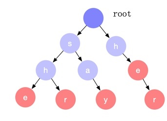
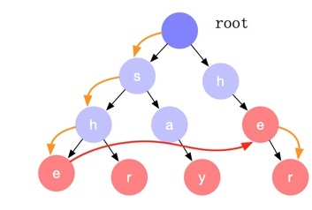
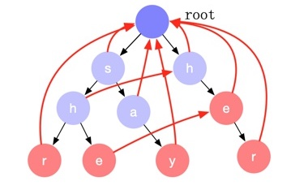
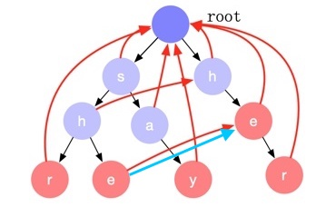

AC 自动机
===================================

- 论文：https://dl.acm.org/doi/10.1145/360825.360855
- 实现：https://github.com/chanfung032/labs/blob/master/Aho-Corasick/ac.go

概述
-------

给定一堆关键字和一篇文档，AC 自动机可以在文档中快速查找出所有的关键字匹配。算法复杂度为 O(n)，n 为文档的长度。AC 自动机正式的名字叫 Aho-Corasick 算法，以算法发明人 Alfred V. Aho 和 Margaret J.Corasick 的名字命名。

AC 自动机的构建包含三个步骤： 构建前缀树、计算失配指针、计算后缀匹配项。

我们以 {say, she, shr, he, her} 为例，来看下 AC 自动机的构建和查找过程。

构建前缀树 (Trie)
--------------------

https://zh.wikipedia.org/wiki/Trie

将关键词列表中的关键词逐个字符的加入前缀树。

因为前缀树只能顺着某一个路径往下匹配，如果中途遇到不匹配的节点，只能回溯然后从根节点选择另外一个分支继续往下匹配。以处理字符串 sher 为例：首先，我们匹配了 she 子树，下一个字符 r 无法匹配，这时需要回溯到开始，然后从前缀树的根节点再选择 her 分支往下匹配。但是观察可以发现 her 的前缀 he 是 she 的一个后缀，she 匹配也就意味着 he 已经匹配，我们可以直接跳过 her 子树的 he 匹配，直接从 e 节点开始继续往下匹配，这个横向的跳转就是 **失配指针** 。

AC 自动机构建的主要过程就是计算失配指针的过程。

计算失配指针
----------------

AC 自动机的前缀树的节点都存在失配指针，它表示从当前状态节点往下匹配失败后，我们应该跳转到哪个节点继续匹配。如上图中红色的箭头。

失配指针的计算过程如下：

1. 第二层节点的失配指针为根节点。
2. 从第三层开始对前缀树做宽度优先遍历。若当前处理到节点 x，从它的父节点开始沿着失配指针上溯直到根节点，如果中间遇到某个节点存在一个子节点，其字符和节点 x 的相同，那么就将节点 x 的失配指针指向这个子节点。否则失配指针为根节点。

完全计算完成后失配指针如下图所示：

计算后缀匹配项
----------------

我们看 she 字符串的匹配，当前缀树匹配到 e 这个节点的时候，代表匹配了 she 字符串，但其实 he 这个后缀也是匹配的。也就是说，对于前缀树上的每一个节点，我们除了判断节点本身是否是一个匹配项外，还需要判断其是否存在后缀匹配项。

后缀匹配项的计算方式如下：

宽度优先遍历所有节点，对于每一个节点 x，沿着其失配指针一直回溯直到根节点，中间遇到的节点如果是匹配节点（红色节点），那么这个节点代表的字符串就是节点 x 的一个后缀匹配项。实现中每个节点只需记录一个指向最长后缀匹配项节点的指针即可（下图中的蓝色箭头），查找的时候沿着这个指针上溯即可找到所有的后缀匹配项。

-----

这个算法可以用来解答 `Leet#1032 字符流 <https://leetcode-cn.com/problems/stream-of-characters/>`_ 问题。 `解答 <https://github.com/chanfung032/labs/blob/master/Aho-Corasick/leet-1032.go>`_ 。
