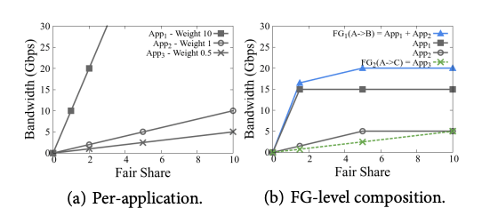
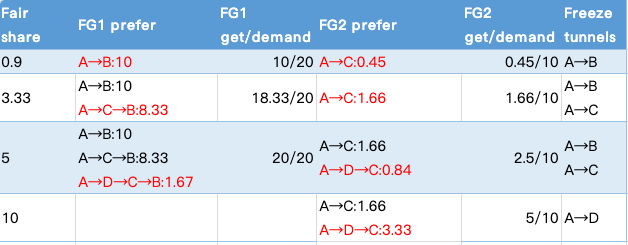

B4 Traffic Engineering Optimization 算法 (2013)
==================================================

本文内容主要来自下面两篇论文：

- `B4: Experience with a Globally Deployed Software Defined WAN (Google, 2013) <https://research.google/pubs/pub41761/>`_
- `BwE: Flexible, Hierarchical Bandwidth Allocation for WAN Distributed Computing (Google, 2015) <https://research.google/pubs/pub43838/>`_

B4 整体架构
----------------

B4 是谷歌的数据中心互联骨干网（Inter-DC Backbone），谷歌自己数据中心之间的流量会走 B4。除了 B4 之外，谷歌还有一个面向外部互联网的骨干网叫 B2（Internet Facing Backbone），从外部互联网到谷歌数据中心的流量走 B2。

B4 将数据中心之间的流量分为 3 种类型：

1. **用户数据复制** 到远程数据中心以保证数据的可用性和持久性（availability/durability)。这个数据量最小，但对延时比较敏感，优先级最高。比如服务器程序将用户正上传的文件保存到存储中，可能会有跨数据中心的写，此时用户可能正阻塞在等待上传请求的完成。
2. **远程存储访问** 进行 MapReduce 之类的分布式计算。
3. **大规模数据同步** 这个流量最大，但是对延迟不敏感，优先级最低。

B4 采用中心化的设计，每个数据中心将核心交换机的各种链路变更事件汇报给中心流量工程服务器（Central Traffic Engineering Server，以下简称 TE），TE 算出路由后下发给数据中心的核心交换机执行。

每个数据中心中，核心交换机负责转发流量，只运行一个 OpenFlow 客户端（OpenFlow Agent，简称 OFA）用来接收来自 OpenFlow 控制器（OpenFlow Controller，简称 OFC）的指令。主控制面程序运行在数据中心的服务器上（Network Control Servers，简称 NCS）。NCS 上运行网络控制、路由（Quagga）、TE 客户端、OpenFlow 控制器等各种控制程序，为了高可靠，这一套控制面程序会部署到多个服务器上，然后通过 paxos 选举一个主运行，其他热备。


核心交换机是谷歌自己攒的，网络包可以走正常的路由到对端，也可以通过隧道封包（IP in IP）让包走自定义路由。通过这种方式，B4 可以将最好的链路优先给到对延时敏感的流量。

一个栗子🫰：从数据中心 A 的服务器 10.0.0.1 发送一个包到另一个数据中心 B 的服务器 9.0.0.1 。在数据中心 A 的核心交换机上查询原生路由表（LPM Table）得该包从交换机的 2 口出去。查 TE 路由表（ACL Table）得到两条隧道路由，同样是从 2 口出去。B4 中 TE 路由的优先级高于原生路由，所以流量走隧道出去，交换机通过 ECMP 将流量均匀哈希到这两个隧道中。封包然后将包从 2 口发出去，封包后的外层目标 IP 保存的是隧道的 ID，中间路途中各个交换机根据这个隧道 ID 来获得这个包的下一条出口（下图中两个隧道的流量第一次都是在封包交换机的 2 口出去的，但是在途中交换机 1 上，不同隧道 ID 的出口就不一样了）。

.. image:: images/b4-forwarding.png

TE 架构
-----------

下面来说 TE 服务器，TE 的架构如下：


B4 TE 网关将各个数据中心上报上来的网络状态信息聚合并据此算出一个全网 **网络拓扑图**，图的顶点为数据中心，边为数据中心和数据中心间的链路，边的属性有：延时、带宽。

（每个数据中心可能有多个交换机、数据中心和数据中心的链路/专线可能有多条，但是在 TE 抽象中，一个数据中心就是一个点，两点之间一条边，多个交换机，多个链路/专线什么的由底下 ECMP 自行解决）

TE 算路的基本单位为一个一个的 **流量组（Flow Group，简称 FG）** ，一个流量组就是 :math:`\{源数据中心, 目的数据中心, QoS\}` 一样的流量集合，论文中 QoS 一带而过，可以先忽略。一个流量组的流量可能由好几个应用的流量组成，不同应用的流量有不同的优先级和带宽需求。一个应用的流量也可能包含在好几个流量组中。

TE 算路的结果会为每个流量组输出一个 **隧道组（Tunnel Group，简称 TG）** ，输出示例： :math:`\{A \rightarrow B \rightarrow C: 0.5, A \rightarrow C: 0.5\}` 表示两条路由，字母 A、B、C 代表数据中心 A、B、C，后面的数字是流量在多条路由间的分配比例。

带宽函数
-----------------

TE 通过带宽函数来描述每个应用的带宽需求： :math:`b(x) = \min(ax, c)`，其中 a 是应用的优先级，c 是应用需要的带宽上限。x 叫做 *fair share*，没有什么实际意义，就是一个用来统一度量不同应用带宽需求的尺度。

下面是 3 个应用的带宽函数，优先级分别为 10/1/0.5，带宽需求分别为 15G/5G/10G：

.. math::

    \begin{aligned} &
    b_{App1}(x) =  \min(10x, 15) \\ &
    b_{App2}(x) = \min(x, 5) \\ &
    b_{App3}(x) = \min(0.5x, 10)  &
    \end{aligned}

流量组的带宽函数由流量组包含的应用的带宽函数组和而成：

.. math::

    \begin{aligned}
    b_{FG1}(x) &=  b_{App1}(x) + b_{App2}(x) \\ 
    &= \min(10x, 15) + \min(x, 5) \\ 
    b_{FG2}(x) &= b_{App3}(x) \\ 
    &= \min(0.5x, 10)  &
    \end{aligned}

函数图像：



带宽需求预估
------------------

数据中心和数据中心间的带宽资源是稀缺资源，TE 也只能尽最大可能满足各个流量组的需求，满足不了的就需要控制带宽，B4 还有一个重要的组件 **带宽管理器（Bandwidth Enforcer，简称 BwE）**，BwE 运行在数据中心的每台服务器上，从源端控制带宽，也会通过 IP 包的 DSCP 字段将信息带给交换机，告诉交换机拥塞的时候选择优先保哪些包（BwE §1）。

带宽函数中的带宽需求常数并不是用户自己瞎估的，而是 BwE 近实时统计的。每隔一段时间 :math:`\Delta t` 采样一下带宽使用，根据以下公式估算得到带宽需求常数（BwE §6.1）：

.. math::

    Demand = \max(\max_{\Delta t}(usage) \times scale, min\_demand)

scale 是一个稍稍大于 1 的常数。

最大最小公平 Max-Min Fairness
-------------------------------------

B4 算路算法的目标是实现最大最小公平，什么是 **最大最小公平**？

在资源分配中，假设资源总量为 S，有 n 个用户，他们的需求分别为 :math:`r_1, r_2, \dots, r_n`，并且 :math:`r_1 < r_2 < \dots < r_n`，如何在满足每个用户的需求的同时兼顾公平，避免出现部分用户分配不到资源的情况，就需要引入 **公平算法** 。

最大最小公平分配算法就是这样的一种公平算法，补全并分词后应该叫： **最大（化）/最小（分配）/公平算法**，顾名思义，这个算法最大化了最小需求用户分配到的资源。算法步骤如下：

1. 将资源 :math:`S/n`` 分配给需求的用户 1。然后将超出需求的部分 a 回收，如果没有超出，那么 a=0 。
2. 计算当前剩余资源总量 :math:`S = S - S/n + a`，将 :math:`S/(n-1)` 分配给需求次小的用户 2，将超出的需求 a 回收。
3. 重复步骤 2 直到所有的用户都分配到资源。

或者，也可以按如下步骤，两者最后效果一样：

1. 将资源 :math:`S/n` 分配给每一个用户。
2. 如果分配的资源超过了用户的需求，回收超出的部分。
3. 将第 2 步中回收的资源平均分配给上一轮中尚未得到满足的用户。
4. 重复步骤 2、3，直到没有回收的资源为止。

**最大最小公平分配算法** 实现的公平就叫 **最大最小公平**。

`https://yoelee.github.io/2018/02/24/Yarn源码分析4-资源调度算法/ <https://yoelee.github.io/2018/02/24/Yarn%E6%BA%90%E7%A0%81%E5%88%86%E6%9E%904-%E8%B5%84%E6%BA%90%E8%B0%83%E5%BA%A6%E7%AE%97%E6%B3%95/>`_

TE 算路算法
-----------------------

算法主要分两步：

1. 为每一个流量组（FG）计算对应的隧道组（TG）。
2. 隧道组离散化。交换机在同一个隧道组内按比例分配流量的时候做不到无限精细，而只能做到某一个粒度，离散化就是将第一步计算得到的比例对齐到交换机能够分配的粒度上去。

设有数据中心 A、B、C、D，网络拓扑结构如下，延时/带宽标在边上。


流量组 :math:`FG1(A \rightarrow B)` 需要带宽 20G，流量组 :math:`FG2(A \rightarrow C)` 需要 10G。流量组的带宽函数如前文所述。

计算隧道组
`````````````

第一轮，使用最短路径算法（按延时）计算得到 FG1 和 FG2 流量组的最优路由，一开始当然都是直连最优。当 fair share 为 0.9 时，计算可得 FG1 和 FG2 分配到的带宽分别为 10G 和 0.45G，此时 :math:`A \rightarrow B` 直连路由的带宽达到带宽限上限。

第二轮，去除 :math:`A \rightarrow B` 边，重新计算最短路径，此时 FG1 的最佳路由为 :math:`A \rightarrow C \rightarrow B`，FG2 仍然是直连。继续分配，当 fair share 为 3.33 时，FG1 和 FG2 分配到的带宽分别为 18.33 G 和 1.66G，FG1 中 :math:`A \rightarrow B` 10G，:math:`A \rightarrow C \rightarrow B` 8.33G，FG1 中路径 :math:`A \rightarrow C` 本轮分配的带宽 8.33G 加上 FG2 两轮分配到的 1.66G 总共 10G，达到路径带宽上限。

第三轮，去除 :math:`A \rightarrow C` 边，重新计算最短路径，此时 FG1 的最佳路由为 :math:`A \rightarrow D \rightarrow C \rightarrow B`， FG2 的最佳路由为 :math:`A \rightarrow D \rightarrow C`。继续分配，当 fair share 为 5 时，此时 FG1 和 FG2 分配到的带宽分别为 20G 和 2.5G，FG1 的需求被完全满足。

最后，路径 :math:`A \rightarrow D` 还剩带宽 3.33G，全部给 FG2 :math:`A \rightarrow D \rightarrow C` 路由，FG2 最后加起来只能分配到 5G 流量，部分满足需求。

整个过程如下表所示：



计算得流量组的路由以及带宽分配结果为：

.. math::

    \begin{aligned}
    FG1 \quad & \{A \rightarrow B: 10G, A \rightarrow C \rightarrow B: 8.33G, A \rightarrow D \rightarrow C \rightarrow B: 1.67G\} \\
    FG2 \quad & \{A \rightarrow C: 1.66G, A \rightarrow D \rightarrow C: 3.33G\}
    \end{aligned} 

将带宽转换为比例就得到初步的隧道组（TG）：

.. math::

    \begin{aligned}
    TG1 \quad & \{A \rightarrow B: 0.5, A \rightarrow C \rightarrow B: 0.4, A \rightarrow D \rightarrow C \rightarrow B: 0.1\} \\
    TG2 \quad & \{A \rightarrow C: 0.3, A \rightarrow D \rightarrow C: 0.7\}
    \end{aligned} 

FG1 的带宽需求完全得到满足，它的 faire share 记为 ∞，FG2 的 faire share 为 10。

离散化隧道组内流量分配比例
`````````````````````````````

B4 采用贪心算法来离散化比例（Quantization），假设交换机最小只能分配到 0.5 这个比例。离散化的计算步骤如下：

1. 取 TG2，将组内所有的比例向下取整（down-quantize），得 :math:`\{A \rightarrow C: 0, A \rightarrow D \rightarrow C: 0.5\}` 。
2. 取整后还剩 0.5 的比例没有分配，尝试将其加入某条隧道后检查对其他隧道组的影响。

   如果加到 :math:`A \rightarrow C` 隧道中，此时 TG2 中 :math:`A \rightarrow C` 隧道已使用了 2.5G 的带宽，还剩 7.5 G 带宽，检查 TG1 会发现，TG1 中 :math:`A \rightarrow C \rightarrow B` 这个隧道没法使用了，因为分配粒度只能到 0.5G，最小得分配 10G 的流量，所以 TG1 :math:`A \rightarrow C \rightarrow B` 隧道的比例只能降为 0，同理 :math:`A \rightarrow D \rightarrow C \rightarrow B` 隧道的带宽都不够最小分配粒度，无法使用，最后 TG1 重新计算后为 :math:`\{A \rightarrow B:1\}`，此时 fair share 约为 0.9 无法满足全部带宽需求。

   加到 :math:`A \rightarrow D \rightarrow C` 隧道中，TG1 重新计算后为 :math:`\{A \rightarrow B: 0.5, A \rightarrow C \rightarrow B: 0.5\}`，完全满足 FG1 的带宽需求。

   比较之后肯定选择后面这个影响小的方案。（影响小这个感性的说法可以通过 fair share 来量化，将所有流量组的 fair share 归到一起并排序，前一个分配方案 fair share 变为了 :math:`(0.9, 5)`， 后一个不变，仍然为 :math:`(5, \infty)` ，所以选后面这个。fair share 越高说明分配得越公平，所以这个变量也不是完全没有意义，可以叫公平系数？）

最终输出的流量组：

.. math::

    \begin{aligned}
    TG1 \quad & \{A \rightarrow B: 0.5, A \rightarrow C \rightarrow B: 0.5\} \\
    TG2 \quad & \{A \rightarrow D \rightarrow C: 1\}
    \end{aligned} 


上图中左侧为上文计算得到的流量组结果，右侧为另一个不同需求情况下计算出的不同路由结果，两厢对比可以看到不同的带宽需求对路由计算的影响。

生产环境中，隧道组流量分配比例的最小力度为 0.25，最多可能有 4 条隧道。