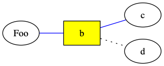
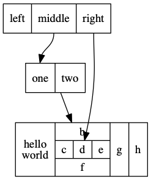

Dot 画图常用语法
====================

有向图
--------

::

    digraph {
        a -> b
    }

.. image:: images/dot-digraph.png

无向图
-----------

::

    graph {
        a -- b
    }

.. image:: images/dot-graph.png

图属性
-----------

- ``label="My Graph"`` 给图添加标题。
- ``rankdir=LR`` 默认图为上下布局，修改为左右布局。
- ``{rank=same; a, b, c }``  将 a, b, c 画到同一个层级上

::

    digraph {
        label="xyz"
        rankdir=LR
        {rank=same; a, b}

        a -> b
        b -> c
    }

.. image:: images/dot-graph-attrs.png

节点属性
-----------

- ``label="XXX"`` 修改节点中的文字内容
- ``color=red`` 修改节点边框 颜色_
- ``style=filled, fillcolor=yellow`` 给节点添加填充色
- ``shape`` `节点形状 <http://graphviz.org/doc/info/shapes.html>`_

边属性
------------

- ``label="XXX"`` 给边添加说明信息
- ``color=red`` 修改边 颜色_
- ``penwidth=2.0`` 修改边宽度
- ``style=dotted`` 修改边的样式

::

    graph {
        rankdir=LR

        a [label="Foo"]
        b [shape=box, style=filled, fillcolor=yellow]
        a -- b -- c [color=blue]
        b -- d [style=dotted]
    }

.. _颜色: http://graphviz.org/doc/info/colors.html

常见的节点和边样式属性：

Record 节点
----------------

::

    digraph structs {
        node [shape=record];

        struct1 [shape=record,label="<f0> left|<f1> middle|<f2> right"];
        struct2 [shape=record,label="<f0> one|<f1> two"];
        struct3 [shape=record,label="hello\nworld |{ b |{c|<here> d|e}| f}| g | h"];

        struct1:f1 -> struct2:f0;
        struct1:f2 -> struct3:here;
        struct2 -> struct3
    }

命令行参数
--------------

将图源码保存为 ``input.dot`` 文件，执行以下命令生成 png 图：

.. code-block:: console

    $ dot -Tpng -o output.png input.dot
