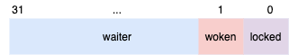

Go 语言实现——同步原语
=========================

Mutex
`````````

正常模式
------------

先看 Go1.8 的 Mutex 实现，这个版本的 Mutex 实现还比较简单，1.9 开始 Mutex 加入了一个饥饿模式的优化，这个后面再说。

Mutex 定义如下：

.. code-block:: go

    type Mutex struct {
        state int32
        sema  uint32
    }

其中 ``state`` 为当前 Mutex 的状态，``sema`` 是解锁信号量。

``state`` 的状态位定义如下：

.. code-block:: go

    const (
        mutexLocked = 1 << iota // mutex is locked
        mutexWoken
        mutexWaiterShift = iota
    )

从最低位开始：
    


- 第一个比特位表示“当前 Mutex 是不是已经上锁”。
- 第二个比特位表示“当前有 goroutine 处于自旋或者收到解锁信号目前处于运行状态”。
- 剩余的位用作计数器，存当前有多少 goroutine 正在等待解锁的信号量。

Mutex 上锁的逻辑如下：

1. 首先使用 CAS 尝试上锁，如果成功直接返回。
2. 如果失败，自旋几次等待解锁并重新尝试上锁。
3. 自旋次数太多后，将 goroutine 睡眠，等待 Unlock 发信号唤醒。

.. code-block:: go

    func (m *Mutex) Lock() {
        // CAS 尝试上锁，成功直接返回
        if atomic.CompareAndSwapInt32(&m.state, 0, mutexLocked) {
            return
        }

        awoke := false
        iter := 0
        for {
            old := m.state
            new := old | mutexLocked

            // 如果锁已经被其它 goroutine 持有了
            if old&mutexLocked != 0 {
                // 检查当前 goroutine 能不能够自旋
                if runtime_canSpin(iter) {
                    // 设置 woken 标示位，告诉 Unlock 不用唤醒 goroutine
                    // 有 goroutine 处在运行状态
                    if !awoke && old&mutexWoken == 0 && old>>mutexWaiterShift != 0 &&
                        atomic.CompareAndSwapInt32(&m.state, old, old|mutexWoken) {
                        awoke = true
                    }
                    // 一次自旋等待解锁
                    runtime_doSpin()
                    iter++
                    continue
                }
                // 不能自旋，计数器 + 1
                new = old + 1<<mutexWaiterShift
            }
            // 如果 mutexWoken 被置位的话，清除标志位
            if awoke {
                new &^= mutexWoken
            }
            // 尝试加锁或者睡眠等待解锁信号
            if atomic.CompareAndSwapInt32(&m.state, old, new) {
                // 加锁成功，返回
                if old&mutexLocked == 0 {
                    break
                }
                // 睡眠 💤 等待解锁信号
                runtime_SemacquireMutex(&m.sema)
                // 收到解锁信号，回循环开始重新开始尝试加锁
                awoke = true
                iter = 0
            }
        }
    }

要进入自旋也是有条件限制的：

1. 自旋的次数小于 4（别一直自旋，浪费 CPU）。
2. 运行在多核机器上（单核机器自旋没有意义）。
3. 其它逻辑线程 P 至少得有一个处在工作状态，而不是都在无所事事（加上下面的条件 4，如果都在无所事事，那么自旋等也等来不来解锁的，除非有新的 goroutine 进来，所以这种情况下还是睡眠等信号吧）。
4. 当前 goroutine 归属的逻辑线程 P 上只有当前 goroutine 一个，没有其它了。
   
.. code-block:: go

    func sync_runtime_canSpin(i int) bool {
        if i >= 4 || ncpu <= 1 || int32(sched.npidle+sched.nmspinning)+1 >= gomaxprocs {
            return false
        }
        if p := getg().m.p.ptr(); !runqempty(p) {
            return false
        }
        return true
    }

自旋就是执行 30 次 PAUSE 指令。

.. code-block:: go

    func sync_runtime_doSpin() {
        procyield(30)
    }

    TEXT runtime·procyield(SB),NOSPLIT,$0-0
        MOVL    cycles+0(FP), AX
    again:
        PAUSE
        SUBL    $1, AX
        JNZ again
        RET

而解锁的逻辑就是：

1. 首先解锁。如果等待锁的 goroutine 有在运行状态的，直接返回就行。
2. 如果没有，那么使用信号量给等待的 goroutine 发送个信号。

.. code-block:: go

    func (m *Mutex) Unlock() {
        // 解锁
        new := atomic.AddInt32(&m.state, -mutexLocked)

        old := new
        for {
            // old>>mutexWaiterShift 是当前等待解锁信号量的 goroutine 计数器
            // 如果没有等待解锁信号量的 goroutine，或者刚解的锁已经被其它 goroutine 重新上锁
            // 或者有在自旋等待锁的 goroutine，直接返回。
            if old>>mutexWaiterShift == 0 || old&(mutexLocked|mutexWoken) != 0 {
                return
            }
            // 等待解锁信号量的 goroutine 数减 1 并且设置“已经有 goroutine 唤醒”标志位。
            new = (old - 1<<mutexWaiterShift) | mutexWoken
            if atomic.CompareAndSwapInt32(&m.state, old, new) {
                runtime_Semrelease(&m.sema)
                return
            }
            old = m.state
        }
    }

https://github.com/golang/go/blob/release-branch.go1.8/src/sync/mutex.go

饥饿模式
--------------

上面正常模式运行下的 Mutex 有一个问题，就是通过 ``runtime_Semrelease`` 信号通知的等待锁的 goroutine 相比于自旋正在等待锁或者运行中的等待锁的 goroutine 有点弱势，因为收到信号后 goroutine 并不是立刻运行，只是被加入了可运行队列，抢锁就很容易抢不过正在 CPU 上运行着的 goroutine，因此 Go1.9 之后 Go 新加了一个饥饿模式，在这个模式下，通过 ``runtime_SemacquireMutex`` 唤醒的 goroutine 会检查自己等待锁的时间是不是太长了，如果是那么就将锁的争抢模式改为“饥饿模式”，禁止自旋，所有等待锁的进程都排排坐吃果果。另外，``runtime_SemacquireMutex`` 的时候将自己直接加到等待队列的前面，优先获取锁。

详细参见：

- https://github.com/golang/go/issues/13086
- https://github.com/golang/go/commit/0556e26273f704db73df9e7c4c3d2e8434dec7be#diff-f6dc3e83d9b4548fbba149aca4d4307b8d4551951978fd9c1b98dff9c1ada149

RWMutex
```````````

RWMutex 结构体如下：

.. code-block:: go

    type RWMutex struct {
        w           Mutex  // 写锁
        writerSem   uint32 // 读锁释放信号量
        readerSem   uint32 // 写锁释放信号量
        readerCount int32  // 已上的读锁计数器，为负的时候表示已加写锁
        readerWait  int32  // 加写锁时读锁计数器的值，写锁加完后需
                           // 要等待之前这些读锁全部释放整个写锁加锁过程才算完成
                           // 写锁加上后后续上读锁操作会阻塞，直接等待写锁释放信号
    }

上读锁比较简单，就是给读锁计数器加一，如果计数器的值为负数，说明 RWMutex 当前已上写锁，此时需要等写锁释放，才算上锁完成。

释放读锁的时候计数器减一，同时需要判断当前是不是有写锁，如果有写锁的话，判断写锁等待的那些读锁是不是全部释放完毕，是的话通知写锁“所有读锁已经释放，可以返回进行写操作了”。

.. code-block:: go

    func (rw *RWMutex) RLock() {
        // 更新读操作计数器，如果值为负，说明有写锁
        // 直接等待写锁释放信号，否则返回上读锁成功。
        if atomic.AddInt32(&rw.readerCount, 1) < 0 {
            runtime_Semacquire(&rw.readerSem)
        }
    }

    func (rw *RWMutex) RUnlock() {
        // 更新读操作计数器，如果计数器为负，说明有写锁
        if r := atomic.AddInt32(&rw.readerCount, -1); r < 0 {
            // 更新 readerWait 计数器，当计数器为 0，说明加写锁时正在执行的读操作已经完成
            if atomic.AddInt32(&rw.readerWait, -1) == 0 {
                // 通知读锁全部释放了
                runtime_Semrelease(&rw.writerSem, false)
            }
        }
    }

写锁就是 RWMutex 中的 w 这个 Mutex 排他锁，加写锁的第一件事就是上这个排他锁，保证只能有一个写操作在执行，然后修改 readerCount 为负数，这个主要是通知读锁操作，我这边已经加了写锁了，后续上读锁直接等我 *写锁释放信号* 就行。将此时的 readerCount 快照下来，等待这些读锁释放后，就可以返回进行写操作了。

.. code-block:: go

    const rwmutexMaxReaders = 1 << 30

    func (rw *RWMutex) Lock() {
        // 加写锁
        rw.w.Lock()
        // 将 readerCount 减去一个常数变成负数，作为加了写锁的标示
        r := atomic.AddInt32(&rw.readerCount, -rwmutexMaxReaders) + rwmutexMaxReaders
        // 记录当前正在执行的读操作数量
        if r != 0 && atomic.AddInt32(&rw.readerWait, r) != 0 {
            // 等待上面记录的这些读操作完成的信号
            runtime_Semacquire(&rw.writerSem)
        }
    }

    func (rw *RWMutex) Unlock() {
        // 将 readerCount 恢复原样
        r := atomic.AddInt32(&rw.readerCount, rwmutexMaxReaders)
        // 通知这些读操作写锁已经释放了
        for i := 0; i < int(r); i++ {
            runtime_Semrelease(&rw.readerSem, false)
        }
        // 释放写锁
        rw.w.Unlock()
    }

-----

    If a goroutine holds a RWMutex for reading and another goroutine might call Lock, no goroutine should expect to be able to acquire a read lock until the initial read lock is released. In particular, this prohibits recursive read locking. This is to ensure that the lock eventually becomes available; a blocked Lock call excludes new readers from acquiring the lock.

    -- https://pkg.go.dev/sync#RWMutex

因为加写锁：

1. 需要等待 *加锁前所有的读锁* 释放才算整个加锁过程完成。
2. 加锁后 *后续的读锁操作* 直接阻塞并等待写锁释放信号才能上锁。

就造成了上面引用的官方文档里说的现象。

这个用 https://www.zenlife.tk/go-read-mutex-block.md 中的一段代码来说明。

.. code-block:: go

    package main

    import (
        "fmt"
        "time"
        "sync"
    )

    // g1
    func main() {
        var mu sync.RWMutex

        // g2
        go func() {
            mu.RLock()
            time.Sleep(10*time.Second)
            mu.RUnlock()
        }()

        time.Sleep(100*time.Millisecond)

        // g3
        go func() {
         	mu.Lock()
         	mu.Unlock()
        }()

        time.Sleep(100*time.Millisecond)

        start := time.Now()
        fmt.Println("before get read block")
        // 会被 g2 阻塞
        mu.RLock()
        fmt.Println("inside read load no block", time.Since(start))
        mu.RUnlock()
    }

我们以 g1, g2, g3 分别标示上面代码中的几个 goroutine，g1 最后的 RLock 会被 g2 的 RLock 阻塞。整个逻辑链条如下：

1. g2 中给 RWMutex 上了一个读锁。
2. g3 中尝试给 RWMutex 上写锁，写锁需要等待 g2 中加的读锁完成才算加锁完成。
3. g1 中上读锁时，发现有写锁，直接阻塞等待写锁释放的信号。
4. 10 秒之后，g2 中的读锁释放，写锁等到释放信号，完成加锁，然后写锁释放，g1 等到释放信号，继续上读锁操作。