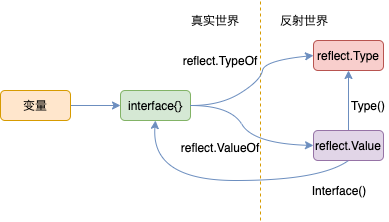

# Go 语言实现——反射

## 基本使用



reflect 包最重要的两个数据结构就是 `Type` 和 `Value`，定义如下：

```go
type Type interface {
    Align() int
    FieldAlign() int
    Method(int) Method
    MethodByName(string) (Method, bool)
    NumMethod() int
    Name() string
    PkgPath() string
    Size() uintptr
    String() string
    Kind() Kind
    Implements(u Type) bool
    // ...
}

type Value struct {
    // 类型指针
    typ *rtype
    // 数据指针
    ptr unsafe.Pointer

    flag
}
```

- 变量通过 `reflect.TypeOf`、 `reflect.ValueOf` 可以反射得到 `Type`、 `Value`。
- `Type` 是一个接口，这个接口定义了获取类型信息的各种接口，`Value` 是个结构体，这个结构体里保存了变量的数据信息，其字段都是私有，所以得通过结构体的方法来获取数据信息。
- `Value` 调用自身的 `Interface()` 方法可以将数据再反射回原始数据（interface{} 类型，通过类型断言可以回到最原始的数据）。
- `Value` 调用自身的 `Type()` 方法可以获得类型信息。

## 反射和 interface{}

从 {doc}`golang-internals-variable` 中关于 interface{} 的实现可以看出，interface{} 是 Go 类型信息的注入点，`reflect.TypeOf` 和 `reflect.ValueOf` 的入口参数类型都是 interface{}。

`TypeOf` 直接返回 interface{} 的类型指针。

```go
func TypeOf(i interface{}) Type {
    eface := *(*emptyInterface)(unsafe.Pointer(&i))
    return toType(eface.typ)
}

func toType(t *rtype) Type {
    if t == nil {
        return nil
    }
    return t
}

type emptyInterface struct {
    typ  *rtype
    word unsafe.Pointer
}
```

`ValueOf` 将 interface{} 的类型指针和数据指针封装在 `Value` 结构体中返回。

```go
func ValueOf(i interface{}) Value {
    if i == nil {
        return Value{}
    }

    escapes(i)

    return unpackEface(i)
}

func unpackEface(i interface{}) Value {
    e := (*emptyInterface)(unsafe.Pointer(&i))
    t := e.typ
    if t == nil {
        return Value{}
    }
    f := flag(t.Kind())
    if ifaceIndir(t) {
        f |= flagIndir
    }
    return Value{t, e.word, f}
}
```

## 静态类型（static type）和实际类型（underlying type）

> The static type (or just type) of a variable is the type given in its declaration, the type provided in the new call or composite literal, or the type of an element of a structured variable.

```go
var r io.Reader
tty, err := os.OpenFile("/dev/tty", os.O_RDWR, 0)
if err != nil {
    return nil, err
}
r = tty
```

上面的代码中：

- `r` 的（静态）类型是 `io.Reader`，Go 会在编译期作类型检查。
- `io.Reader` 是一个 interface ，运行时它在内存中是一个 `iface` 结构体，这个结构体中的类型指针指向 `*os.File` 这个实际类型（不是 `io.Reader`），数据指针指向 `tty` 。

因此，通过类型断言，我们还可以将 `r` 给转换成 `io.Writer` 类型。

```go
var w io.Writer
w = r.(io.Writer)
```

## 方法

```go
type Person struct{}

func (p Person) SayHello(message string) {}

func main() {
    p := Person{}
    fmt.Println(reflect.TypeOf(p.SayHello))
    // 输出：func(string)

    fmt.Println(reflect.TypeOf(Person.SayHello))
    // 输出：func(main.Person, string)
}
```

``Person.SayHello(Person{}, "me")`` 和 ``Person{}.SayHello("me")`` 这两个调用虽然是等价的，底层最终编译成的代码也是一样的，但是这两个类型是不一样的，一个是 ``未绑定方法（Unbounded method）``，一个是 ``绑定方法（Bounded method）``，这样通过 ``reflect.Value.Call`` 调用方法传参的时候就和正常调用一样，未绑定方法需要传需要绑定的对象，而绑定方法不用。

实现方法就是绑定方法的 ``reflect.ValueOf(p.SayHello)`` 里包含了指向绑定对象的指针和一个适配函数，通过适配函数来完成额外的绑定对象这个参数的传递，详细参见： [https://golang.org/s/go11func](https://golang.org/s/go11func) 。

## 使用场景一：修饰器 Decorator

以修饰 [nats.io](https://pkg.go.dev/github.com/nats-io/nats.go#Conn.Subscribe>) 消息队列客户端的 ``Conn.Subscribe`` 函数的回调处理函数为例，这类处理函数一般都是先解码请求、处理请求生成响应、编码响应这个流程。

```go
nc.Subscribe("foo", func(m *nats.Msg) {
    var reqeust requestType
    json.Unmarshal(m.Data, &request)

    var reply replyType
    reply.X = "blahblah"

    replyData, _ := json.Marshal(&reply)
    m.Respond(replyData)
})
```

处理函数多了，每个函数都写一遍解码编码很麻烦，如果处理函数能够类似 rpc 处理函数一样，将编解码的部分抽出来，处理函数中直接处理请求/响应的结构体，写起来就会方便得多，类似下面这样：


```go
nc.Subscribe("foo", makeRequestReplyHandler(func (request *requestType, reply *replyType) {
    reply.X = "blahblah"
}))
```

上面的这个 ``makeRequestReplyHandler`` 修饰器需要用到 ``reflect`` 来实现：

```go
func makeRequestReplyHandler(cb interface{}) nats.MsgHandler {
    f := reflect.ValueOf(cb)
    typ := f.Type()

    if typ.Kind() != reflect.Func {
        panic("not a function")
    }
    numParams := typ.NumIn()
    if numParams != 2 {
        panic("invalid param number")
    }
    reqType := typ.In(0)
    replyType := typ.In(1)
    if reqType.Kind() != reflect.Pointer || replyType.Kind() != reflect.Pointer {
        panic("invalid request/reply type")
    }

    return func(m *nats.Msg) {
        req := reflect.New(reqType.Elem())
        reply := reflect.New(replyType.Elem())

        json.Unmarshal(m.Data, req.Interface())
        f.Call([]reflect.Value{req, reply})
        replyData, _ := json.Marshal(reply.Interface())

        m.Respond(replyData)
    }
}
```

最后，通过 [reflect.MakeFunc](https://pkg.go.dev/reflect#MakeFunc) 函数还能实现更复杂的泛型的修饰器，详细可以参考： [https://coolshell.cn/articles/17929.html#泛型的修饰器](https://coolshell.cn/articles/17929.html#%E6%B3%9B%E5%9E%8B%E7%9A%84%E4%BF%AE%E9%A5%B0%E5%99%A8)