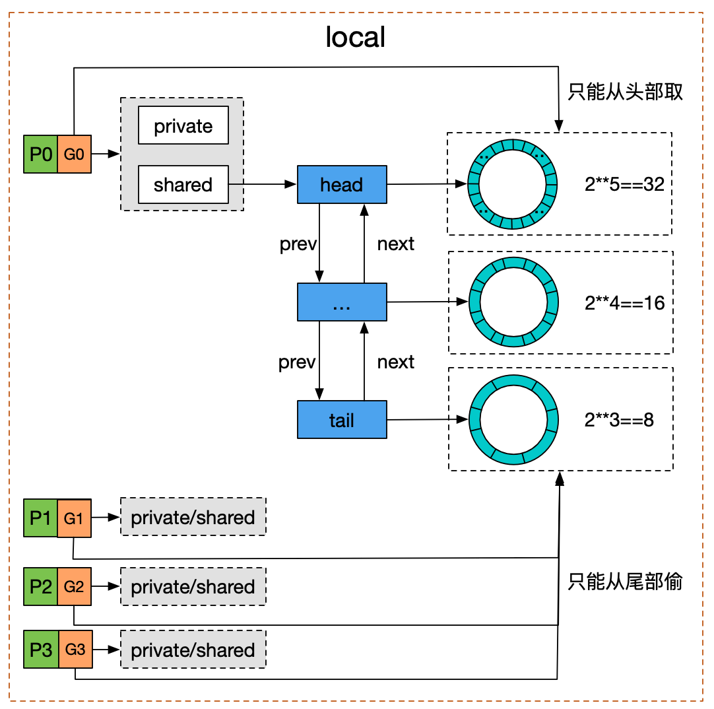

Go 语言实现——sync.Pool
============================

使用示例
------------

sync.Pool 可以用来池化复用一些需要频繁申请释放的临时对象，减小 gc 的压力从而提高性能。

前述 :doc:`golang-internals-io-copy-and-zerocopy` 中提到的 splice 就使用 sync.Pool 对第一步需要创建的 pipe 进行了池化复用。

.. code-block:: go

    type splicePipe struct {
        // ...
    }

    // 如果不指定 New 方法，那么在 pool 中没有可用对象的时候，pool.Get 就返回 nil
    // 如果指定了则会调用 New 函数新建一个对象。
    var splicePipePool = sync.Pool{New: newPoolPipe}

    func newPoolPipe() interface{} {
        // 创建并初始化一个新的 splicePipe 对象
        p := newPipe()
        // 设置这个新的对象 gc 前调用 destroyPipe 函数
        runtime.SetFinalizer(p, destroyPipe)
        return p
    }

    func getPipe() (*splicePipe, string, error) {
        // 从 pool 中去一个闲置对象或者创建一个新对象
        v := splicePipePool.Get()
        return v.(*splicePipe), "", nil
    }

    func putPipe(p *splicePipe) {
        // 将闲置对象放回 pool 中
        splicePipePool.Put(p)
    }

    func destroyPipe(p *splicePipe) {
        // cleanup ...
    }

https://github.com/golang/go/blob/release-branch.go1.17/src/internal/poll/splice_linux.go#L166

实现
------------

``sync.Pool`` 结构体定义：

.. code-block:: go

    type Pool struct {
        // P 是 虚拟线程的个数
        local     [P]poolLocal
        victim    [P]poolLocal

        New func() interface{}
    }

    type poolLocal struct {
        private interface{} // 只能被本地 P 使用的对象
        shared  poolChain   // 本地 P 使用 pushHead/popHead 操作对象; 其它 P 可以调用 popTail 从里面偷对象
    }

每个虚拟线程维护一个 poolLocal，优先使用 poolLocal 来存储、获取闲置对象，当 poolLocal 没有可用闲置对象的时候，也可以从其它虚拟线程的 poolLocal.shared 中偷闲置对象。类似 GMP 调度中从其它线程偷 goroutine。

往 pool 中存闲置对象的时候。

1. 首先检查 poolLocal.private 是不是 nil，如果是 nil 直接存在 private 中。
2. 如果不为空，再将对象 pushHead 进 poolLocal.shared 中。

.. code-block:: go

    func (p *Pool) Put(x interface{}) {
        if x == nil {
            return
        }
        pid := runtime_procPin()
        l := p.local[pid]
        if l.private == nil {
            l.private = x
            x = nil
        }
        if x != nil {
            l.shared.pushHead(x)
        }
        runtime_procUnpin()
    }

从 pool 中获取闲置对象的时候。

1. 首先检查 private 是不是空，如果不为空直接返回 private。
2. 否则 popHead 从 poolLocal.shared 中尝试获取一个闲置对象返回。
3. 如果 poolLocal.shared 中也没有闲置对象，那么尝试从其它线程的 poolLocal 中偷一个闲置对象，逻辑同 1 和 2。
4. 如果还没有再从 p.victim 中安装前面 1、2、3 的逻辑尝试获取闲置对象返回。
5. 如果上述都失败，如果 pool.New 不为空，则调用 pool.New 新建一个对象返回。

第 4 步的 victim 的来历如下，每次 gc 执行前会调用 sync.Pool 注册的一个清理函数会执行 ``pool.victim, pool.local = nil, p.victim`` 清理长期不使用的闲置对象，如果一个对象在两次 gc 期间都没有被 Get，这个对象就会被 gc 回收。

.. code-block:: go

    func (p *Pool) Get() interface{} {
        pid := runtime_procPin()
        l := p.local[pid]
        x := l.private
        l.private = nil
        if x == nil {
            x, _ = l.shared.popHead()
            if x == nil {
                x = p.getSlow(pid)
            }
        }
        runtime_procUnpin()
        if x == nil && p.New != nil {
            x = p.New()
        }
        return x
    }

    func (p *Pool) getSlow(pid int) interface{} {
        // 尝试从其它线程的 localPool.shared 中偷一个闲置对象
        size := len(p.locals)
        locals := p.local
        for i := 0; i < size; i++ {
            l := p.locals[(pid+i+1)%int(size)]
            if x, _ := l.shared.popTail(); x != nil {
                return x
            }
        }

        // 尝试从 p.victim 中获取一个闲置对象。
        // sync.Pool 注册了一个 cleanup 函数，这个函数在每次 gc 前执行一次，
        locals = p.victim[pid]
        if x := l.private; x != nil {
            l.private = nil
            return x
        }
        for i := 0; i < int(size); i++ {
            l := indexLocal(locals, (pid+i)%int(size))
            if x, _ := l.shared.popTail(); x != nil {
                return x
            }
        }

        return nil
    }

下面是 Google 的一张图，poolLocal.shared 数据结构是一个 双向链表 + ringbuffer，可以忽略。看主要逻辑就行。

