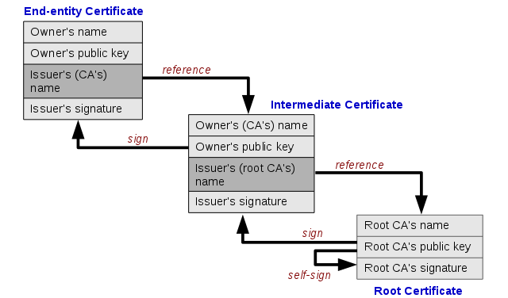

HTTPS——证书校验
=========================

几个概念
-------------

**X.509** 是公钥证书的格式标准，X.509 证书基于 ASN.1 来描述其格式。

**ASN.1** （Abstract Syntax Notation One），是一种描述数字对象的方法和标准，它包括了一系列编码标准来将其描述的数字对象转换成应用程序能够处理、保存和网络传输的二进制编码。

**DER\ 编码** （Distinguished Encoding Rules），是这一系列编码标准中的一种。

**PEM\ 编码** （Privacy Enhanced Mail），是一种保密邮件的编码标准，在 rfc1421 规范中规定。将 X.509 的证书在 DER 编码的基础上进行 base64 编码，然后添加一些头、尾标志（ ``-----BEGIN CERTIFICATE-----`` ``-----END CERTIFICATE-----`` ）就是PEM格式编码了，头尾的标志也是PEM的一部分。相比于 DER 编码是二进制格式，PEM 编码都是可见字符，便于分享。

校验方法
------------------

HTTPS 证书（X.509 证书）的 ASN.1 描述主要部分如下： ::

    Certificate  ::=  SEQUENCE  {
            tbsCertificate       TBSCertificate,
            signatureAlgorithm   AlgorithmIdentifier,
            signatureValue       BIT STRING  }
    TBSCertificate  ::=  SEQUENCE  {
            version         [0]  EXPLICIT Version DEFAULT v1,
            serialNumber         CertificateSerialNumber,
            signature            AlgorithmIdentifier,
            issuer               Name,
            validity             Validity,
            subject              Name,
            subjectPublicKeyInfo SubjectPublicKeyInfo,
            issuerUniqueID  [1]  IMPLICIT UniqueIdentifier OPTIONAL,
                                -- If present, version MUST be v2 or v3
            subjectUniqueID [2]  IMPLICIT UniqueIdentifier OPTIONAL,
                                -- If present, version MUST be v2 or v3
            extensions      [3]  EXPLICIT Extensions OPTIONAL
                                -- If present, version MUST be v3
            }

证书主要包括三个部分：

- 证书的主体部分 tbsCertificate，这里面包括了证书的各种信息，证书所有者的身份、证书颁发机构、有效期、证书中的域名等等。
- 证书颁发机构使用何种签名算法对 tbsCertificate 进行签名。
- 证书颁发机构使用上述签名算法对 tbsCertificate 进行签名，然后使用自己的私钥对其加密后的签名。

证书的颁发机构也有它的证书，这个证书也有其颁发机构，这样一层一层往上直到根证书，也就构成信任链，根证书一般操作系统（比如 Linux 一般在 ``/etc/ssl/certs`` 目录下）、浏览器会自带。

证书的校验方法基于证书的信任链结构：

1. 取上级证书的公钥，对下级证书的签名进行解密得出下级证书的主体内容签名。
2. 对下级证书的主体内容计算其签名。
3. 判断 1 和 2 中的签名是否相等，相等则说明下级证书校验通过，否则失败。
4. 依次对各个相邻级别证书实施 1～3 步骤，直到根证书。

本质上来说，也就是上级证书颁发机构用其信用为其颁发的证书背书。

我们以 ``wwww.baidu.com:443`` 为例，来看下其 https 证书的校验过程。

首先，我们通过 ``openssl s_client`` 命令获取服务端发送的证书：

.. code-block:: console

    $ openssl s_client -connect www.baidu.com:443 -showcerts
    CONNECTED(00000005)
    depth=2 C = BE, O = GlobalSign nv-sa, OU = Root CA, CN = GlobalSign Root CA
    verify return:1
    depth=1 C = BE, O = GlobalSign nv-sa, CN = GlobalSign Organization Validation CA - SHA256 - G2
    verify return:1
    depth=0 C = CN, ST = beijing, L = beijing, OU = service operation department, O = "Beijing Baidu Netcom Science Technology Co., Ltd", CN = baidu.com
    verify return:1
    ---
    Certificate chain
    0 s:C = CN, ST = beijing, L = beijing, OU = service operation department, O = "Beijing Baidu Netcom Science Technology Co., Ltd", CN = baidu.com
    i:C = BE, O = GlobalSign nv-sa, CN = GlobalSign Organization Validation CA - SHA256 - G2
    -----BEGIN CERTIFICATE-----
    MIIJrzCCCJegAwIBAgIMLO4ZPBiCeOo+Q3VzMA0GCSqGSIb3DQEBCwUAMGYxCzAJ
    BgNVBAYTAkJFMRkwFwYDVQQKExBHbG9iYWxTaWduIG52LXNhMTwwOgYDVQQDEzNH
    bG9iYWxTaWduIE9yZ2FuaXphdGlvbiBWYWxpZGF0aW9uIENBIC0gU0hBMjU2IC0g
    RzIwHhcNMTkwNTA5MDEyMjAyWhcNMjAwNjI1MDUzMTAyWjCBpzELMAkGA1UEBhMC
    ...
    XVdqyUHEJSsyGKpiqB5JgXMcgV9e+uSUMsNQbY6qzGxMUwz6j040eZ+lYMD4UHW4
    oZ0B5qslIww7JAJAWCT/NAKLlGEQaC+2gOPQX0oKpwLSwJg+HegCyCdxJrKoh7bb
    nRBHS8ITYjTG0Dw5CTklj/6i9PP735snPfzQKOht3N0X0x8=
    -----END CERTIFICATE-----
    1 s:C = BE, O = GlobalSign nv-sa, CN = GlobalSign Organization Validation CA - SHA256 - G2
    i:C = BE, O = GlobalSign nv-sa, OU = Root CA, CN = GlobalSign Root CA
    -----BEGIN CERTIFICATE-----
    MIIEaTCCA1GgAwIBAgILBAAAAAABRE7wQkcwDQYJKoZIhvcNAQELBQAwVzELMAkG
    A1UEBhMCQkUxGTAXBgNVBAoTEEdsb2JhbFNpZ24gbnYtc2ExEDAOBgNVBAsTB1Jv
    ...
    SOlCdjSXVWkkDoPWoC209fN5ikkodBpBocLTJIg1MGCUF7ThBCIxPTsvFwayuJ2G
    K1pp74P1S8SqtCr4fKGxhZSM9AyHDPSsQPhZSZg=
    -----END CERTIFICATE-----

服务端提供了两个证书，baidu 自身的证书以及其直接证书颁发机构的证书，我们将其分别保存到 ``baidu.pem`` 和 ``inter.pem`` 中。

通过下面的命令可以我们可以看到证书的详细信息。

.. code-block:: console

    $ openssl x509 -in baidu.pem -noout -text

因为我们想要手工验证一把签名，我们可以使用以下命令解析出证书更详细的 asn.1 对象结构（根据每一行的d也就是depth做了缩进）：

    Each line starts with the offset in decimal. d=XX specifies the current depth. The depth is increased within the scope of any SET or SEQUENCE. hl=XX gives the header length (tag and length octets) of the current type. l=XX gives the length of the contents octets

.. code-block:: console

    $ openssl asn1parse -in baidu.pem
    0:d=0  hl=4 l=2479 cons: SEQUENCE
      4:d=1  hl=4 l=2199 cons: SEQUENCE
        ...
      2207:d=1  hl=2 l=  13 cons: SEQUENCE
        2209:d=2  hl=2 l=   9 prim: OBJECT            :sha256WithRSAEncryption
        2220:d=2  hl=2 l=   0 prim: NULL
      2222:d=1  hl=4 l= 257 prim: BIT STRING

我们可以得到从 offset 4 开始的 asn.1 对象为 tbsCertificate 对象， offset 2222 开始的对象为签名，签名使用的 sha256 签名算法以及 rsa 加密。

我们可以使用 ``openssl asn1parse`` 的 ``-strparse offset`` 选项来直接提取对应 offset 开始的 asn.1 对象。

    -strparse offset
        Parse the content octets of the ASN.1 object starting at offset.

提取 baidu 证书里的 *tbsCertificate* 部分到 tbsCertificate 文件并计算其签名：

.. code-block:: console

    $ openssl asn1parse -in baidu.pem -out tbsCertificate -noout -strparse 4
    $ openssl sha256 -c tbsCertificate
    SHA256(tbsCertificate)= 36:16:3e:13:15:9b:dd:ca:8a:f8:bf:24:b8:dc:8f:38:b4:b7:7f:df:33:60:ec:0a:33:15:3b:cf:a5:99:bf:0f

提取 baidu 证书里的签名到 sig 文件，提取其证书颁发机构的公钥并解密签名：

.. code-block:: console

    $ openssl asn1parse -in baidu.pem -out sig -noout -strparse 2222
    $ openssl x509 -in inter.pem -pubkey -noout >pubkey.pem
    $ openssl rsautl -in sig -verify -asn1parse -inkey pubkey.pem -pubin
        0:d=0  hl=2 l=  49 cons: SEQUENCE
        2:d=1  hl=2 l=  13 cons:  SEQUENCE
        4:d=2  hl=2 l=   9 prim:   OBJECT            :sha256
       15:d=2  hl=2 l=   0 prim:   NULL
       17:d=1  hl=2 l=  32 prim:  OCTET STRING
        0000 - 36 16 3e 13 15 9b dd ca-8a f8 bf 24 b8 dc 8f 38   6.>........$...8
        0010 - b4 b7 7f df 33 60 ec 0a-33 15 3b cf a5 99 bf 0f   ....3`..3.;.....

比较计算出的签名和证书中解密出的签名一致，说明证书的内容确实是证书颁发机构颁发的内容没有被篡改过。同理我们也可以验证证书颁发机构的证书一直直到根证书，从而最终判断出证书是否可信。

参考：

- https://www.zybuluo.com/blueGhost/note/807076
- http://openssl.cs.utah.edu/docs/apps/rsautl.html
- X509 公钥证书 https://tools.ietf.org/html/rfc5280
- ASN.1 https://tools.ietf.org/html/rfc6025
- PEM https://tools.ietf.org/html/rfc1421
