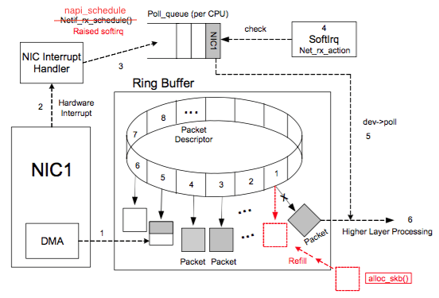
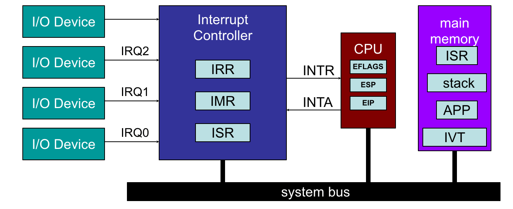
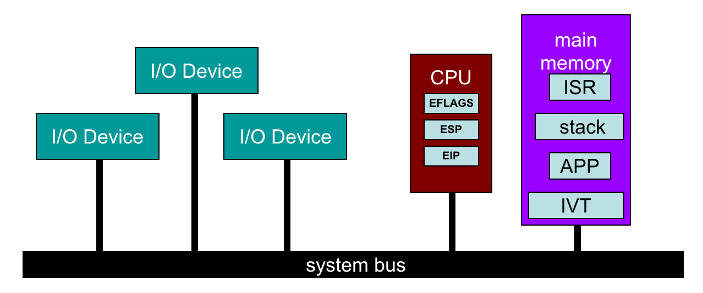

#220817 网络栈接收数据（RX）——从网卡收到包到 net_rx_action
=================================================================

常见的几种 intel 网卡
-----------------------------

- **igb** i 是 intel，gb 表示（每秒 1）Gb。老网卡。
- **ixgbe** x 是罗马数字 10，所以 xgb 表示 10Gb，e 表示以太网。
- **i40e** intel 40Gbps 以太网。

本文使用 5.19 内核以及 ixgbe 网卡。

收包过程
-------------------

1. 网络包会被通过 `DMA（Direct Memory Access） <https://en.wikipedia.org/wiki/Direct_memory_access>`_ 写入内存 ring buffer 中。
2. 网卡触发 **硬件中断** ，通知系统网卡有新的网络包到来。
3. 硬件中断程序通过 **软中断** 通知 ksoftirqd。
4. ksoftirqd 调用网络收包程序从 ring buffer 中收取所网络包并封装成 skb 结构体给上面的网络协议栈去处理。当没有包继续收的时候，退出收包程序。

网卡中断处理程序
---------------------

调用栈： ::

  ixgbe_msix_clean_rings(irq, data)
    |- q_vector = data
    |- napi_schedule_irqoff(&q_vector->napi)
      |- __napi_schedule_irqoff
        |- ____napi_schedule(this_cpu_ptr(&softnet_data), n)
          |- list_add_tail(&napi->poll_list, &sd->poll_list);
          |- __raise_softirq_irqoff(NET_RX_SOFTIRQ);

ixgbe 网卡驱动注册的硬件中断处理函数是 ``ixgbe_msix_clean_rings``，现在网卡一般都支持多队列，系统会为每个 CPU 配置一个网卡队列，每个队列有独立的中断，独立的 ring buffer，每个中断对应一个 ``napi_struct`` 结构体，也就是上面调用栈中的 ``q_vector->napi``。中断处理函数将 ``napi_struct`` 挂到本 CPU 的 ``softnet_data->poll_list`` 中，然后触发一个 ``NET_RX_SOFTIRQ`` 类型的软中断通知本 CPU 自己的 ksoftirqd 来收包。

ksoftirqd 是软中断处理进程， ``ps`` 可以看到， ``/`` 后面的数字是 CPU id。

.. code-block:: console

    # ps aux|grep ksoftirqd
    root          10  0.0  0.0      0     0 ?        S    Aug16   0:01 [ksoftirqd/0]
    root          16  0.0  0.0      0     0 ?        S    Aug16   0:00 [ksoftirqd/1]

开始收包
-----------------------

调用栈： ::

    net_rx_action()
      |- sd = this_cpu_ptr(&softnet_data)
      |- for n in sd->poll_list
           napi_poll(n)
             |- __napi_poll
               |- n->poll()/ixgbe_poll(n)   \
                 |- ixgbe_clean_rx_irq       |
                   |- ixgbe_get_rx_buffer    驱
                   |- ixgbe_run_xdp          动
                   |- ixgbe_build_skb        |
                   |- ixgbe_rx_skb           /
                     |- napi_gro_receive

``NET_RX_SOFTIRQ`` 类型的软中断对应的处理函数是 ``net_rx_action``。这个函数做的事就是遍历本 CPU 的 ``softnet->poll_list`` ，对于链表里所有的 ``napi_struct``，调用其 ``poll`` 函数。 ``poll`` 函数是网卡驱动初始化的时候注册的，比如 ixgbe 网卡的 ``poll`` 函数就是 ``ixgbe_poll``，这个函数实际从 ``napi_struct`` 指向的 ring buffer 中收割包并封装成一个一个的 skb 结构，最终调用  ``napi_gro_receive`` 函数进入网络设备子系统作进一步处理。

各种处理函数、poll 函数都是怎么来的
--------------------------------------

上面收包过程中的各种处理函数主要在下面这三个地方注册。

**首先**，在网络设备子系统（netdev subsys）的初始化函数中，设置了 ``NET_RX_SOFTIRQ`` 和 ``NET_TX_SOFTIRQ`` 的软中断处理函数，并且初始化了硬软中断交互用的 ``softnet->poll_list`` 结构体。 ::

  net_dev_init
    |- for_each_possible_cpu(i)
    |    struct softnet_data *sd = &per_cpu(softnet_data, i)
    |    INIT_LIST_HEAD(&sd->poll_list)
    |
    |- open_softirq(NET_TX_SOFTIRQ, net_tx_action)
    |- open_softirq(NET_RX_SOFTIRQ, net_rx_action)

**第二**，网卡一般都是 `PCI express <https://en.wikipedia.org/wiki/PCI_Express>`_ 设备，ixgbe 网卡驱动模块的 ``module_init`` 函数中，会调用 ``pci_register_driver`` 将自己注册为 PCI 驱动，注册结构体中的 ``id_table`` 列出自己所有能够驱动的 PCI 设备 ID， 内核检测到 PCI 设备后，会根据设备 ID 来寻找能够驱动这个设备的驱动，然后调用 ``probe`` 函数来初始化好这个设备。

.. code-block:: c

    static struct pci_driver ixgbe_driver = {
      .name      = ixgbe_driver_name,
      .id_table  = ixgbe_pci_tbl,
      .probe     = ixgbe_probe,
    };

    static const struct pci_device_id ixgbe_pci_tbl[] = {
      {PCI_VDEVICE(INTEL, IXGBE_DEV_ID_82598), board_82598 },
      {PCI_VDEVICE(INTEL, IXGBE_DEV_ID_82598AF_DUAL_PORT), board_82598 },
      {PCI_VDEVICE(INTEL, IXGBE_DEV_ID_82598AF_SINGLE_PORT), board_82598 },
      {PCI_VDEVICE(INTEL, IXGBE_DEV_ID_82598AT), board_82598 },
      // ...
    };

    static int __init ixgbe_init_module(void) {
      ret = pci_register_driver(&ixgbe_driver);
    }

``ixgbe_probe`` 是个比较庞大的函数，里面干的事有：

1. ``pci_enable_device_mem`` Enable 网卡这个 PCI 设备。
2. 初始化 DMA。调用 ``dma_set_mask_and_coherent`` 设置 DMA Mask， ``DMA_BIT_MASK(64)`` 表示网卡可以读写 64bit 内存地址。 ``pci_set_master`` Enable DMA。
3. 申请创建一个新的网络设备，设置设备相关的操作函数 ``netdev_ops``、 ``ethtool`` 操作函数等。
4. 创建 MSI-X 中断，为每个中断分配一个 ``napi_struct``，设置其 ``poll`` 函数为 ``ixgbe_poll`` 函数。

::

    ixgbe_probe(struct pci_dev *pdev, const struct pci_device_id *ent)
      |- pci_enable_device_mem(pdev)
      |
      |- dma_set_mask_and_coherent(&pdev->dev, DMA_BIT_MASK(64))
      |- pci_request_mem_regions(pdev, ixgbe_driver_name)
      |- pci_set_master(pdev)
      |- pci_save_state(pdev)
      |
      |- netdev = alloc_etherdev_mq(sizeof(struct ixgbe_adapter), indices)
      |- netdev->netdev_ops = &ixgbe_netdev_ops
      |- ixgbe_set_ethtool_ops(netdev)
      |
      |- ixgbe_init_interrupt_scheme
      | |- ixgbe_set_interrupt_capability
      | |  |- ixgbe_acquire_msix_vectors
      | |     |- vectors = ...
      | |     |- adapter->msix_entries = kcalloc(vectors, sizeof(struct msix_entry), GFP_KERNEL)
      | |     |- pci_enable_msix_range(adapter->pdev, adapter->msix_entries, vector_threshold, vectors)
      | |- ixgbe_alloc_q_vectors
      |   |- ixgbe_alloc_q_vector
      |     |- netif_napi_add(adapter->netdev, &q_vector->napi, ixgbe_poll, 64)
      |       |- netif_napi_add_weight
      |         |- napi->poll = ixgbe_poll
      |
      |- register_netdev(netdev)

**最后** 一个地方，是在上面网卡设备创建的时候注册的操作函数中的 ``ixgbe_open`` 函数中，刚刚创建的网卡设备被内核启用的时候会调用这个函数（called when a network interface is made active by the system IFF_UP）。

.. code-block:: c

      static const struct net_device_ops ixgbe_netdev_ops = {
        .ndo_open = ixgbe_open,
        //...
      }

这个函数中，会分配 ring buffer 资源，设置之前创建的网卡中断的处理函数为 ``ixgbe_msix_clean_rings``，启用 napi，启用网卡中断，然后，网络包就可以进来了。 ::

  ixgbe_open
    |- ixgbe_setup_all_rx_resources
    |- ixgbe_setup_all_tx_resources
    |
    |- ixgbe_request_irq
    |  |- ixgbe_request_msix_irqs
    |       for (vector = 0; vector < adapter->num_q_vectors; vector++)
    |          q_vector = adapter->q_vector[vector]
    |  	       entry = &adapter->msix_entries[vector]
    |          request_irq(entry->vector, &ixgbe_msix_clean_rings, 0, q_vector->name, q_vector)
    |
    |- ixgbe_up_complete
      |- ixgbe_napi_enable_all
      | |- napi_enable
      |
      |- ixgbe_irq_enable

MSI-X 中断是个什么东西
---------------------------

https://en.wikipedia.org/wiki/Message_Signaled_Interrupts

MSI 全称 Message Signaled Interrupts，也就是 **基于消息信号的中断** ，顾名思义，就是这个中断不需要物理的中断控制器，不需要从设备连一个物理的中断线到中断控制器，中断和数据一样走数据总线就行。

MSI 可以支持每个设备申请 1、2、4、8、16、32 个中断，而 MSI-X 支持每个设备最多申请到 2048 个中断。

因为没有物理的中断线，所以在 pci probe 函数中需要调用 pci 接口创建虚拟的中断线。

老的中断方式：

MSI 中断：

更多可以参见：https://en.ppt-online.org/21599