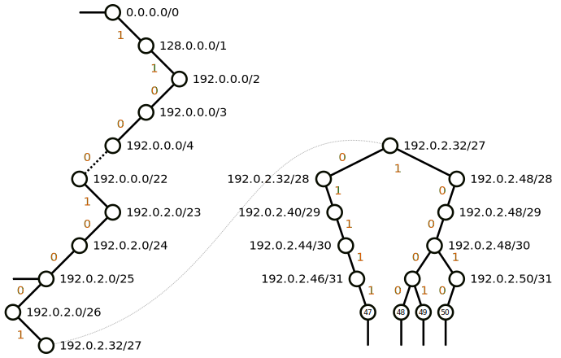

#220923 路由
=================

功能
---------------

内核中进出的包都需要经过路由这一步。路由决定接下去如何处理这个包。

对于进的包，路由确定网络包是要：

- **本地接收 RTN_LOCAL** 确定本地接收后会校验 IP 源，也就是执行 rp_filter，检查 *如果发送一个包给收到的包的源地址的话，这个包是不是从收到的网卡出去* 。如果不是，包会被丢弃掉。防止 IP Spoofing。
- **转发给下一跳 RTN_UNICAST** Linux 默认不开启转发功能 （``sysctl net.ipv4.ip_forward`` 控制），会直接给源端回一个 type=ICMP_DEST_UNREACH，code=EHOSTUNREACH 的 ICMP 包。
- **丢弃 RTN_BLACKHOLE** 。

对于出的包，路由确定这个包要从哪个网卡出去，能直接发给目的主机吗还是要走网关，走哪个网关。

到底两个还是一个路由表
-----------------------

现在的内核默认支持多路由表（``CONFIG_IP_MULTIPLE_TABLES``），一般至少会有 ``local`` 、 ``main`` 两个路由表，``ip route`` 不加任何参数显示的就是 ``main`` 路由表的条目。如果需要显示 ``local`` 路由表的内容需要通过 table 参数指定。

.. code-block:: console

   # ip route list table local
   broadcast 10.0.2.0 dev eth0 proto kernel scope link src 10.0.2.15
   local 10.0.2.15 dev eth0 proto kernel scope host src 10.0.2.15
   broadcast 10.0.2.255 dev eth0 proto kernel scope link src 10.0.2.15
   broadcast 127.0.0.0 dev lo proto kernel scope link src 127.0.0.1
   local 127.0.0.0/8 dev lo proto kernel scope host src 127.0.0.1
   local 127.0.0.1 dev lo proto kernel scope host src 127.0.0.1
   broadcast 127.255.255.255 dev lo proto kernel scope link src 127.0.0.1

``local`` 路由表中的路由都是走 lo 的，127.0.0.1、本机 IP 等都是通过 local 表路由到 lo 的（对，本机 IP 也是走 lo 的，无论绑定的是哪个网卡）。

老内核中路由查询时会先查 ``local`` 表，匹配不到再查 ``main`` 表。4.1 内核 `commit 0ddcf43d5d4a <https://git.kernel.org/pub/scm/linux/kernel/git/torvalds/linux.git/commit/?id=0ddcf43d5d4a03ded1ee3f6b3b72a0cbed4e90b1>`_ 之后，为了提升性能，这两张表在底层实现上被合并成了一张表，只查询 ``main`` 表即可。上层显示路由表的各种接口没有变，还是会分开展示这两个表，遍历表的时候按照表 id 再对路由条目进行过滤，过滤出要展示的表的。

入和出的路由相关逻辑封装在了下面这两个函数中，这个里面最终查询路由表是通过 ``fib_lookup`` 这个函数，其它都是围绕路由而进行的一系列校验、决策。 ::

   ip_route_input_noref
   |- ip_route_input_rcu
      |- ip_route_input_slow
         |- fib_lookup

   ip_route_output_ports
   |- ip_route_output_flow
      |- __ip_route_output_key
         |- ip_route_output_key_hash
            |- ip_route_output_key_hash_rcu
               |- fib_lookup

路由表的存储数据结构 LPC-trie
----------------------------------

内核使用 LPC-trie 来存储一个路由表，LPC-trie 全称 **L**\ evel **P**\ ath **C**\ ompressed **trie**，也就是一个经过路径（Path）、层级（Level）压缩的 trie。

我们通过下面这个路由表的压缩过程来看看这两个压缩是什么意思，理解了压缩过程也就理解了这个数据结构。

.. code-block:: console

   # ip route
   default via 203.0.113.5 dev out2
   192.0.2.0/25
      nexthop via 203.0.113.7  dev out3 weight 1
      nexthop via 203.0.113.9  dev out4 weight 1
   192.0.2.47 via 203.0.113.3 dev out1
   192.0.2.48 via 203.0.113.3 dev out1
   192.0.2.49 via 203.0.113.3 dev out1
   192.0.2.50 via 203.0.113.3 dev out1

首先，它是一个 trie，上面的路由表用 trie 表示出来就是这样：

（trie 比较长所以拆成了左右两半显示，有些节点带有箭头，这些箭头指向路由表条目）

查找路由的过程如下：从根节点 ``0.0.0.0/0`` 开始，每次取 IP 地址的一个比特位，如果为 0，沿着左子树前进一个节点继续，如果为 1，沿着右子树前进一个节点继续，如果子树缺失，则回溯至最近的一个有路由条目箭头的节点，其指向的路由条目就是要找的路由。

比如对于 IP 地址 ``192.0.2.50``，直接叶子节点就能找到对应的路由，但是对于 ``192.0.2.51``，找到 ``192.0.2.50/31`` 之后，下一个比特位为 1，需要沿着右子树前进，但是没有右子树，这个时候就得回溯到 ``192.0.2.0/25`` 节点才找到对应的路由。

上面的 trie 中很多节点都只有一个孩子节点，这些节点可以删除（除非节点指向了一个路由条目）省下一些比较过程和内存，剩余的节点添加一个 skip 属性告知下一次比较需要跳过多少个比特（对应有多少个节点被删除了）。这个删除节点的过程就是 **路径压缩** ，这样压缩后的 trie，也叫 `radix tree <https://en.wikipedia.org/wiki/Radix_tree>`_ ，压缩后的 trie 如下：

.. image:: images/lpc-trie-radix-tree.svg

因为上面有一些比特跳过了比较，所以最后还需要再比较下下确保这些比特是匹配的，否则可能是个假匹配，仍然需要回溯。比如下图中的两个 IP 都匹配了叶子节点 ``192.0.2.48/32``，显然 ``205.17.42.180`` 是个假匹配。

.. image:: images/lpc-trie-lookup-mismatch.svg

（trie 中检测的比特一致，但是跳过的比特不一致）

在路径压缩的基础上，层级压缩检测 trie 有哪些部分是节点密集的（densily populated），然后将这些部分的多个节点替换成单个节点，这个节点直接处理 k 个比特，也就有 2\ :sup:`k` 个孩子节点，下面是层级压缩后的 trie：

.. image:: images/lpc-trie-lpc-trie.svg

这样的树就叫做 **LPC-trie** 或 LC-trie，可以提供比 radix tree 更好的查找性能。

LPC-trie 在内核中的真实结构：

.. image:: images/lpc-trie-struct.svg

主要包含以下几种类型的结构体：

- ``struct fib_table`` 表示一个路由表。
- ``struct trie`` 表示一个 LPC-trie。
- ``struct key_vector`` 表示 trie 上的一个节点，如果 ``bits`` 为 0，则为一个叶子节点。
- ``struct fib_info`` 表示一条或者几条路由共同的一些属性（下一跳网关地址啊、出口网卡啊）。
- ``struct fib_alias`` 将 trie 上有箭头的节点和 ``struct fib_info`` 关联起来。

LPC-trie 可以通过下面的命令打印出来：

.. code-block:: console

   # cat /proc/net/fib_trie
   Main:
   +-- 0.0.0.0/0 2 0 2
      |-- 0.0.0.0
         /0 universe UNICAST
      +-- 192.0.2.0/26 2 0 1
         |-- 192.0.2.0
            /25 universe UNICAST
         |-- 192.0.2.47
            /32 universe UNICAST
         +-- 192.0.2.48/30 2 0 1
            |-- 192.0.2.48
               /32 universe UNICAST
            |-- 192.0.2.49
               /32 universe UNICAST
            |-- 192.0.2.50
               /32 universe UNICAST
   Local:
   ...

其中 ``|--`` 后面的是叶子节点。

更多关于性能数据以及 IPv6 的路由实现请参见：

- https://vincent.bernat.ch/en/blog/2017-ipv4-route-lookup-linux
  本文中 LPC-trie 这部分主要翻译自这篇文章。
- https://vincent.bernat.ch/en/blog/2017-ipv6-route-lookup-linux