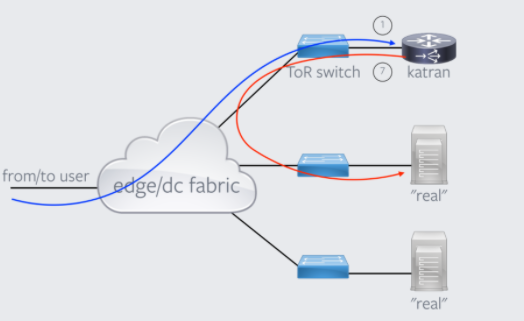

Day 6: xdp
=================

Pinning Maps
--------------------

前述 :ref:`bpf map 操作 <bpf-map>` 中，bpf map 的操作需要 bpf 程序的 bpf_object 对象，通过其获取 bpf map 的 fd。bpf map 可以通过 pinning 操作将 map 和一个文件路径绑定在一起，这样要读取 map 直接从该文件路径获取 map 的 fd 就可以了。

Mount BPF 文件系统：

.. code-block:: console

    $ mount -t bpf bpf /sys/fs/bpf/

在 loader 程序中 pinning map：

.. code-block:: c

    // 清理
    bpf_object__unpin_maps(bpf_obj, "/sys/fs/bpf/eth1");
    bpf_object__pin_maps(bpf_obj, "/sys/fs/bpf/eth1/xdp_stats_map");

其它程序如果要操作 map，直接通过路径获取 map 的 fd 即可：

.. code-block:: c

    int stats_map_fd;
    struct bpf_map_info info = { 0 };
    stats_map_fd = open_bpf_map_file("/sys/fs/bpf/eth1/", "xdp_stats_map", &info);

函数内联、循环展开
-----------------------

bpf 对函数和循环的支持有限，所以 bpf 程序中

- 如果使用子函数，需要在函数前面加上 ``__always_inline``，让函数始终内联。
- 如果有循环，需要在循环语句前加上 ``#pragma unroll``，让循环展开。

而不是让编译器自己去做决定。

网络包解析
----------------

下面是一个简单的 IPv6 版本的 ICMP 处理程序示例，功能是丢掉 sequence number 为偶数的 icmp 包。

.. code-block:: c

    int  xdp_parser_func(struct xdp_md *ctx) {
        // [data, data_end) 为网络包数据
        void *data     = (void *)(long)ctx->data;
        void *data_end = (void *)(long)ctx->data_end;

        struct ethhdr *eth = data;
        if (eth + 1 > data_end)
            return XDP_ABORT;
        if (eth->h_proto != bpf_htons(ETH_P_IPV6))
            return XDP_DROP;

        struct ipv6hdr *ip6h = eth + 1;
        if (ip6h + 1 > data_end)
            return XDP_ABORT;
        if (ip6h->nexthdr != IPPROTO_ICMPV6)
            return XDP_DROP;

        struct icmp6hdr *icmp_hdr = ip6h + 1;
        if (bpf_ntohs(icmp_hdr->icmp6_sequence) % 2 != 0)
            return XDP_DROP;
        
        return XDP_PASS;
    }

解析网络包第一步，包含定义 packet header 的各种头文件：

================= =========================
Struct            Header file
================= =========================
struct ethhdr	  <linux/if_ether.h>
struct ipv6hdr	  <linux/ipv6.h>
struct iphdr	  <linux/ip.h>
struct icmp6hdr	  <linux/icmpv6.h>
struct icmphdr	  <linux/icmp.h>
================= =========================

第二步，bounds checking，在读取 \*hdr 结构体中的字段时，首先需要检查 \*hdr 结构体是否在 [data, data_end) 之间，如果不检查，程序后续加载的时候 bpf verifier 会报错。也就是上面代码中的 ``if (eth + 1 > data_end) ...`` 这样的判断，It's necessary。

最后，网络包的数据是直接从网卡读到的数据，所以引用字段时要注意字节序，不要混用网络序和主机序的数据，必要时使用 bpf_htons/bpf_ntohs 之类的函数互相转换。

- https://en.wikipedia.org/wiki/Ethernet_frame
- https://en.wikipedia.org/wiki/IPv6_packet
- https://code.woboq.org/linux/linux/tools/testing/selftests/bpf/bpf_endian.h.html

----

.. code-block:: c

	printf("%p\n", (void*)NULL + 1);
	printf("%p\n", (int*)NULL + 1);

上面的代码运行的结果是： ::

    0x1
    0x4

指针加 1 的时候，如果是 ``void*`` 指针，指针是往后移一个字节，如果指针有类型，那么则是往后移 ``sizeof(类型）`` 个字节。所以上面所有 hdr 类型的 bounds checking 的时候都是使用相同的指针加 1 操作。

网络包 Rewrite
----------------------

xdp 程序可以直接修改 [ctx->data, ctx->data_end] 之间的数据，并且可以通过 ``bpf_xdp_adjust_head`` 函数来扩大/缩小网络数据包的 buffer 的大小。

.. c:function:: long bpf_xdp_adjust_head(struct xdp_buff *xdp_md, int delta)

   将 ``xdp_md->data`` 指针移动 ``delta`` 个字节，delta 为正的时候是缩小网络包的 buffer（可以用在解包场景下），如果为负，相当于在 buffer 的前面新申请了一段 buffer 空间（可以用来封包），返回 0 成功或者一个负的错误码。

网络拓扑要求
--------------

unimog 的转发用的是 xdp 的 tx action，所以其对网络拓扑有和 katran 一样的要求，即 “从客户端到 l4lb” 和 “从 l4lb 到 l7lb” 走的是同一个网络接口。如下图所示：

https://github.com/facebookincubator/katran#environment-requirements-for-katran-to-run

当然 xdp 还有一个 redirect action，可以允许从不同接口将包发出去。