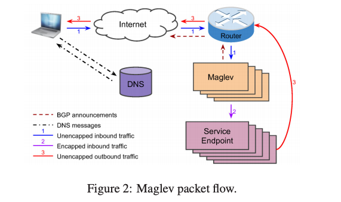
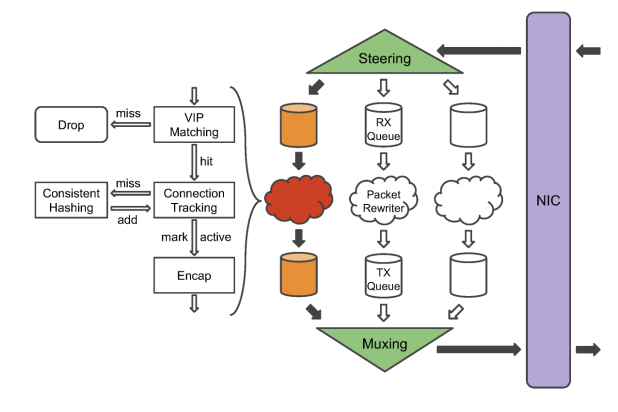
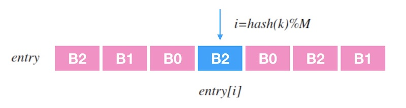
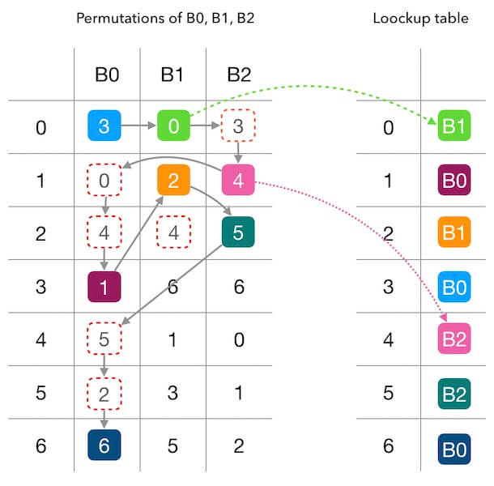
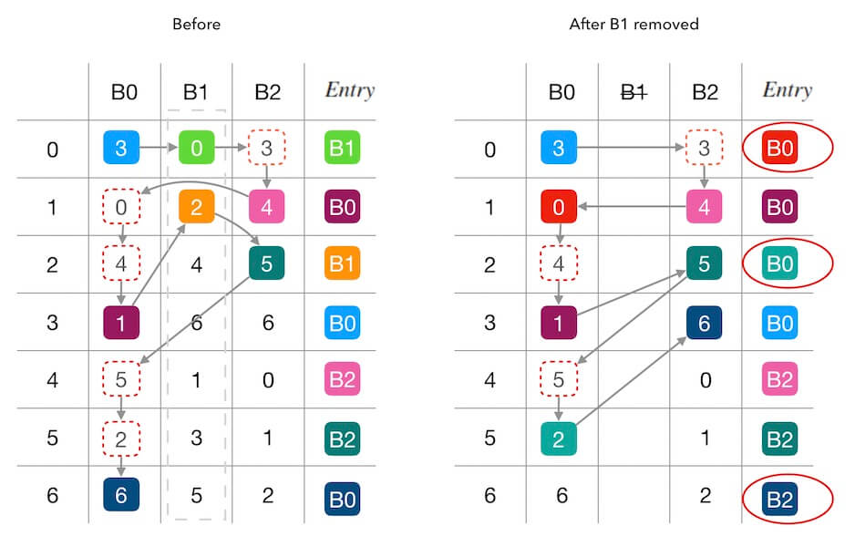

Day 8: Maglev
====================

论文：https://research.google.com/pubs/archive/44824.pdf

架构
-------------

Maglev 整体的架构和 unimog 基本差不多，如下图所示：

1. DNS 将服务解析到 VIP，用户访问服务时和 VIP 建立连接。
2. 用户访问的流量包到达边缘机房的核心路由后使用 ECMP 将包分配给 Maglev。
3. Maglev 根据流量包的五元组计算哈希，使用哈希映射得到后端服务器，然后使用 GRE(Generic Routing Encapsulation) 封包，将流量包发给后端服务器。
4. 最后后端服务器收到包后解包再处理包，处理完成后的回包直接发送出去，不再经过 Maglev。

和 unimog 不一样的地方在于 Maglev 使用的是 Connection Tracking + Consistent Hashing 来调度连接。

1. Maglev 每调度一个新连接后会将其分配的后端信息存储下来，这样下次同一连接的包过来时，直接将包发给对应的后端即可，这样后端的服务器有变更或者挂了，已建立的连接的包仍然会被发给同一个后端。
2. 当 Maglev 本身有变更或者挂了的时候，ECMP 重新哈希之后一个连接的包可能会被分配给另外一个 Maglev 去处理，这个新分配的 Maglev 上可能没有这个连接的信息，此时就得依赖一致性哈希去将连接的包调度给同一个后端。

Maglev 的 Connection Tracking 使用固定大小的哈希表来存储连接信息，当 Maglev 是和其它服务混合部署的时候，会尤其限制这个哈希表的大小。

一致性哈希算法
------------------

https://writings.sh/post/consistent-hashing-algorithms-part-4-maglev-consistent-hash

一致性哈希的实现和 cf 的 forwarding table 非常类似，就是生成一个大的查找表，表中的条目映射到实际的后端服务器，设表长为 :math:`M` ，流量包的五元组为 :math:`k` ，则映射到后端的服务器的过程就是 :math:`entry \left[ hash(k) \% M \right]`  。

查找表生成算法：

首先，为每一个后端服务器计算出一个长度为 :math:`M` 的 *查找表中的填充位置* 的偏好序列。

取两个无关的哈希函数 :math:`h1` 和 :math:`h2` ，假设后端的名字是 :math:`b`，计算偏好序列的方法如下：

.. math::

    \begin{split}\begin{array}{lcl}
      offset = h_1(b) \% M \\
      skip = h_2(b) \% (M - 1) + 1 \\
      permutation\left[j\right] = (offset + j \times skip) \% M
    \end{array}\end{split}

然后我们循环所有的后端，对于每一个后端，使用其偏好序列中的数字作为查找表的位置索引，将后端填充到该位置上，如果该位置已经填充了后端，则顺延使用偏好序列中的下一个数字。如此直到整个查找表填充完成。

以论文中的示例查找表为例，我们用单步的方式来填充下这个表来理解下填充的整个过程：

1. :math:`B0` 的偏好序列的第一个数字是 3， 所以填充 :math:`B0` 到 :math:`entry \left[3 \right]`。
2. 轮到 :math:`B1` 填充了，:math:`B1` 的偏好序列第一个是 0，所以填充 :math:`B1` 到 :math:`entry \left[0 \right]`。
3. 轮到 :math:`B2` 填充了，由于 :math:`entry \left[3 \right]` 被占用， 所以向下看 B2 偏好序列的下一个数字，是 4，因此填充 :math:`B2` 到 :math:`entry \left[4 \right]`。
4. 接下来， 又轮到 :math:`B0` 填充了， 该看它的偏好序列的第 2 个数字了，是 0，但是 :math:`entry \left[0 \right]` 被占用了； 所以要继续看偏好序列的第 3 个数字，是 4， 同理， 这个也不能用，直到测试到 1 可以用， 则填充 B0 到 :math:`entry \left[1 \right]` 。
5. 如上， 直到把整张查找表填充满。

查找表的长度一般为一个大于 :math:`100 \times N` 的质数。

Maglev 的一致性哈希在某个后端挂了的情况下，影响的连接除了分发到这个后端的连接之外，还会稍微关联扰动（disruption）一些其它的连接，我们以下图删除一个后端为例，可以看到，:math:`Entry` 中除了为 :math:`B1` 的条目改变了之外，还影响了 :math:`entry \left[6 \right]` 。

