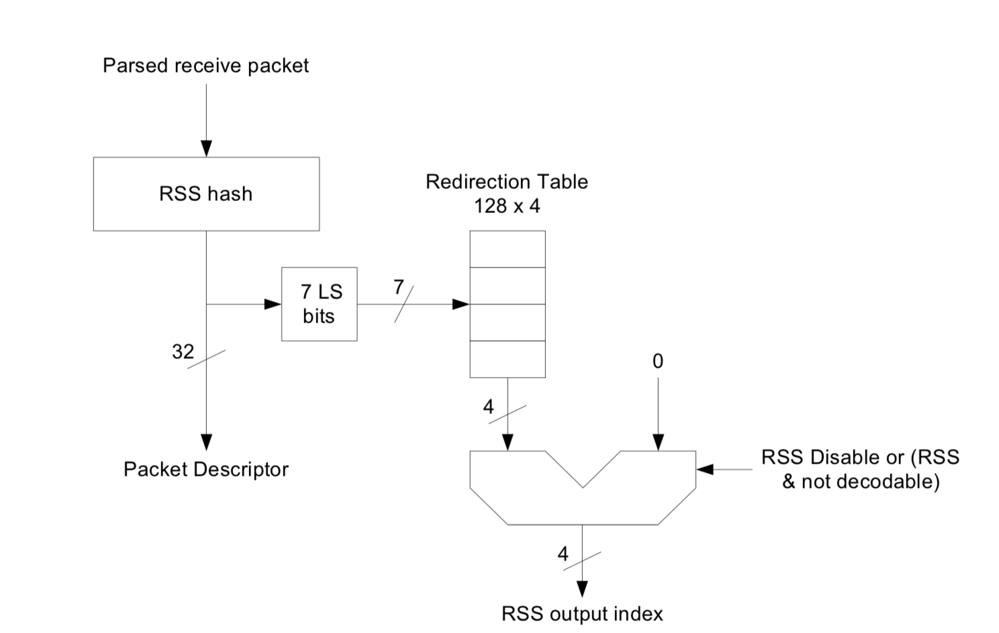

#0226 性能
================

如何获取网卡的型号
--------------------

基本信息：

.. code-block:: console

    # lspci|grep -i ethernet
    ...
    04:00.0 Ethernet controller: Intel Corporation 82599ES 10-Gigabit SFI/SFP+ Network Connection (rev 01)
    04:00.1 Ethernet controller: Intel Corporation 82599ES 10-Gigabit SFI/SFP+ Network Connection (rev 01)
    05:00.0 Ethernet controller: Intel Corporation 82599ES 10-Gigabit SFI/SFP+ Network Connection (rev 01)
    05:00.1 Ethernet controller: Intel Corporation 82599ES 10-Gigabit SFI/SFP+ Network Connection (rev 01)

更详细的信息：

.. code-block:: console

    # lspci -v|grep -i ethernet -A20
    ...
    05:00.1 Ethernet controller: Intel Corporation 82599ES 10-Gigabit SFI/SFP+ Network Connection (rev 01)
        Subsystem: Inspur Electronic Information Industry Co., Ltd. 10G SFP+ DP EP102Fi4 Adapter
        Flags: bus master, fast devsel, latency 0, IRQ 112
        Memory at dc800000 (64-bit, non-prefetchable) [size=8M]
        I/O ports at dce0 [size=32]
        Memory at dbffc000 (64-bit, non-prefetchable) [size=16K]
        Expansion ROM at d0400000 [disabled] [size=4M]
        Capabilities: [40] Power Management version 3
        Capabilities: [50] MSI: Enable- Count=1/1 Maskable+ 64bit+
        Capabilities: [70] MSI-X: Enable+ Count=64 Masked-
        Capabilities: [a0] Express Endpoint, MSI 00
        Capabilities: [e0] Vital Product Data
        Capabilities: [100] Advanced Error Reporting
        Capabilities: [140] Device Serial Number 6c-92-bf-ff-ff-48-61-b9
        Capabilities: [150] Alternative Routing-ID Interpretation (ARI)
        Capabilities: [160] Single Root I/O Virtualization (SR-IOV)
        Kernel driver in use: ixgbe
        Kernel modules: ixgbe
    ...

Intel 82599 网卡如何实现 RSS
-----------------------------------

`Intel 82599 datasheet.pdf/7.1.2.8 小节 Receive-Side Scaling(RSS) <https://www.intel.com/content/www/us/en/embedded/products/networking/82599-10-gbe-controller-datasheet.html?asset=2377>`_

1. 对于 IPv4 协议的 TCP/UDP 包， 计算 ``RSS Hash = Hash(src ip, src port, dst ip, dst port)`` 。
2. 取哈希低位的 7 bit，将其映射到一个 Redirection Table 中，这个表一共 128 个槽位，每个槽位 4 bit。
3. 输出槽位的值（4 bit）作为 RSS Index。

获取 RSS 配置信息：

.. code-block:: console

    # ethtool -x p1p1
    RX flow hash indirection table for p1p1 with 24 RX ring(s):
    0:       0     1     2     3     4     5     6     7
    8:       8     9    10    11    12    13    14    15
    16:      0     1     2     3     4     5     6     7
    24:      8     9    10    11    12    13    14    15
    32:      0     1     2     3     4     5     6     7
    40:      8     9    10    11    12    13    14    15
    48:      0     1     2     3     4     5     6     7
    56:      8     9    10    11    12    13    14    15
    64:      0     1     2     3     4     5     6     7
    72:      8     9    10    11    12    13    14    15
    80:      0     1     2     3     4     5     6     7
    88:      8     9    10    11    12    13    14    15
    96:      0     1     2     3     4     5     6     7
    104:     8     9    10    11    12    13    14    15
    112:     0     1     2     3     4     5     6     7
    120:     8     9    10    11    12    13    14    15
    RSS hash key:
    1f:e1:8d:4c:b2:14:83:40:97:19:64:9b:d9:ee:19:b2:3d:31:6a:da:85:f2:f2:3f:39:b0:f1:eb:d8:53:8f:d1:92:70:be:90:92:2b:81:47
    RSS hash function:
        toeplitz: on
        xor: off
        crc32: off

输出的 RSS Index 最多为 4 bit，所以 RSS 最多支持 16 个队列。因此当机器的 CPU 数目大于 16，如果绑定网卡和 CPU，那么有一部分 CPU 会空闲不处理任何流量。