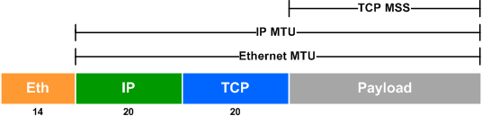
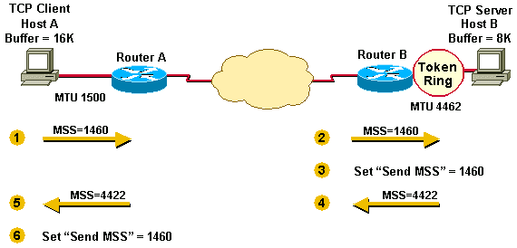
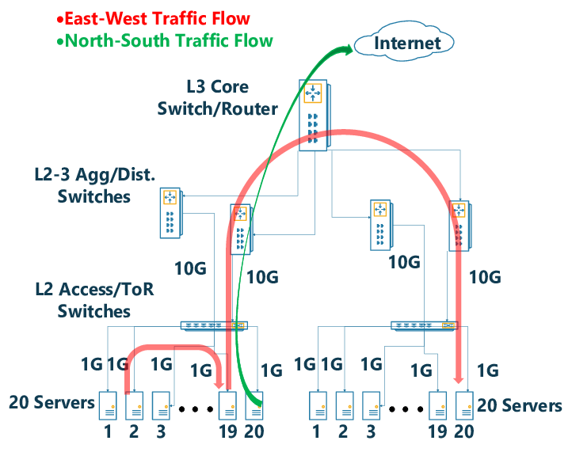

#0305 大包模式（Jumbo Frame）
===============================

Unimog/GLB 文档中对于大包模式的说明
---------------------------------------------

    we have enabled jumbo frames on the networks inside our data centers, so that the 1500-byte limit only applies to packets headed out to the Internet

    -- unimog

    The datacenter internal MTU is expected to be large enough to encapsulate any user packet inside a GUE header. We use jumbo frames (9000+ MTU) within the datacenter with a transit/internet MTU of 1500. GLB Director will not fragment packets if they are too large.

    If GLB is used within a datacenter, proxy servers should know the correct maximum MSS they can use. We tell haproxy to clamp MSS to a small enough value that it can always be encapsulated.

    Because of the above 2 points, GLB Director doesn't send ICMP fragmentation required messages when it cannot forward packets.

    GLB Director will, however, forward ICMP fragmentation required packets from outside to the correct proxy server.

    -- GLB https://github.com/github/glb-director/blob/master/docs/README.md

MTU 和 MSS
--------------

MTU(Maximum Transmission Unit)，是一个以太网包 /IP 包能够传输的最大数据长度。MSS(TCP Maximum Segment Size)，是一个 TCP 包能够传输的最大数据长度。它们的关系如下图所示：

默认以太网包的 MTU 为 1500，查看网卡当前的 MTU：

.. code-block:: console

    # ip link
    1: lo: <LOOPBACK,UP,LOWER_UP> mtu 65536 qdisc noqueue state UNKNOWN mode DEFAULT group default qlen 1000
        link/loopback 00:00:00:00:00:00 brd 00:00:00:00:00:00
    2: eth0@if6: <BROADCAST,MULTICAST,UP,LOWER_UP> mtu 1500 qdisc noqueue state UP mode DEFAULT group default qlen 1000
        link/ether 72:56:ce:c7:43:0c brd ff:ff:ff:ff:ff:ff link-netnsid 0

MSS 主要是用来避免 TCP 包太大导致 IP 包在传输的链路上被分片（Fragmentation），在 TCP 握手阶段，客户端和服务器分别将各自的 MSS 放在 SYN 包的 TCP Options 中带给对端，双方在封 TCP 包的时候以较小的 MSS 来自我约束包大小，从而避免 IP 包分片的问题。

- https://en.wikipedia.org/wiki/Jumbo_frame
- https://packetlife.net/blog/2008/nov/5/mtu-manipulation/
- `Resolve IPv4 Fragmentation, MTU, MSS, and PMTUD Issues with GRE and IPsec <https://www.cisco.com/c/en/us/support/docs/ip/generic-routing-encapsulation-gre/25885-pmtud-ipfrag.html#anc3>`_

tcpdump 出的包的大小为什么大于 MTU？
-----------------------------------------

默认网卡的 MTU 为 1500，curl 百度并抓包，可以看到 HTTP 响应包长度 2781，大于 MTU 1500。

.. code-block:: console

    # tcpdump -n -nn -i eth0 src port 80
    ...
    06:48:09.353543 IP 220.181.38.150.80 > 10.0.2.15.56756: Flags [P.], seq 1:2782, ack 78, win 65535, length 2781: HTTP: HTTP/1.1 200 OK
    ...

这个是因为内核开启了 TSO（TCP Segmentation Offload）、GSO（Generic Segmentation Offload）、GRO（Generic Receive Offload）这些特性的缘故，这几个特性分别指的是将原本在内核协议栈完成的 TCP 分段、IP 分片、重组等操作向下转移到网卡硬件中去进行，从而降低系统的 CPU 消耗，提升处理性能。

.. code-block:: console

    # ethtool -k eth0 |grep offload
    tcp-segmentation-offload: on
    generic-segmentation-offload: on
    generic-receive-offload: on
    ...

将这些特性关闭，tcpdump 就正常了，当然这样系统的性能会变差。

.. code-block:: bash

    ethtool -K eth0 gro off
    ethtool -K eth0 tso off
    ethtool -K eth0 gso off
    # 打开特性
    #ethtool -K eth0 gro on
    #ethtool -K eth0 tso on
    #ethtool -K eth0 gso on

利用路由规则分别配置数据中心内外流量的 MTU
-------------------------------------------------

数据中心配置大包模式（Jumbo Frame）需要配置成数据中心内部 MTU 9000，但是出数据中心的包仍然需要是 MTU 1500。

服务器部分配置方法如下：

1. 使用 ``ip link set <iface> mtu 9000`` 提高服务器的 MTU 硬限制。
2. 使用 ``ip route add default via <gateway> mtu 1500`` 修改默认路由的 MTU 为 1500。
3. 添加路由修改东西向流量的 MTU 为 9000 ``ip route add <cidr> via <gateway> mtu 9000`` 。

数据中心的交换机 / 路由器也需要相应的配置。

- https://wiki.archlinux.org/index.php/jumbo_frames
- https://tldp.org/HOWTO/Adv-Routing-HOWTO/lartc.cookbook.mtu-discovery.html

----

如果不需要开启大包模式，服务器也需要执行上面的前 2 步，否则超过 1500 包会被网卡丢弃。

网卡驱动在初始化的时候会根据网卡的 mtu 计算网卡的 MFS（Max Frame Size） 并写入网卡的配置寄存器中，网卡收包的时候大于 MFS 的包会被丢弃。发送不受限制。

.. code-block:: c

    static void ixgbe_set_rx_buffer_len(struct ixgbe_adapter *adapter)
    {
        int max_frame = netdev->mtu + ETH_HLEN + ETH_FCS_LEN;

        if (max_frame < (ETH_FRAME_LEN + ETH_FCS_LEN))
            max_frame = (ETH_FRAME_LEN + ETH_FCS_LEN);

        // #define IXGBE_MHADD     0x04268
        mhadd = IXGBE_READ_REG(hw, IXGBE_MHADD);
        if (max_frame != (mhadd >> IXGBE_MHADD_MFS_SHIFT)) {
            mhadd &= ~IXGBE_MHADD_MFS_MASK;
            mhadd |= max_frame << IXGBE_MHADD_MFS_SHIFT;

            IXGBE_WRITE_REG(hw, IXGBE_MHADD, mhadd);
        }

        ...
    }

https://elixir.bootlin.com/linux/v5.19/source/drivers/net/ethernet/intel/ixgbe/ixgbe_main.c#L4253

这个里面读写的就是下面这个配置寄存器，用来控制网卡能够接收的最大包的大小。

    *Max Frame Size — MAXFRS (0x04268; RW)*

    This field defines the maximum frame size in bytes units from Ethernet MAC Addresses up to inclusive the CRC. Frames received that are larger than this value are dropped. This field is meaningful when jumbo frames are enabled (HLREG0.JUMBOEN = 1b). When jumbo frames are not enabled the 82599 uses a hardwired value of 1518 for this field.

    The MFS does not include the 4 bytes of the VLAN header. Packets with VLAN header can be as large as MFS + 4. When double VLAN is enabled, the device adds 8 to the MFS for any packets.

    This value has no effect on transmit frames; it is the responsibility of software to limit the size of transmit frames.

    `Intel 82599 datasheet.pdf 中搜 0x04268 <https://www.intel.com/content/www/us/en/embedded/products/networking/82599-10-gbe-controller-datasheet.html?asset=2377>`_

东西向 / 南北向流量是什么意思？
------------------------------

术语。网络中东西向指的是数据中心服务器之间的流量，南北向指的是客户端和数据中心之间的流量。

tcpdump 打印出的几个不同 length 之间的换算
--------------------------------------------

.. code-block:: console

    # l4lb tcpdump "ip[2:2] > 1460" -v
    xdpcap /sys/fs/bpf/xdpcap-hook - "$(bpfoff 54 "ip[2:2] > 1460")"| tcpdump -r - -lnnn -v
    reading from file -, link-type EN10MB (Ethernet)
    19:16:05.402446 IP (tos 0x0, ttl 64, id 0, offset 0, flags [DF], proto UDP (17), length 1540)
        113.240.91.27.56266 > 113.240.91.33.19523: UDP, length 1512

首先， ``ip[2:2]`` 是 IP 头中的 total length 字段，是整个 IP 包的长度，可以通过其来过滤是否有大于默认 1500 mtu 的包，因为 xdpcap 抓的包都是转发封装后的包，GUE 整个封装 40 个字节，只要原始的包大于 1460 字节，封装转发的时候就会大于 1500 mtu。

这个里面每个转发包有 2 个 length 字段：

1. IP 行最后的 length 是 IP 包的整个长度，也就是 ``ip[2:2]`` ，这一行默认不显示，通过 ``-v`` 选项显示这行。
2. UDP 行最后的 length 是 UDP 包数据的长度。IP 包 1540 减去 20 个字节的 IP 头，再减去 8 个字节的 UDP 头，就是 UDP 包数据的长度 1512。1512 个字节中 12 个字节是 GUE 头的长度，剩下的是原始的 IP 包 1500 个字节。

.. code-block:: console

    # l4lb tcpdump 'ip[2:2] > 1460'  -v -decap
    xdpcap /sys/fs/bpf/xdpcap-hook - "$(bpfoff 54 "ip[2:2] > 1460")"| l4lb tcpdump decap-ng| tcpdump -r - -lnnn -v
    reading from file -, link-type EN10MB (Ethernet)
    19:20:14.983555 IP (tos 0x0, ttl 53, id 20654, offset 0, flags [DF], proto TCP (6), length 1500)
    183.60.152.38.38877 > 113.240.91.53.10443: Flags [.], cksum 0xb7e9 (correct), seq 2744982456:2744983916, ack 3619310159, win 4497, length 1460

原始的转发包是一个 TCP 包，TCP 信息显示行的最后有一个 length 为 1460，这个长度是 TCP 数据的长度，加上 TCP 头 20 个字节，再加上 IP 头 20 个字节，正好 1500 个字节。

常见的协议头大小：

================ ===================
协议              大小（字节）
================ ===================
ETH              14
IP               20
IPv6             40
TCP              20
UDP              8
================ ===================

https://www.tcpdump.org/manpages/pcap-filter.7.html

通过 ipset + iptables 修改部分 IP 的 TCP MSS
---------------------------------------------------

特殊情况无法修改交换机的 MTU 为 9000 大包模式的情况下，可以通过以下 iptables 规则让客户端缩小上行的 TCP 包，让封包后整个 IP 包也不会超过 1500 字节。

.. code-block:: bash

   ipset create l4lb-vips hash:ip
   iptables -t mangle -A POSTROUTING -p tcp -m tcp --tcp-flags SYN,ACK SYN,ACK -m set --match-set l4lb-vips src -j TCPMSS --set-mss 1420

   ipset create l4lb-vips6 hash:ip family inet6
   iptables -t mangle -A POSTROUTING -p tcp -m tcp --tcp-flags SYN,ACK SYN,ACK -m set --match-set l4lb-vips6 src -j TCPMSS --set-mss 1400

通过以下 tcpdump 命令可以观察上面的规则是否确实修改了 syn-ack 包的 mss。

.. code-block:: bash

    # 过滤 syn，syn-ack 包
    tcpdump "tcp[tcpflags]&tcp-syn != 0"
    # 过滤 syn-ack 包
    tcpdump "tcp[tcpflags]&(tcp-syn|tcp-ack) == tcp-syn|tcp-ack"
    # 过滤 ipv6 的 syn-ack 包，tcp[tcpflags] 不支持 ipv6
    # 40 是默认 IPv6 头的长度，13 是 tcpflags 相对于 tcp 头开始的偏移量
    tcpdump "tcp and ip6[40+13]&(tcp-syn|tcp-ack) == tcp-syn|tcp-ack"

- https://ipset.netfilter.org/ipset.man.html
- https://www.linuxtopia.org/Linux_Firewall_iptables/x4700.html

还有一些其它方法可以参见： https://blog.cloudflare.com/path-mtu-discovery-in-practice/ 这篇文章。

.. note::

   iptables 也可以直接按 IP 段过滤，通过 ``-m iprange --src-range IP-IP`` 来过滤，我们需要能够动态修改 IP 的能力，所以使用了 ipset。

pmtud 不同系统不一样的默认行为
-----------------------------------

Mac OSX 的 TCP 协议栈默认开启了 pmtud，可以自适应调节 mss。

.. code-block:: console

   $ sysctl -a|grep pmtu
   net.inet.tcp.pmtud_blackhole_detection: 1
   net.inet.tcp.pmtud_blackhole_mss: 1200

如下是一个 OSX 的 POST 请求，可以看到协议栈在等待一段时间没有 ack 回来后，降低了 mss 并重传了 POST 的数据包。

.. code-block:: console

   17:20:14.267665 IP 172.19.124.27.65277 > 113.240.91.50.80: Flags [P.], seq 5003:5573, ack 24460, win 4096, length 570: HTTP: POST /tc700/jpyadmin/files/uploads.html HTTP/1.1

   17:20:14.267763 IP 172.19.124.27.65277 > 113.240.91.50.80: Flags [.], seq 5573:7025, ack 24460, win 4096, length 1452: HTTP
   17:20:14.267765 IP 172.19.124.27.65277 > 113.240.91.50.80: Flags [.], seq 7025:8477, ack 24460, win 4096, length 1452: HTTP
   17:20:14.267766 IP 172.19.124.27.65277 > 113.240.91.50.80: Flags [.], seq 8477:9929, ack 24460, win 4096, length 1452: HTTP
   17:20:14.267767 IP 172.19.124.27.65277 > 113.240.91.50.80: Flags [.], seq 9929:11381, ack 24460, win 4096, length 1452: HTTP
   17:20:14.267768 IP 172.19.124.27.65277 > 113.240.91.50.80: Flags [.], seq 11381:12833, ack 24460, win 4096, length 1452: HTTP
   17:20:14.267769 IP 172.19.124.27.65277 > 113.240.91.50.80: Flags [.], seq 12833:14285, ack 24460, win 4096, length 1452: HTTP
   17:20:14.301647 IP 113.240.91.50.80 > 172.19.124.27.65277: Flags [.], ack 5573, win 210, length 0
   17:20:14.349390 IP 172.19.124.27.65277 > 113.240.91.50.80: Flags [.], seq 14285:15737, ack 24460, win 4096, length 1452: HTTP
   17:20:14.600227 IP 172.19.124.27.65277 > 113.240.91.50.80: Flags [.], seq 5573:7025, ack 24460, win 4096, length 1452: HTTP

   17:20:14.901363 IP 172.19.124.27.65277 > 113.240.91.50.80: Flags [.], seq 5573:6773, ack 24460, win 4096, length 1200: HTTP
   17:20:14.936257 IP 113.240.91.50.80 > 172.19.124.27.65277: Flags [.], ack 6773, win 206, length 0
   ...

Linux 默认没有开启，如果是实现的服务端，客户端不在我们的控制下，应该假定客户端没有开启 pmtud。

不同的默认行为可能会导致一些请求在有些系统上失败，但在另外的系统上的却可以成功。
