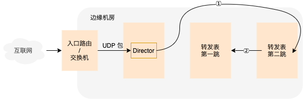
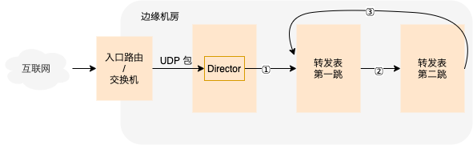

# 220112 UDP
===========================

Unimog 的 UDP 处理策略
-------------------------------------

首先，对于像 DNS 这种简单的 *请求响应* 式服务，仅均衡负载，不维护状态，转发表每个槽位中只有一跳，完全无状态。

而对于复杂的像 QUIC 这种需要维护连接状态的服务。

- 在 director 上会有一个 QUIC 协议的 dissector 提取网络包中的 connection id 替代默认的 IP 端口来计算到转发表的哈希。
- 第二跳逻辑和 TCP 不一样，TCP 有 SYN 包来区分是 *新连接* 还是 *已建立连接（established）* 的包，SYN 包直接在第一跳接收，UDP 不行。UDP 只能通过内核接口判断是 *新连接* 的包还是 *已建立连接* 的包。所以 UDP 包在正常情况下包都需要过两跳。
  
  UDP 包在转发时，第一跳/第二跳分别对应转发表中的第二跳/第一跳。转发表没有变更的情况下所有包都是在转发的第二跳（转发表的第一跳）上被接收的。只有某一个槽位有变更的时候，转发表的第一跳变成转发表的第二跳，也就成了转发的第一跳，此时老连接上的包才会在转发的第一跳上被接收。维护了老连接，保证了老连接不会断，相对于 TCP，额外开销不小。
- 上面第二跳的逻辑要工作，对 UDP Server 有要求，需要 UDP Server 建立 connected udp sockets。
  

bpf 中使用  ``bpf_sk_lookup_udp`` 判断是 *新连接* 的包还是 *已建立连接* 的包。

https://github.com/torvalds/linux/blob/v5.16/tools/testing/selftests/bpf/progs/test_cls_redirect.c#L683

查看其调用链可以发现最后调用的 ``__udp4_lib_lookup`` 和 ``__udp6_lib_lookup`` 这两个函数。 ::

    bpf_sk_lookup_udp
    ➡️ bpf_sk_lookup
      ➡️ bpf_skc_lookup
        ➡️ __bpf_skc_lookup
          ➡️ sk_lookup
            ➡️ __udp4_lib_lookup
            ➡️ __udp6_lib_lookup

什么是 connected udp sockets
------------------------------------

connected udp sockets 指的是在读写 socket 之前调用 connect 系统调用 “建立” 和对端的连接。

对于客户端来说，使用下面的方式建立的 socket 就是 connected 的，比较好理解。

.. code-block:: python

    c = socket.socket(socket.AF_INET, socket.SOCK_DGRAM)
    c.connect(('127.0.0.1', 1234))
    c.send(b"hello world!")
    data = cd.recv(2048)

而我们大部分情况下看到的 udp 服务端的实现基本都是 unconnected 的，比如下面这段代码。

.. code-block:: python

    s = socket.socket(socket.AF_INET, socket.SOCK_DGRAM)
    s.bind(('127.0.0.1', 1234))

    while True:
        msg, addr = s.recvfrom(1024)
        print(addr, msg)
        s.sendto(msg, addr)

我们需要对该服务端做如下改造，才能使上面的第二跳逻辑可以工作。

.. code-block:: python

    s = socket.socket(socket.AF_INET, socket.SOCK_DGRAM)
    s.setsockopt(socket.SOL_SOCKET, socket.SO_REUSEADDR, 1)
    s.bind(('127.0.0.1', 1234))

    while True:
        msg, addr = s.recvfrom(1024)
        print(msg)

        c = socket.socket(socket.AF_INET, socket.SOCK_DGRAM)
        c.setsockopt(socket.SOL_SOCKET, socket.SO_REUSEADDR, 1)
        c.bind(('127.0.0.1', 1234))
        c.connect(addr)
        c.send(msg)
        while True:
            msg = c.recv(1024)
            print(msg)
            c.send(msg)

上面的代码比较糙，只能处理一条连接，通过 ``ss`` 命令可以看到这条 established 的连接（ESTAB 那一行），前面 unconnected 的版本只能看到看到 UNCONN 那一行。

.. code-block:: console

    # ss -panu|grep python
    ESTAB  0      0          127.0.0.1:1234     127.0.0.1:57346 users:(("python",pid=52309,fd=4))
    UNCONN 0      0          127.0.0.1:1234       0.0.0.0:*     users:(("python",pid=52309,fd=3))

UDP 的 connect 调用并不会实际的去和对端服务器建立连接，所以上面说建立连接的时候都是加引号的，调用 connect 不会和对端有任何的网络包交互，只是告诉内核某一个 socket 的对端是哪，而不需要每次都得调用 recvfrom，sendto 获得/传递对端的 IP 和端口。

- https://blog.cloudflare.com/everything-you-ever-wanted-to-know-about-udp-sockets-but-were-afraid-to-ask-part-1/
- https://ops.tips/blog/udp-client-and-server-in-go/

----

使用 nc 来模拟 connected udp socket

.. code-block:: 

    # 服务端
    nc -ul IP PORT

    # 客户端
    nc -u IP PORT

注意，这里的 IP 不能通配的 ``0.0.0.0``。

nc 中只需处理一条连接，所以不需要再创建新的 socket，直接在原本的 server socket 上 connect 就可以了，详细见：https://github.com/openbsd/src/blob/master/usr.bin/nc/netcat.c#L609

----

nginx 中 udp 使用的 unconnected socket。

- 使用 recvmsg 收包 https://github.com/nginx/nginx/blob/master/src/event/ngx_event_udp.c 
- 使用 sendto 发包 https://github.com/nginx/nginx/blob/master/src/os/unix/ngx_udp_send.c 
- 使用 sendmsg 发包 https://github.com/nginx/nginx/blob/master/src/os/unix/ngx_udp_sendmsg_chain.c 

另一种处理策略
-----------------------

Unimog 处理策略中，正常情况下，UDP 的包都需要经过 2 跳，额外开销太大，我们可以稍微修改下策略，让大部分的包在第一跳解决，修改如下：

转发的第一跳和第二跳还是和转发表一致，但是增加一个第三跳，第三跳还是转发表中的第一跳，如果第二跳上检查没发现对应的连接，那么是新连接的包，继续转发给第三跳（也就是第一跳）去处理。那么这个连接上后续的包就会在第一跳上直接被处理了。

