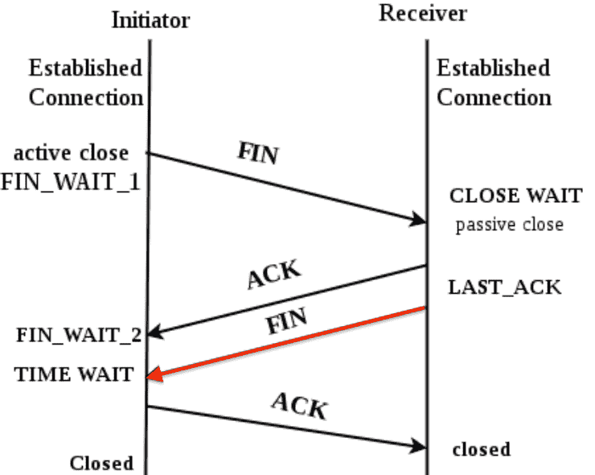

#220721 探活、TIME_WAIT 以及 SO_LINGER
==========================================

- https://coolshell.cn/articles/22263.html
- https://ndeepak.com/posts/2016-10-21-tcprst/

问题
----------

HTTP/TCP 类型的健康检查探活，最后一步都是关闭 tcp 连接，tcp 状态变化如下所示：

我们从主动/被动关闭连接方的视角来看这张图（而不是服务端/客户端的视角），最后一个非 ACK 包是由被动关闭方发给主动关闭方的，主动关闭方收到这个 FIN 包后进入 TIME_WAIT 状态，然后给被动关闭方发送 ACK 告诉对端包收到，连接关闭正式完成。但是最后这个 ACK 包可能中途丢了，此时被动关闭方可能会重新发送 FIN 包，所以 TIME_WAIT 状态系统会等待一个超时才会最终进入关闭状态，TIME_WAIT 状态时端口资源是没有释放的。机器的端口资源是有限的，太多的 TIME_WAIT 会导致服务器无法建立新的连接。

    When TCP performs an active close and sends the final ACK, that connection must stay in the TIME_WAIT state for twice the MSL. This lets resend the final ACK in case it is lost. The final ACK is resent not because the TCP retransmits ACKS (they do not consume sequence numbers are are not retransmitted by TCP) but because the otherwise will retransmit its FIN (which does consume a sequence number).

    -- TCP/IP Illustrated

查看系统的 TIME_WAIT 状态：

.. code-block:: console
    
    # ss -n -o state time-wait
    Netid       Recv-Q       Send-Q             Local Address:Port              Peer Address:Port        Process
    tcp         0            0                     172.17.2.1:8301                172.17.2.2:53468        timer:(timewait,2.156ms,0)
    tcp         0            0                     172.17.2.1:8301                172.17.4.4:39164        timer:(timewait,9.306ms,0)

解决方案
-------------

方法一，调小 ``/proc/sys/net/ipv4/tcp_fin_timeout`` 值，这个 Linux 默认 60，还是比较大的。

方法二，使用 ``SO_LINGER`` socket 参数修改 close 行为为直接发送 RST 来终止连接，这样就不会有 TIME_WAIT 状态了。

.. code-block:: c

    struct linger sl;
    sl.l_onoff = 1;     /* non-zero value enables linger option in kernel */
    sl.l_linger = 0;    /* timeout interval in seconds */
    setsockopt(sockfd, SOL_SOCKET, SO_LINGER, &sl, sizeof(sl));

不设置这个参数时关闭连接时的 tcpdump： ::
    
    32.813786 IP clt.16575 > svr.http: Flags [F.], seq 1, ack 1, ... length 0
    32.813843 IP svr.http > clt.16575: Flags [.], ack 2, ... length 0
    32.814907 IP svr.http > clt.16575: Flags [F.], seq 1, ack 2, ... length 0
    32.815107 IP clt.16575 > svr.http: Flags [.], ack 2, ... length 0

设置这个参数后 tcpdump： ::

    12.828324 IP clt.59784 > svr.http: Flags [R.], seq 1, ack 1, ... length 0

Flags 里的 R 表示这是一个 TCP RST 包。

LVS 中也是通过这个方法来关闭连接的：https://github.com/alibaba/LVS/blob/master/tools/keepalived/keepalived/core/layer4.c#L39

Go 中对于 TCP 连接，直接使用 `conn.(*net.TCPConn).SetLinger(0) <https://pkg.go.dev/net#TCPConn.SetLinger>`_ 就可以了。 HTTP 连接稍微麻烦点，得 Monkey Patch下：

.. code-block:: go

    t := http.DefaultTransport.(*http.Transport).Clone()
    dialContext := t.DialContext
    t.DialContext = func(ctx context.Context, network, addr string) (net.Conn, error) {
        conn, err := dialContext(ctx, network, addr)
        if err != nil {
            return conn, err
        }
        if tcpConn, ok := conn.(*net.TCPConn); ok {
            tcpConn.SetLinger(0)
            return tcpConn, nil
        }
        return conn, nil
    }
    log.Info("patched http.DialContext")
    client := &http.Client{Timeout: checkTimeout, Transport: t}