#221025 直接使用 bpf_map_lookup_elem helper 函数返回的指针指向的数据安全吗？
===============================================================================

TL;DR 可以，必须的。

用户空间的库函数
------------------------------------

虽然名字一样，但用户空间和 bpf 程序调用的 bpf_map_lookup_elem 函数不一样。

先看用户空间的 bpf_map_lookup_elem 函数，这个函数由 libbpf 库提供，定义位于 *tools/lib/bpf/bpf.h* 文件中。

.. code-block:: c

    LIBBPF_API int bpf_map_lookup_elem(int fd, const void *key, void *value);

    int bpf_map_lookup_elem(int fd, const void *key, void *value)
    {
        union bpf_attr attr;

        memset(&attr, 0, sizeof(attr));
        attr.map_fd = fd;
        attr.key = ptr_to_u64(key);
        attr.value = ptr_to_u64(value);

        return sys_bpf(BPF_MAP_LOOKUP_ELEM, &attr, sizeof(attr));
    }

    static inline int sys_bpf(enum bpf_cmd cmd, union bpf_attr *attr,
                            unsigned int size)
    {
        return syscall(__NR_bpf, cmd, attr, size);
    }

这个函数比 bpf 程序调用的 helper 函数多了一个 value 参数，这个参数指向一块 buffer，这块 buffer 由调用方申请，用来保存返回的 value 数据。跟 helper 函数直接返回 map 中 value 的指针不一样。

而且这个函数是对 bpf 系统调用的封装，所有的用户空间 bpf 函数最终都是通过 bpf 系统调用和内核的 bpf 系统打交道。不同功能对应不同的 cmd，参数通过 attr 这个 union struct 传递。

内核中根据 cmd 调用到上层指定的功能函数。

.. code-block:: c

    SYSCALL_DEFINE3(bpf, int, cmd, union bpf_attr __user *, uattr, unsigned int, size)
    |- __sys_bpf
    |- switch cmd
       case BPF_MAP_CREATE:
            err = map_create(&attr)
            break;
       case BPF_MAP_LOOKUP_ELEM:
            err = map_lookup_elem(&attr)
            break;
       ...
       case BPF_PROG_LOAD:
            err = bpf_prog_load(&attr, uattr)
            break

根据 cmd bpf_map_lookup_elem 函数会调用下面这个函数来完成：

.. code-block:: c

    map_lookup_elem(union bpf_attr *attr)
    |- int ufd = attr->map_fd
    |- struct fd f = fdget(ufd)
    |- struct bpf_map *map = __bpf_map_get(f)
    |- ...
    |- bpf_map_copy_value
    |  |- rcu_read_lock()
    |  |- map->ops->map_lookup_elem(map, key)
    |  |- rcu_read_unlock()
    |  ...
    |- copy_to_user(uvalue, value, value_size)

如果是 BPF_MAP_TYPE_HASH 类型的 map，最后就是调用 **htab_map_lookup_elem** 这个函数。

.. code-block:: c

    struct bpf_htab {
        struct bpf_map map;
        ...
    }
    struct bpf_map {
        const struct bpf_map_ops *ops;
        ...
    }
    const struct bpf_map_ops htab_map_ops = {
        ...
        .map_lookup_elem = htab_map_lookup_elem,
        ...
    };

对于用户空间的 bpf_map_lookup_elem，它是复制数据返回（不可能直接访问到内核的数据嘛），所以没有安全问题。

BPF 程序特供版：Helper 函数
--------------------------------

接下来，来看 bpf 程序调用的 helper 函数，helper 函数在 *tools/lib/bpf/bpf_helpers.h* 中定义，bpf 程序需要 include 这个头文件，这个头文件里 include 了一个 *bpf_helper_defs.h* 文件，这个文件是脚本根据 *include/uapi/linux/bpf.h* 文件自动生成的。

.. code-block:: c

    // bpf_helpers.h
    // include/uapi/linux/bpf.h + scripts/bpf_doc.py 自动生成下面这个文件
    // scripts/bpf_doc.py" --header --file include/uapi/linux/bpf.h > src/bpf_helper_defs.h
    #include "bpf_helper_defs.h"

*include/uapi/linux/bpf.h* 中和 Helper 函数相关的主要是下面这些内容：

.. code-block:: c

    /* Start of BPF helper function descriptions:
    * ...
    * void *bpf_map_lookup_elem(struct bpf_map *map, const void *key)
    * 	Description
    * 		Perform a lookup in *map* for an entry associated to *key*.
    * 	Return
    * 		Map value associated to *key*, or **NULL** if no entry was
    * 		found.
    * ...
    */

    //
    #define ___BPF_FUNC_MAPPER(FN, ctx...)  \
        FN(unspec, 0, ##ctx)                \
        FN(map_lookup_elem, 1, ##ctx)       \
        ...

    #define __BPF_FUNC_MAPPER_APPLY(name, value, FN) FN(name),
    #define __BPF_FUNC_MAPPER(FN) ___BPF_FUNC_MAPPER(__BPF_FUNC_MAPPER_APPLY, FN)

    #define __BPF_ENUM_FN(x, y) BPF_FUNC_ ## x = y,
    enum bpf_func_id {
        ___BPF_FUNC_MAPPER(__BPF_ENUM_FN)
        __BPF_FUNC_MAX_ID,
    };
    // 上面这一大堆宏最终会给每个 Helper 函数定义一个如下的函数 id。
    // enum bpf_func_id {
    //     BPF_FUNC_bpf_map_lookup_elem = 1
    //     ...
    //  }

*scripts/bpf_doc.py* 脚本会将上面注释中的 Helper 函数定义说明和 Helper 函数 ID 定义合并生成下面给 bpf 程序用的头文件。其中 bpf_map_lookup_elem 定义如下：

.. code-block:: c

    // bpf_helper_defs.h
    static void *(*bpf_map_lookup_elem)(void *map, const void *key) = (void *) 1;

这样，编译出来的 bpf 程序的 call 指令 BPF_CALL 的函数地址就被替换成了一个函数 id。

bpf 程序加载的时候会在 verifer 中验证 bpf 指令是否安全以及将 bpf 指令即时向下编译为原生指令，这个过程中会执行函数的 link，将函数 id 翻译成最终实际的函数地址。

.. code-block:: c

    bpf_prog_load
    |- ...
    |- bpf_check
    |- ...
    |- do_misc_fixups
    |  |- ...
    |  |- const struct bpf_map_ops *ops;
    |  |- ...
    |  |- switch (insn->imm) {
    |  |  case BPF_FUNC_map_lookup_elem:
    |  |     insn->imm = BPF_CALL_IMM(ops->map_lookup_elem);
    |  |     // #define BPF_CALL_IMM(x)	((void *)(x) - (void *)__bpf_call_base)
    |  |     continue;
    |- ...
    |- fixup_call_args
        |- jit_subprogs
            |- bpf_int_jit_compile // arch/x86/net/bpf_jit_comp.c
                |- do_jit
                   |- switch (insn->code) {
                      case BPF_JMP | BPF_CALL:
                           func = (u8 *) __bpf_call_base + imm32;
                           emit_call(&prog, func, image + addrs[i - 1])

对于 BPF_MAP_TYPE_HASH 类型的 map，这个 call 的函数地址最终被翻译成了 ``htab_map_lookup_elem`` 函数。

.. code-block:: c

    const struct bpf_map_ops htab_map_ops = {
    ...
        .map_lookup_elem = htab_map_lookup_elem,
    ...
    };

问题和结论
------------------

从上面的分析来看，bpf 程序调用 bpf_map_lookup_elem （实际调用的是 htab_map_lookup_elem 函数）的时候，并没有加 rcu 读锁，而且就算加了读锁，返回的是 map 中原始数据的指针，这个指针指向的数据在函数调用结束后还能安全的使用吗？不会被更新或者删除掉吗？

答案是肯定的，安全。因为虽然 bpf 程序调用 helper 函数的时候没有加读锁，但整个 bpf 程序的执行都在一个更大范围的 rcu 读锁中。这个读锁保证了 xdp 程序中访问 map 数据的安全性。

.. code-block:: c

    local_bh_disable();
    ...
    act = bpf_prog_run_xdp(xdp_prog, xdp);
    ...
    local_bh_enable();

local_bh_disable/local_bh_enable 对标记了一个 rcu 的读临界区（critical section)。

   BPF relies heavily on RCU protection for its data structures, but because the BPF program invocation happens entirely within a single local_bh_disable() section in a NAPI poll cycle, this usage is safe. The reason that this usage is safe is that readers can use anything that disables BH when updaters use call_rcu() or synchronize_rcu(). anything that disables bottom halves also marks an RCU-bh read-side critical section, including local_bh_disable() and local_bh_enable(), local_irq_save() and local_irq_restore(), and so on

   - https://lwn.net/ml/bpf/20210624160609.292325-2-toke@redhat.com/
   - https://github.com/torvalds/linux/blob/master/Documentation/RCU/Design/Requirements/Requirements.rst#bottom-half-flavor-historical

References:

- https://man7.org/linux/man-pages/man2/bpf.2.html
- https://man7.org/linux/man-pages/man7/bpf-helpers.7.html
- https://github.com/xdp-project/xdp-tutorial/issues/203#issuecomment-817695271
- https://open-nfp.org/the-classroom/demystify-bpf-jit-compiler/

如何添加一个新的 BPF Helper 函数
---------------------------------------

bpf_ktime_get_tai_ns 这个函数比较简单，以其为例。https://github.com/torvalds/linux/commit/c8996c98f703b09afe77a1d247dae691c9849dc1

第一步，如前所述，在 *include/uapi/linux/bpf.h* 中添加新 Helper 函数的调用描述文档以及 函数 ID。

.. code-block:: diff

    diff --git a/include/uapi/linux/bpf.h b/include/uapi/linux/bpf.h
    @@ -5341,6 +5341,18 @@ union bpf_attr {
      *		**-EACCES** if the SYN cookie is not valid.
      *
      *		**-EPROTONOSUPPORT** if CONFIG_IPV6 is not builtin.
    + *
    + * u64 bpf_ktime_get_tai_ns(void)
    + *	Description
    + *		A nonsettable system-wide clock derived from wall-clock time but
    + *		ignoring leap seconds.  This clock does not experience
    + *		discontinuities and backwards jumps caused by NTP inserting leap
    + *		seconds as CLOCK_REALTIME does.
    + *
    + *		See: **clock_gettime**\ (**CLOCK_TAI**)
    + *	Return
    + *		Current *ktime*.
    + *
      */
     #define __BPF_FUNC_MAPPER(FN)		\
        FN(unspec),			\
    @@ -5551,6 +5563,7 @@
        FN(tcp_raw_gen_syncookie_ipv6),	\
        FN(tcp_raw_check_syncookie_ipv4),	\
        FN(tcp_raw_check_syncookie_ipv6),	\
    +	FN(ktime_get_tai_ns),		\
        /* */

第二步，实现这个函数，这部分一般通过 ``BPF_CALL_*`` 宏来定义并实现。``bpf_ktime_get_tai_ns`` 比较简单，没有参数，直接使用 ``BPF_CALL_0`` 宏就行。

.. code-block:: diff

    diff --git a/kernel/bpf/helpers.c b/kernel/bpf/helpers.c
    @@ -198,6 +198,18 @@
    +BPF_CALL_0(bpf_ktime_get_tai_ns)
    +{
    +	/* NMI safe access to clock tai */
    +	return ktime_get_tai_fast_ns();
    +}
    +

第三步，通过一个 ``bpf_func_proto`` 类型的结构体将这个 BPF Helper 函数详细的调用方法：有几个参数、参数是什么类型的、参数大小限制啊、返回值是什么样的……这些信息提供给 BPF Verifier，Verfier 加载 BPF 程序遇到 ``bpf_ktime_get_tai_ns`` 调用的时候，需要这些信息来判断调用是否正确合法。

另外，每种类型的 BPF 程序都有一个 ``*_func_proto`` 函数（比如 XDP 就是 ``xdp_func_proto``），这个函数传入函数 ID 返回该 ID 对应的 Helper 函数的 ``bpf_func_proto`` 结构体指针，Helper 函数可以在哪些类型的 BPF 程序中调用，就需要在这些类型对应的 ``*_func_proto`` 函数中添加一个 switch 分支将新加的函数加上。如果所有的 BPF 类型程序都可以调用，可以加入特殊的 ``bpf_base_func_proto`` 函数中，不用所有的 ``*_func_proto`` 中都加一遍。

.. code-block:: diff

    diff --git a/include/linux/bpf.h b/include/linux/bpf.h
    @@ -2349,6 +2349,7 @@
     extern const struct bpf_func_proto bpf_tail_call_proto;
    +extern const struct bpf_func_proto bpf_ktime_get_tai_ns_proto;
     extern const struct bpf_func_proto bpf_get_current_comm_proto;

    diff --git a/kernel/bpf/core.c b/kernel/bpf/core.c
    @@ -2623,6 +2623,7 @@
     const struct bpf_func_proto bpf_ktime_get_coarse_ns_proto __weak;
    +const struct bpf_func_proto bpf_ktime_get_tai_ns_proto __weak;

     const struct bpf_func_proto bpf_get_current_uid_gid_proto __weak;

    diff --git a/kernel/bpf/helpers.c b/kernel/bpf/helpers.c
    @@ -198,6 +198,18 @@
    +const struct bpf_func_proto bpf_ktime_get_tai_ns_proto = {
    +	.func		= bpf_ktime_get_tai_ns,
    +	.gpl_only	= false,
    +	.ret_type	= RET_INTEGER,
    +};
    +
    @@ -1617,6 +1629,8 @@ bpf_base_func_proto(enum bpf_func_id func_id)
            return &bpf_ktime_get_ns_proto;
        case BPF_FUNC_ktime_get_boot_ns:
            return &bpf_ktime_get_boot_ns_proto;
    +	case BPF_FUNC_ktime_get_tai_ns:
    +		return &bpf_ktime_get_tai_ns_proto;
        case BPF_FUNC_ringbuf_output:
            return &bpf_ringbuf_output_proto;
        case BPF_FUNC_ringbuf_reserve:
