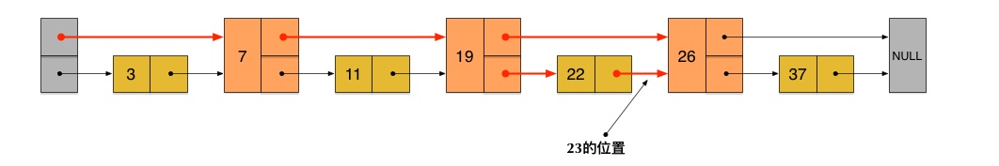

跳表 Skiplist
===================

概述
-----------

跳表是一种数据结构，用于解决算法中的查找问题，即根据给定的 Key，快速查找到其位置（或对应的 Value）。

原始论文： `Skip Lists: A Probabilistic Alternative to Balanced Trees <ftp://ftp.cs.umd.edu/pub/skipLists/skiplists.pdf>`_ （从标题可以看出，跳表是一个对标各种平衡树的数据结构）。

跳表在有序链表的基础上发展而来。普通的有序链表的 查找/插入/删除 都需要从头逐个比较节点，时间复杂度为 O(n) 。

.. image:: images/skiplist-list.png

一种改进的方式是每隔一个节点添加一个指针，让其指向下下个节点，这些新的指针连成一个新的链表，链表里的节点只有原来的一半，这样当查找数据的时候，可以先沿着新链表进行查找，当遇到比要查的数据大的节点时，再回到原来的链表中查找。比如查 23 可以沿着下图红色的指针所指的方向进行。

依据同样的规则，我们可以创建一个多层链表结构，这种多层链表的上层链表相当于索引，可以帮我们快速跳过很多下层节点，大大加快查找速度。

.. image:: images/skiplist-list-3.png

但是上述的多层链表在插入和删除节点的时候需要调整其后所有节点的上层指针以使其继续满足上述规则，这会让时间复杂度退化到 O(n)。

跳表由上面的多层链表启发而来，为了解决上述问题，跳表引入了随机过程，为每个节点随机一个层数（level），避免了上述的指针调整。下图为一个跳表的构建过程。

.. image:: images/skiplist-build.png

节点层数的随机生成算法如下（并不是普通的服从均匀分布的随机数）：

.. code-block:: go

    func randomLevel() int {
        level := 1
        // rand.Float32() 返回一个 [0.0, 1.0) 区间的随机数
        for rand.Float32() < p && level < maxLevel {
            level += 1
        }
        return level
    }

随机数包含两个参数，``p`` 和 ``maxLevel`` ，节点数 小于 2\ :sup:`16` 的时候 ``p = 1/2, maxLevel = 16`` 即可（来自原始论文）。

查找
----------

定义跳表结构体：

.. code-block:: go

    type SkipList struct {
        header node
        level  int  // 跳表中最大的节点层数
    }

    type node struct {
        key     int
        value   interface{}
        forward []*node
    }

    func New() *SkipList {
        return &SkipList{
            header: &node{forward: make([]*node, 1)},
        }
    }

查找的过程如图所示：

.. image:: images/skiplist-search.png

.. code-block:: go

    func (s *SkipList) Search(searchKey int) (interface{}, bool) {
        x := s.header
        for i := s.level - 1; i >= 0; i-- {
            for x.forward[i] != nil && x.forward[i].key < searchKey {
                x = x.forward[i]
            }
        }
        x = x.forward[0]

        if x != nil && x.key == searchKey {
            return x.value, true
        } else {
            return nil, false
        }
    }

插入
-----------

插入过程的第一步同查找，查找的途中记录下插入点在每一层的前一个节点：

- 上层链表的前一个节点是 *上层往下层跃迁的节点* 。
- 最下层链表的前一个节点即查找终止点。

然后和普通链表一样新建一个节点并插入到各层中去即可。

.. code-block::  go

    func (s *SkipList) Insert(searchKey int, newValue interface{}) {
        var update [maxLevel]*node

        x := s.header
        for i := s.level - 1; i >= 0; i-- {
            for x.forward[i] != nil && x.forward[i].key < searchKey {
                x = x.forward[i]
            }
            // 记录插入点在该层的前一个节点
            update[i] = x
        }
        x = x.forward[0]

        if x != nil && x.key == searchKey {
            x.value = newValue
        } else {
            level := randomLevel()

            if level > s.level {
                // 层数大于了当前最大节点层数
                //  1. 扩容
                forward := s.header.forward
                if cap(forward) < level {
                    s.header.forward = make([]*node, level)
                    copy(s.header.forward, forward)
                }
                //  2. 新增层数的前一个节点为跳表头
                for i := s.level; i < level; i++ {
                    update[i] = s.header
                }
                s.level = level
            }

            // 新建一个节点并插入到各层中去
            x = &node{searchKey, newValue, make([]*node, level)}
            for i := 0; i < level; i++ {
                x.forward[i] = update[i].forward[i]
                update[i].forward[i] = x
            }
        }
    }

删除的过程同理。

完整代码： https://gist.github.com/chanfung032/66c3ae0ca85f314e9b08a9aafc109fc3

参考以及本文图来自： http://zhangtielei.com/posts/blog-redis-skiplist.html

