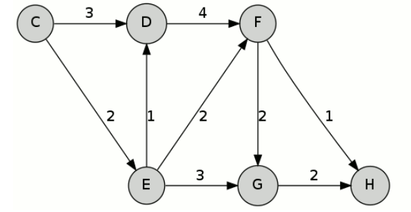

最短路径之 Dijkstra 和 Yen 算法
===================================

Dijkstra 算法
---------------------

Dijkstra 算法是计算最短路径的经典算法。设需要计算的图为 :math:`G` ，起点 :math:`s` ，终点 :math:`d` 。伪算法描述：

.. code-block:: python

    def Dijkstra(G, s, d):
        # dist[i] 保存从起点到顶点 i 当前计算出的最短距离，默认初始化为 ♾️
        # prev[i] 保存到顶点 i 当前最短路径的上一跳节点
        for v in G.vertices:
            dist[v] = inf
            prev[v] = undefined
            Q.append(v)
        # 起点到起点的距离为 0
        dist[s] = 0

        while len(Q) > 0:
            # 取当前集合 Q 里距离起点 s 最近的一个顶点
            u = vertex in Q with min dist[u]
            # 从集合 Q 中删除顶点 u
            remove u from Q

            # 计算完成，退出
            if u == d:
                break

            # 遍历顶点 u 所有的相邻节点 v，如果 s->u 的距离加上 u->v 的距离小于
            # 当前 s->v 的最短距离，更新
            for each neighbor v of u:
                if v in Q:
                    alt = dist[u] + Graph.edges(u, v)
                    if alt < dist[v]:
                        dist[v] = alt
                        prev[v] = u
        
        # 反向遍历得到最短路径
        p = [d]
        while prev[d] != undefined:
            p.insert(0, prev[d])
            d = prev[d]
        
        return dist[d], p
            
Dijkstra 算法的主要思想是广度优先搜索，每次选择距离起点最近的顶点扩展，逐步往外直到得到所有节点（或者目标节点）的最短路径。其时间复杂度为 :math:`O(n^2)` 。

以下图为例，计算起点 :math:`C`，终点 :math:`H` 的最短路径：

- 第一轮迭代，计算可以得到 :math:`C-D` 距离 3， :math:`C-E` 距离 2。
- 第二轮，扩展 :math:`E` 点，更新得 :math:`C-D` 距离 3， :math:`C-E-F` 距离 4， :math:`C-E-G` 距离 5。
- 第三轮，扩展 :math:`D` 点，更新得 :math:`C-D-F` 距离 7， :math:`C-E-F` 距离 4， :math:`C-E-G` 距离 5。
- 第四轮，扩展 :math:`F` 点，更新得 :math:`C-D-F-H` 距离 8，:math:`C-E-F-G` 距离 6， :math:`C-E-F-H` 距离 5， :math:`C-E-G` 距离为 5。
- 第五轮，扩展 :math:`H` 点，计算结束，得到 :math:`C-E-F-H` 为最短路径。

Yen 算法
-----------

Yen 算法是 Dijkstra 算法的扩展，Dijkstra 只能计算得到一条最短路径，Yen 算法可以计算出 TOP K 条最短路径。这个在很多场景下会很有用，比如 Google 在 B4 论文中提到其广域网就用到 Yen 算法来计算多条路由，然后按照线路的带宽和应用的优先级来给不同的应用分配不同的路由。

给定图 :math:`G`，起点 :math:`s`， 终点 :math:`d`，想要的获得的最短路径条数 :math:`k`。Yen 算法的基本流程如下：

1. 首先，调用 Dijkstra 算法获得最短路径 :math:`P[0]` 。
2. 求 :math:`P[i+1]` 时，将 :math:`P[i]` 路径上除了终点 :math:`d` 之外的其他点依次作为一个偏离节点（Spur Node）。
   
   对每一个偏离节点，设 :math:`P[i]` 路径中起点到偏离点的路径为 :math:`rootPath`，遍历所有已经计算出的最短路径，如果某条路径中包含 :math:`rootPath`，将这个路径中 :math:`rootPath` 接下去的那一条边从图中删除。调用 Dijkstra 算法重新计算这个偏离点到终点的最短路径，设为 :math:`spurPath`，:math:`rootPath + spurPath` 作为 :math:`P[i]` 的一个候选路径。

   所有偏离节点计算得到的候选路径中取最短的一条作为 :math:`P[i+1]` 。
3. 重复 2 直到所有的 k 条路径计算完成。

还是以上文 Dijkstra 算法中的图为例，来手算下 Yen 算法。

1. 首先通过 Dijkstra 算法获得最短路径 :math:`P[0] = C-E-F-H` 。
2. 计算 :math:`P[1]`

   - 以 :math:`C` 为偏离点，删除 :math:`C-E` 边，重新计算得最短路径 :math:`C-D-F-H` 。
   - 以 :math:`E` 为偏离点，删除 :math:`E-F` 边，重新计算得最短路径 :math:`C-E-G-H` 。
   - 以 :math:`F` 为偏离点，删除 :math:`F-H` 边，重新计算得最短路径 :math:`C-E-F-G-H` 。

   取三条候选里最短的，得 :math:`P[1] = C-E-G-H`。

   .. image:: images/sp-2.png
3. 继续计算可得 :math:`P[2] = C-D-F-H` 。

References:

- https://zhuanlan.zhihu.com/p/336140079
- https://en.wikipedia.org/wiki/Dijkstra%27s_algorithm
- https://en.wikipedia.org/wiki/Yen%27s_algorithm