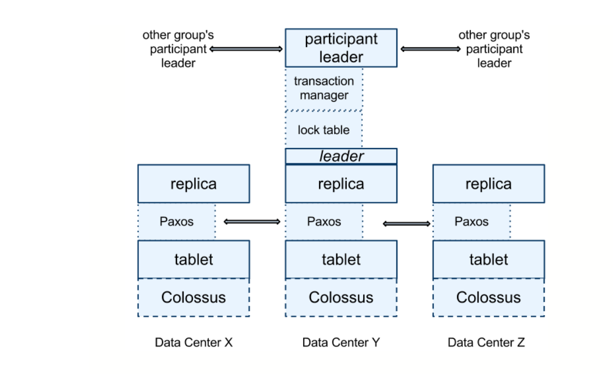
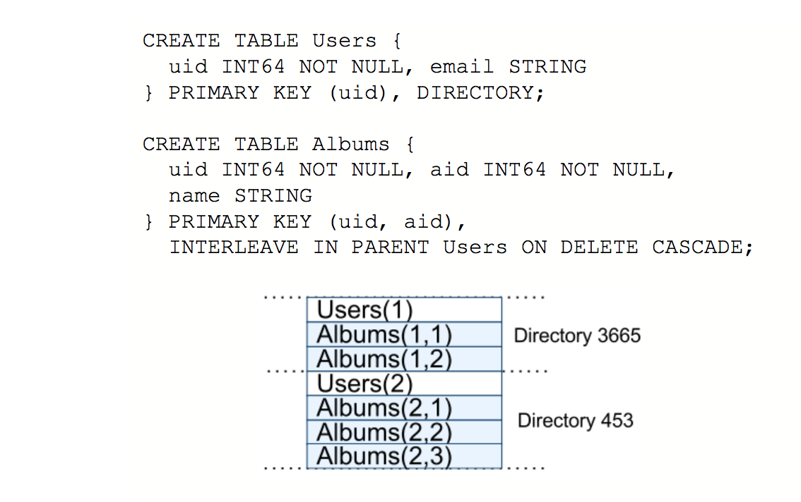

Spanner 概要（K-V 部分）
============================

- http://research.google.com/archive/spanner.html
- https://research.google.com/pubs/pub46103.html

Paxos Group
---------------

Spanner 底层是一个类似于 Bigtable 的 K-V 存储，存储如下形式的数据： ::

    (key:string, timestamp:int64) → string

按 key 分片（sharding），每个分片归属于一个 paxos group（replicated state machine）， paxos group 维护一个 replicated write-ahead log，使用 paxos 共识算法保证其在每一个副本（replica）上的一致性。每个副本再根据 write-ahead log 更新各自的数据，从而保证每个副本数据的一致。

分片可以从一个 paxos group 移到另外 group，也可以分裂到新的 group 中（一般是因为负载）。

副本的数据存在一个叫做 Colossus 的分布式追加（append-only）文件系统上，原始使用的文件格式是 SSTable，后期（2017-）改为了 Ressi 格式（build from ground up）。

Spanner 提供了一个叫做 coprocessor framework 的 RPC 框架来隐藏查找数据的复杂性，读写请求指定 key 或者一个 key range 而不是某一个服务器。coprocessor framework 隐藏底层复杂的 paxos group 查找，满足条件的副本确定等事宜。

Data Model
------------------

Spanner 中每张表都必须包含一个和多个主键（primary key），每张表在底层的 K-V 存储中就是 *主键列* 到 *非主键列* 的映射。

表之间可以存在父子（parent-child）关系。存在父子关系的表会按其主键或者主键前缀交叉存取在同一分片中。例如：

用户可以使用 *INTERLEAVE IN* 关键字来将相关联的表的数据存储在一起。

Concurrency Control
-----------------------

对于只写（blind-write）、读写（read-modify-write） 事务，`2 阶段锁（2PL） <https://en.wikipedia.org/wiki/Two-phase_locking>`_ 可以确保同一个 paxos group 中并行事务的可串行化（serializability），2 阶段提交（2PC）可以确保整个数据库上的可串行化。

每个事务提交都会被赋予一个时间戳，通过时间戳，用户可以读取这个时间点上数据库的快照数据（也就是应用所有提交时间 <= T 的事务后都到的数据）。可以参照： :doc:`percolator` 。

