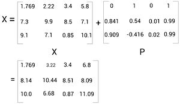
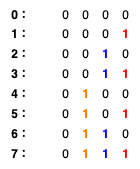

Transformer 模型笔记
========================

*本笔记主要来自《Getting Started with Google BERT》中的 Transformer 章节，另外参考其他资料补充了一些相关知识，主要方便自己理解。*

*其它资料包括且不限于：*

- `Attention Is All You Need（Transformer 原论文, 2017） <https://arxiv.org/abs/1706.03762>`__
- `李宏毅【機器學習2021】Transformer <https://www.youtube.com/watch?v=n9TlOhRjYoc>`__
- `The Annotated Transformer(2018) <https://nlp.seas.harvard.edu/2018/04/03/attention.html>`__
- `Preparing Text Data for Transformers: Tokenization, Mapping and Padding(2023) <https://medium.com/@lokaregns/preparing-text-data-for-transformers-tokenization-mapping-and-padding-9fbfbce28028>`__
- `Are transformer decoder predictions computed in parallel during training? <https://ai.stackexchange.com/questions/40119/are-transformer-decoder-predictions-computed-in-parallel-during-training>`__

模型
-----------

Transformer 模型是典型的 **编码器-解码器（Encoder-Decoder）** 架构，以英译法翻译任务为例，输入的待翻译语句经过编码器被编码为一个内部表示，解码器再根据这个内部表示来生成对应的法语翻译。

.. image:: images/transformer-simple.svg
   :align: center

训练阶段，我们训练模型预测句子的下一个词，上面图中的 ``<sos>`` 和 ``<eos>`` 是两个特殊的词，分别表示句子开始（start of sentence）和句子结束（end of sentence），看解码器的输入和输出可以看出，输入和输出错位了一个词，每个输入词的输出对应其在句子里的下一个词，我们希望通过海量句子的训练，模型可以习得预测下一个词的能力。

预测阶段，编码部分不变，解码的过程是一个自回归的过程（auto-regressive），一开始，输入 ``<sos>`` 给解码器，预测句子的第一个词，然后不断将解码器预测出的最新的词追加到解码器的输入序列中，再输入解码器，不断迭代直到输出 ``<eos>`` 为止。整个计算过程和训练阶段是一样的，只不过训练阶段知道正确答案，所以可以一次性批量预测所有词的下一个词。

上面是为了整体理解简化了的 Transformer 模型，完整的 Transformer 架构如下：

.. image:: images/transformer-full.svg
   :align: center

下面我们逐层来看看 Transformer 模型的详细计算过程。

词向量层 Embedding
-------------------

句子是没法直接输入模型的，需要分词，再将词转换成对应的词向量，词向量就是用一组数值来表示一个词，比如：

- 词 ``i`` 的词向量 :math:`x_i = [1.76, 2.22, ..., 6.66]` 。
- 词 ``am`` 的词向量 :math:`x_{am} = [7.77, 0.631, ..., 5.35]` 。
- 词 ``good`` 的词向量 :math:`x_{good} = [11.44, 10.10, ..., 3.33]` 。

词向量单独没有意义，向量和向量的距离才有意义，距离近表示两个词的意义相近。

词向量层也属于 Transformer 模型参数的一部分，在训练过程中会不断调整，初始化可以用随机参数或用一些训练好的词向量库。

.. math::

    X = \begin{bmatrix}
    x_{i} \\
    x_{am} \\
    x_{good} \\
    \end{bmatrix} = \begin{bmatrix}
    1.76 & 2.22 & ... & 6.66\\ 
    7.77 & 0.631  & ... & 5.35\\ 
    11.44 & 10.10 & ... & 3.33
    \end{bmatrix}

位置编码 Positional Encoding
------------------------------

除了词本身的意义，一个词在句子中的位置信息也很重要。编码器中对于句子上下文理解最重要的自注意力层计算的时候并不关心词向量输入的顺序，只关心词向量本身，所以需要通过某种编码将词的位置信息注入到词向量中去。

Transformer 模型中，位置编码的公式为：

.. math::

    P(pos, 2i) = \sin(pos / (1000^{2i/d_{model}})) \\
    P(pos, 2i+1) = \cos(pos / (1000^{2i/d_{model}}))

理解这个公式之前，我们先看一个比较简单的编码方式，二进制编码：

上图中，低位到高位用不同的颜色标出了，可以看到，随着位置的变化，最低位的 0 和 1 变化的周期最短，越往高位，变化的周期越长。最高位甚至一直没有变化。

回到 Transformer 用到的位置编码，编码从左到右可以看成进制的低位到高位，越往右因为除的数值越大，数值随着位置的变化量就越小，类似二进制编码中的变化周期长。

.. image:: images/transformer-positional-encoding-1.png
   :align: center

（128 维位置编码，每一行是一个编码，从上到下是 0～50 位置的编码）

另外，每个进制位使用了 2 个数值来编码，偶数进制位（2i）使用正弦函数编码，奇数进制位（2i+1）使用余弦函数编码，还有一些其他特性。

    We chose this function because we hypothesized it would allow the model to easily learn to attend by relative positions, since for any fixed offset k, :math:`P_{pos+k}`` can be represented as a linear function of :math:`P_{pos}` .

更多解释可以阅读：https://kazemnejad.com/blog/transformer_architecture_positional_encoding/

编码器 Encoder
--------------------

直觉理解
^^^^^^^^^^^^^^^^

编码器的功能就是根据自身的知识（训练得到的参数）将输入的上下文无关的词向量（context-free embedding）转换成上下文感知的词向量（context-aware embedding）。什么意思呢，举个例子来说：

- 句一： He got bit by **Python**.
- 句二： **Python** is my favorite programming language.

上面两个句子中， Python 这个词在输入编码器的时候，除了位置编码不一样，其他完全一样，但是通过上下文可以看出，这两个词的意义完全不一样，句一说的是动物蟒蛇，句二说的是 Python 编程语言。

那一个词向量怎么能感知上下文呢，一个简单粗暴的想法就是将上下文的其它词向量加一点点到这个词向量中。类似下面这样：

.. math::

    \begin{align*}
    \begin{bmatrix}
    z_{i} \\
    z_{am} \\
    z_{good} \\
    \end{bmatrix}  &= \begin{bmatrix}
    a_{i,i}x_i + a_{i,am}x_{am} + a_{i,good}x_{good} \\
    a_{am,i}x_i + a_{am,am}x_{am} + a_{am,good}x_{good} \\
    a_{good,i}x_i + a_{good,am}x_{am} + a_{good,good}x_{good} \\
    \end{bmatrix} \\  
    &= \begin{bmatrix}
    a_{i,i} & a_{i,am} & a_{i,good} \\
    a_{am,i} & a_{am,am} & a_{am,good}\\
    a_{good,i} & a_{good,am} & a_{good,good} \\
    \end{bmatrix} \begin{bmatrix}x_{i}, x_{am}, x_{good}\end{bmatrix} 
    \\ &= aX
    \end{align*}

这个就是注意力的核心思路，也就是 Transformer 模型中注意力层主要干的事。

自注意力 & 多头注意力
^^^^^^^^^^^^^^^^^^^^^^^^^^^^

下面是自注意力层的公式：

.. math::

    \begin{align*}
    \text{Attention}(Q, K, V) &= \text{softmax}\left(\dfrac{QK^T}{\sqrt{d_k}}\right)V \\
        &= \text{softmax}\left(\dfrac{W_QX(W_KX)^T}{\sqrt{d_k}}\right)(W_VX)
    \end{align*}

第二行，我们将 Q、K、V 矩阵展开，可以看到，这三个矩阵都是输入矩阵 X 的线性变换，:math:`\sqrt{d_k}` 是一个常量，所以要理解自注意力公式，四舍五入等于理解：

.. math::

    \text{softmax}(XX^T)X

softmax 函数是用来归一化的，就是保证注入上下文词向量的时候，这个词取一点，那个词取一点，但总体取的比例加起来得为 1。

:math:`XX^T` 一个矩阵乘以它自己的转置代表什么，又有什么意义呢？

.. math::

    XX^T = \text{softmax}\left(\begin{bmatrix}
    x_{i}x_{i} & x_{i}x_{am} & x_{i}x_{good} \\
    x_{am}x_{i} & x_{am}x_{am} & x_{am}x_{good} \\
    x_{good}x_{i} & x_{good}x_{am} & x_{good}x_{good}  \\
    \end{bmatrix}\right)

两个向量相乘是向量里每个对应的元素相乘，得到的积再相加，也叫内积。 **向量的内积表征两个向量的夹角，表征一个向量在另一个向量上的投影，可以用来判断两个向量的相关程度。** 值越大，说明两个向量相关度越高，相反，如果值为 0，说明两个向量垂直，两个向量线性无关，完全没有相关性。

矩阵乘以它自己的转置是一次性算出所有向量之间的内积，也就是算出所有词之间的相关性。

更详细可以参见：https://zhuanlan.zhihu.com/p/410776234

每一个编码器块中会并行有 N 多个自注意力层，也叫多头注意力，这 N 多个自注意力层中的参数矩阵 :math:`W_K`、 :math:`W_Q`、 :math:`W_V` 都是随机初始化的，最后可以学到不同的值，从而使得每个注意力层可以从输入中获取不同的信息。

.. TODO: 添加多头注意力意义的具体示例。

这些注意力层的输出最后会被拼接到一起然后经过一个线性变换后输出,保证输入输出的维度一样。

.. math::

    \text{MultiHead}(Q, K, V) = \text{Concat}(\text{head}_1, \text{head}_2, ..., \text{head}_h)W_O

编码器中只有注意力层的运算会涉及句子中的所有词向量，也就是感知上下文，其他层都只是对单个词向量的各种变换运算。当然，经过注意力层后每个词向量也不单纯了就是了。

Q、K、V 的生物学意义（一种解释）： https://zh.d2l.ai/chapter_attention-mechanisms/attention-cues.html

逐位前馈网络
^^^^^^^^^^^^^^^^^^^

两层全连接网络，中间用 ReLU 激活函数拼接起来。

.. math::

    \text{FFN}(x) = \text{max}(0, xW_1 + b_1)W_2 + b_2

加 & 规范化
^^^^^^^^^^^^^^^^^^^^

所有的子层都会经过这个操作再输入给下一个子层。公式如下：

.. math::

    \text{LayerNorm}(x + \text{Sublayer}(x))

就是把子层的输入和输出相加之后再做规范化，这个是优化深度网络的小技巧，不展开说了。

解码器 Decoder
--------------------

每一个解码器块中有 2 个注意力子层，一个 **掩蔽多头注意力层** ，一个交叉注意力层。

掩蔽自注意力
^^^^^^^^^^^^^^^

解码器中的自注意力层和编码器中的基本一样，但是因为预测的时候，模型没法未卜先知，没法知道后面的词是什么，所以预测的时候输入编码器的词向量经过注意力层只能感知到句子前面已经输出的词，也就是上文信息，没法感知下文信息。

因此训练的时候，解码器中的自注意力层也得跟预测时一样，对于每一个词向量，只注意这个词前面的词向量，后面的词向量得 **掩蔽（masked）** 掉。也就是将 :math:`QK^T` 矩阵斜对角线上方的数值设置为 -inf，softmax(-inf) 为 0，这样所有词向量后面的词向量就会被掩蔽掉。

交叉注意力层
^^^^^^^^^^^^^^^^^

公式：

.. math::

    \text{CrossAttention}(Q_{\text{dec}}, K_{\text{enc}}, V_{\text{enc}}) = \text{softmax}\left(\frac{Q_{\text{dec}}K_{\text{enc}}^T}{\sqrt{d_k}}\right)V_{\text{enc}}

和自注意层不一样，交叉注意力层的 Q 矩阵是根据解码器的输入变换得到的，但 K、V 矩阵变成了从编码器的输出变换得到，:math:`QK^T` 还是算相关性，但是变成了交叉相关性，而不是自相关性，因为 V 矩阵是从编码器输出的上下文感知词向量变换得到的，所以交叉注意力层相当于使用注意力去取上下文感知词向量，无非是这个词向量多点，那个词向量少点。

最后的线性变换层 & softmax
----------------------------

解码器的输出并不是词，还是一个向量，这个向量经过一个线性变换将维度转换成和输出词汇表的大小一样，然后再经过一个 softmax 层，将输出的数值变成输出每一个可能词汇的概率。

最简单的方法是将概率最高的词作为预测的下一个词输出。

其它的一些替代策略： https://zh.d2l.ai/chapter_recurrent-modern/beam-search.html#id5